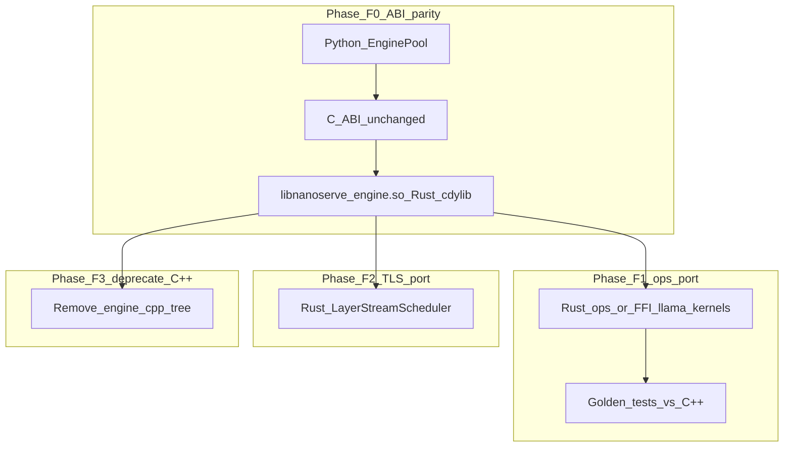

# Future-Scope-Rust-port-for-C++Part — NanoServe

> **Future scope only — not in v1/v2 implementation scope.**
> Copy-paste this file into an agent session when the C++ native path (Part A + TLS) is stable and parity gates are green.
>
> **Related:** [TODO-NanoServe-Industry-grade-plan.md](TODO-NanoServe-Industry-grade-plan.md) (current industrial roadmap; C++23 engine remains primary until this plan exits)

---

## Prompt header

You are planning or executing a **gradual migration** of NanoServe's **C++23 inference hot path** (`libnanoserve_engine.so`) to a **Rust-native engine**, while preserving:

- Scale: 300 concurrent users (orchestrator tier), edge TLS on 4 GB SBCs
- Quality: parity tests, bounded RSS, Valgrind-class memory discipline, audit scripts
- API: `/v1/completions`, SDK, TUI, Web UI — **no Python orchestrator rewrite required in Phase F0–F3**
- Coexistence: optional GGUF lane unchanged; `.nanoq` v2 legacy demo until deprecated

**Tagline:** *Same orchestrator, safer engine* — not *big-bang rewrite*.

**Non-goal:** Replace Python/FastAPI in early phases. Python stays the coordinator unless Phase F4 is explicitly approved.

---

## Why consider this (future)

| Driver | Detail |
|--------|--------|
| **TLS safety** | Layer streaming + double-buffer prefetch + in-place activations are lifetime-heavy; Rust borrow checker reduces UAF/race class |
| **Unified Rust surface** | `buddy_alloc`, `nanoq_runtime`, `nanoq_rag` already Rust; C++ is the remaining split |
| **Long-term embedded** | `no_std` / FPGA / MCU tiers (Part D T2–T3) may favor one Rust core over C++ + Emscripten |
| **Maintenance** | Single memory model + one primary native codebase after migration completes |

**Why not now:** C++ path reuses llama.cpp kernel subset, existing FFI, WASM (Emscripten), CUDA/OpenCL stubs, and 48+ tests. Migrating before `.nanoq` v3 + TLS-1 ships duplicates effort.

---

## Scope definition

### In scope (Rust engine)

| Component | Today (C++) | Future (Rust) |
|-----------|-------------|---------------|
| Transformer forward (GPT-2, Llama) | `engine/src/transformer_*.cpp` | Rust graph module |
| TLS scheduler | `layer_stream.hpp` (planned) | Rust `LayerStreamScheduler` or port |
| KV cache | `kv_cache.hpp` | Rust + buddy FFI |
| Sampling | `sampler.cpp` | Rust |
| Tensor ops (matmul, norm, rope, attn) | `engine/src/ops/` + llama.cpp subset | Rust kernels **or** FFI to vendored C kernels |
| `.nanoq` loader (hot path) | `nanoq_loader.cpp` | Rust mmap + tensor views; keep Rust validator |
| Engine FFI | `engine_ffi.cpp` | Rust `cdylib` exporting **identical C ABI** |

### Out of scope (unchanged unless Phase F4)

| Component | Stays |
|-----------|--------|
| FastAPI micro-batcher | Python |
| `InferenceRouter`, `EnginePool`, `GGUFPool` | Python |
| Model registry, download pipeline | Python |
| RAG / NMDP / Train routers | Python (+ Rust `nanoq_rag`) |
| Optional GGUF | `llama-cpp-python` **or** Rust llama binding (Phase F3 decision) |
| Web UI / TUI | Unchanged |

### Explicit non-goals

- Do **not** remove C++ engine until Phase F3 exit criteria pass
- Do **not** break `format=nanoq` routing or ctypes symbol names during F0–F2
- Do **not** require Candle as mandatory dependency in F0 (evaluate in F1)
- Do **not** drop `.nanoq` v3 format or Blake3 validation
- Do **not** claim 300-user LLM throughput without re-benchmark on target models

---

## Migration strategy: strangler fig (recommended)



---

## Phase F0 — Rust cdylib, C ABI freeze

**Goal:** Ship `libnanoserve_engine.so` built from Rust that passes existing integration tests with **stub or delegated** inference (GEMV demo parity first, then v3 stub).

### C ABI (must remain stable)

Preserve symbols consumed by `nanoserve/engine/worker.py`:

```c
void* engine_init(...);
void  engine_cleanup(void* handle);
int   engine_infer(void* handle, ...);
int   engine_infer_stream(void* handle, ...);   // when implemented
int   engine_reset_kv(void* handle);
int   engine_set_sampler(void* handle, const char* json_opts);
// ... existing nanoq load symbols
```

### New crate layout (planned)

```
rust/nanoserve_engine/
  Cargo.toml          # crate-type = ["cdylib"]
  src/lib.rs          # C ABI exports
  src/ffi.rs          # bindgen-compatible layout
  src/handle.rs       # EngineHandle
  build.rs            # link buddy_alloc, optional llama.cpp static
```

### Buddy allocator integration

- Continue calling `pool_create` / `pool_allocate` / `pool_free` from `allocator/` via `extern "C"`
- Do **not** duplicate buddy logic inside engine crate

### Acceptance

- [ ] `python3 tests/test_suite.py` passes with `NANOSERVE_ENGINE_LIB` pointing at Rust-built `.so`
- [ ] `python3 tests/test_nanoq_loader.py` unchanged behavior for v2 demo
- [ ] `bash scripts/audit_deployments.sh` native path passes (demo tier)
- [ ] No Python source changes required (drop-in `.so` swap)

---

## Phase F1 — Graph + ops port (correctness first)

**Goal:** Real `.nanoq` v3 autoregressive inference in Rust with **logits ε-parity** vs C++ reference.

### Implementation options (pick one per subsystem)

| Subsystem | Option A (recommended) | Option B |
|-----------|------------------------|----------|
| Quant matmul | FFI to vendored **llama.cpp** kernels | Candle `quantized` / custom SIMD |
| RoPE / softmax / sampling | Port from llama.cpp with license header | Candle equivalents |
| GPT-2 / Llama graph | Native Rust module | Thin wrapper over Candle model |

**Industrial default:** Option A for kernels (reuse proven Q4/Q8 paths), Option B only where FFI overhead dominates.

### Golden tests (mandatory)

| Test | Purpose |
|------|---------|
| `tests/test_rust_engine_parity.py` | Rust `.so` vs C++ `.so` logits (distilgpt2 fixture) |
| `tests/test_nanoq_vs_gguf.py` | Qualitative parity vs GGUF (unchanged) |
| `tests/test_transformer_gpt2.rs` or `.cpp` | Layer-level golden vectors |
| `tests/test_tls_parity.py` | TLS on/off same tokens |

### Performance gate (distilgpt2-class, int8, CPU)

| Metric | Target |
|--------|--------|
| vs C++ v3 | ≤ 1.2× latency (same CPU, same model) |
| RSS | ≤ C++ + 5% (acceptable Rust overhead) |

### Acceptance

- [ ] `format=nanoq` real LLM text from Rust engine
- [ ] All Phase A acceptance items from industry plan pass on Rust `.so`
- [ ] C++ engine still buildable side-by-side (`NANOSERVE_ENGINE=cpp\|rust` env for CI matrix)

---

## Phase F2 — TLS + KV in Rust

**Goal:** Port Temporal Layer Streaming scheduler and prefetch worker to Rust; retire C++ `layer_stream.*`.

### Components

| Rust module | Responsibility |
|-------------|----------------|
| `stream/scheduler.rs` | Chunk load/unload, chunk_id from v3 index |
| `stream/prefetch.rs` | Double-buffer; `std::thread` or `rayon` worker |
| `stream/activation.rs` | In-place hidden-state buffer |
| `kv/cache.rs` | Per-layer K/V in buddy pool |

### Env vars (unchanged)

```bash
NANOSERVE_TLS=1
NANOSERVE_TLS_CHUNK_LAYERS=2
NANOSERVE_TLS_PREFETCH=1
NANOSERVE_TLS_WEIGHT_ARENA_MB=512
```

### Acceptance

- [ ] `tests/test_tls_parity.py` — Rust TLS == full load
- [ ] `tests/test_tls_memory.py` — RSS within caps on 4 GB fixture profile
- [ ] 7B Q4 qualitative run on T1 SBC (manual benchmark doc)

---

## Phase F3 — Deprecate C++ engine

**Goal:** Remove `engine/src/*.cpp` tree (except optional `third_party/llama.cpp` static libs); Rust `.so` is sole native implementation.

### CI matrix

- Default: Rust engine
- Nightly or tag: build archived C++ for regression comparison (optional, 6-month window)

### WASM tier decision

| Path | Trade-off |
|------|-----------|
| **A:** Rust → `wasm32-unknown-unknown` + `wasm-bindgen` | Unified codebase; rewrite browser glue |
| **B:** Keep Emscripten C++ WASM for demo only until Rust WASM parity | Dual build temporarily |

Document choice in `documentation/WASM.md`.

### CUDA / OpenCL

- **F3 minimum:** CPU + TLS production-ready
- **F3 stretch:** `candle-cuda` or FFI to existing CUDA kernels

### Acceptance

- [ ] CMake no longer required for default native install (Rust `cargo build --release` produces `.so`)
- [ ] `install.sh` updated to build Rust engine (when implemented — not in this doc's execution)
- [ ] Valgrind on C++ retired; **Miri** + soak tests on Rust allocator boundaries
- [ ] README tagline may become: **Rust allocator · Rust engine · Python SDK**

---

## Phase F4 — Optional: Rust HTTP orchestrator (stretch)

**Only if explicitly approved.** Not required for engine port success.

| Piece | Rust crate |
|-------|------------|
| HTTP API | `axum` or `actix-web` |
| Micro-batcher | Port from `server/main.py` logic |
| SDK | Keep Python client; optional Rust client |

**Non-goal for NanoServe motto:** Do not bundle full orchestrator into MCU firmware; F4 is server-side only.

---

## GGUF lane (future decision)

| Strategy | When |
|----------|------|
| Keep `llama-cpp-python` | Default through F3 — zero regression |
| Add `llama-cpp-rs` behind `GGUFPool` | If Python GIL / deployment weight becomes issue |
| Native GGUF in Rust engine | **Not recommended** v1 — duplicates llama.cpp maintenance |

GGUF remains **compatibility lane**; `.nanoq` v3 + TLS remains **primary native**.

---

## Dependency graph


**Trigger to start F0:** Part A Phase 2 complete + TLS-0 green + C++ golden tests checked in.

---

## Risk register

| Risk | Mitigation |
|------|------------|
| Perf regression vs C++ SIMD | Keep llama.cpp kernels via FFI; benchmark before deprecating C++ |
| Binary size bloat (Rust + Candle) | Prefer minimal deps; optional features in Cargo |
| Long dual-maintenance | Time-box F1; CI parity gate; hard F3 date |
| WASM rewrite cost | Defer to F3; keep Emscripten until Rust WASM smoke passes |
| Python ctypes ABI drift | `bindgen` from `engine/include/engine_ffi.h`; single header contract |
| Embedded no_std | Separate `nanoserve_engine_nostd` crate — post F3 |

---

## Resource estimates (planning only)

| Phase | Effort (1 senior) | Calendar |
|-------|-------------------|----------|
| F0 ABI + demo parity | 2–4 weeks | After C++ v3 alpha |
| F1 full v3 graph | 2–4 months | Golden tests drive scope |
| F2 TLS port | 3–6 weeks | Reuse C++ TLS test vectors |
| F3 C++ removal + docs | 2–4 weeks | |
| F4 Rust HTTP | 3+ months | Optional |

---

## Success criteria (program exit)

- Rust `libnanoserve_engine.so` is the **only** native engine in default install
- All industry plan Part A + TLS acceptance items pass on Rust build
- Stress preset 300 unchanged on orchestrator (throughput within noise of baseline)
- Zero Python API changes for clients using SDK/TUI/curl
- C++ tree archived or removed; no duplicate inference stacks in default Docker image

---

## Relationship to other docs

| Doc | Relationship |
|-----|--------------|
| [TODO-NanoServe-Industry-grade-plan.md](TODO-NanoServe-Industry-grade-plan.md) | **Primary roadmap** until F3 completes |
| [TODO-nanoq-full-blown-engine.md](TODO-nanoq-full-blown-engine.md) | C++ source spec; reference during F1 parity |
| [TODO-WASM-LEAN.md](TODO-WASM-LEAN.md) | WASM port decision in F3 |
| [TODO-plan-GGUF.md](TODO-plan-GGUF.md) | GGUF lane independent of engine language |

---

## Document status

| Field | Value |
|-------|-------|
| Status | **Future scope — not scheduled** |
| Python changes | **None required** for F0–F3 |
| Builds | **None** — planning document only |
