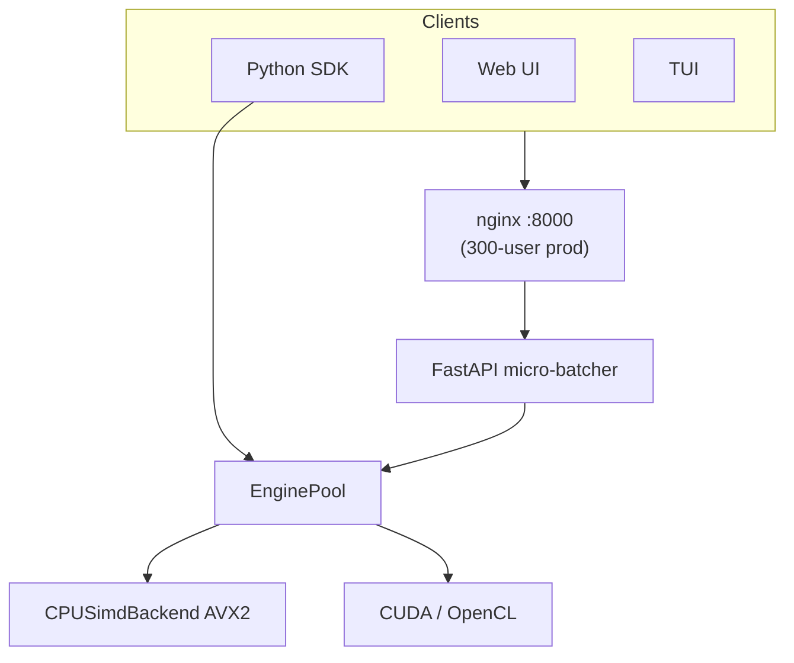
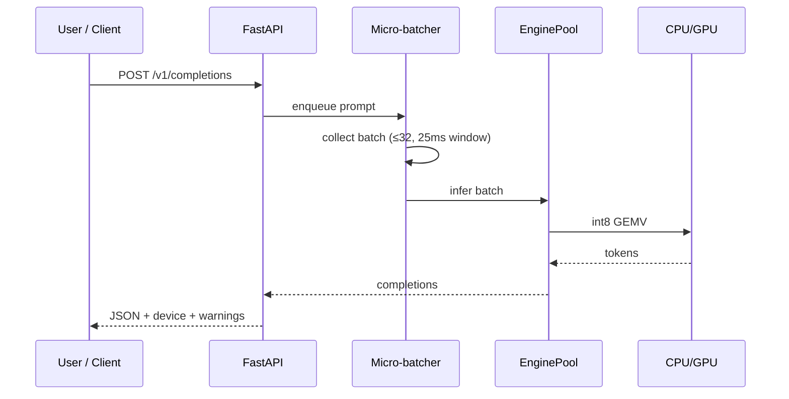

# NanoServe

<p align="center">
  
</p>

<p align="center">
  <strong>Rust allocator · C++23 engine · Python SDK · FastAPI · Web UI · TUI</strong><br/>
  CPU (AVX2) + optional CUDA/OpenCL · Docker or native · scales to <strong>300 concurrent users</strong> without Docker
</p>

<p align="center">
  <a href="documentation/index.html">Documentation</a> ·
  <a href="documentation/SETUP.md">Setup</a> ·
  <a href="documentation/USAGE.md">Usage</a> ·
  <a href="documentation/reports/FULL_TEST_REPORT.md">Test report</a>
</p>

---

## Architecture



### Request flow (animated sequence)



---

## Quick start

### Docker (fastest demo)

```bash
docker compose up --build              # CPU → http://localhost:8000
docker compose --profile gpu up --build   # GPU → http://localhost:8001
```

### Native (no Docker)

**Prior requirements:** [documentation/REQUIREMENTS.md](documentation/REQUIREMENTS.md) — OS packages, Rust, CMake, Python 3.10+, nginx for 300-user production.

```bash
git clone https://github.com/<your-org>/NanoServe.git && cd NanoServe
./install.sh                           # CPU build + venv + .env.nanoserve
ENABLE_CUDA=1 ./install.sh             # optional NVIDIA CUDA

source .venv/bin/activate && source .env.nanoserve
./scripts/run_native.sh                # dev / ~150 users
./scripts/run_native_300.sh            # production / 300 users (nginx + gunicorn)
```

Open **http://localhost:8000** — Web UI with **Compute Engine** dropdown (CPU / GPU / Auto).

---

## How to use

| Task | Command / link |
|------|----------------|
| Full usage guide | [documentation/USAGE.md](documentation/USAGE.md) |
| Web UI | http://localhost:8000 — model, format, precision, download |
| Health check | `curl -s localhost:8000/health \| jq .` |
| List models | `curl -s localhost:8000/v1/models \| jq .` |
| Completions API | `POST /v1/completions` with `device`, `model`, `format`, `precision` |
| Python SDK | `python examples/sdk_demo.py` |
| Terminal chat | `python tui/client.py --device auto --model my-model` |
| Load test | `python3 tests/load_test_report.py --preset 300` |

```bash
curl -X POST http://localhost:8000/v1/completions \
  -H 'Content-Type: application/json' \
  -d '{"prompt":"Hello","max_tokens":24,"device":"auto","model":"my-model","precision":"int8"}'
```

```python
from nanoserve import NanoServe

engine = NanoServe(device="auto", model="my-model")
print(engine.generate("Hello world", max_tokens=50))
engine.download("hf", repo_id="org/model", filename="model.safetensors")
```

---

## Scaling (non-Docker)

| Tier | Users | Command |
|------|-------|---------|
| Dev | ≤50 | `./scripts/run_native.sh` |
| Medium | ~150 | `./scripts/run_native.sh` |
| **Production** | **300** | **`./scripts/run_native_300.sh`** |

Details: [documentation/SCALING.md](documentation/SCALING.md)

---

## Test & quality reports

Human-readable reports in **Markdown, HTML, and PDF**:

| Report | MD | HTML | PDF |
|--------|----|------|-----|
| Full test suite (14/14 pass) | [FULL_TEST_REPORT.md](documentation/reports/FULL_TEST_REPORT.md) | [HTML](documentation/reports/FULL_TEST_REPORT.html) | [PDF](documentation/reports/FULL_TEST_REPORT.pdf) |
| User stress (50/150/300) | [STRESS_REPORT.md](documentation/reports/STRESS_REPORT.md) | [HTML](documentation/reports/STRESS_REPORT.html) | [PDF](documentation/reports/STRESS_REPORT.pdf) |
| Valgrind (0 leaks) | [VALGRIND_REPORT.md](documentation/reports/VALGRIND_REPORT.md) | [HTML](documentation/reports/VALGRIND_REPORT.html) | [PDF](documentation/reports/VALGRIND_REPORT.pdf) |

Regenerate all docs:

```bash
pip install fpdf2
python3 scripts/generate_reports.py
```

Browse: [documentation/index.html](documentation/index.html)

---

## Naming

| Context | Name |
|---------|------|
| GitHub / marketing | **NanoServe** |
| Repo folder | `NanoServe` |
| pip install | `pip install nanoserve` |
| Python import | `from nanoserve import NanoServe` |
| C++ shared lib | `libnanoserve_engine.so` |

---

## Project layout

```
allocator/       Rust buddy-tier memory allocator
engine/          C++23 inference (CPU AVX2, CUDA, OpenCL)
nanoserve/       Python SDK (NanoServe, Quantizer, EnginePool)
server/          FastAPI + static Web UI
tui/             Terminal client + load tester
scripts/         install, production serve, reports, valgrind
documentation/   Setup, usage, requirements, reports (MD/HTML/PDF)
deployment/      nginx config for 300-user native tier
```

---

## Build options

| Flag | Default | Description |
|------|---------|-------------|
| `NANOSERVE_ENABLE_CUDA` | OFF | CUDA INT8 GEMV backend |
| `NANOSERVE_ENABLE_OPENCL` | OFF | OpenCL backend |

```bash
cd engine/build && cmake .. -DNANOSERVE_ENABLE_CUDA=ON && make -j$(nproc)
```

---

## Design notes

- **Backward-compatible FFI:** `engine_init()`, `engine_infer()`, `engine_cleanup()` unchanged on CPU path.
- **Device routing:** `device=cpu|gpu|auto` on API, SDK, Web UI, and TUI.
- **Model routing:** `model`, `format=auto|nanoq|gguf`, `precision=int8|fp16|fp4|raw` on all clients.
- **Auto-quantize:** Raw weights default to int8 `.nanoq`; set `quantize=false` or `precision=raw` to use unquantized fp16 (with warning).
- **Multi-model:** LRU cache (`NANOSERVE_MAX_LOADED_MODELS`); download via HuggingFace Hub or URL.
- **GPU fallback:** Graceful CPU fallback with warnings when GPU unavailable.
- **300-user native:** Same stack as Docker demo — nginx + 4× gunicorn via `run_native_300.sh`; not a separate codebase.

---

## Optional GGUF inference

Real LLM inference via **llama-cpp-python** — opt-in only; default install unchanged.

```bash
pip install -e ".[gguf]"
# or
ENABLE_GGUF=1 ./install.sh

export NANOSERVE_MODEL_PATH=/path/to/model.gguf
curl -X POST localhost:8000/v1/completions \
  -H 'Content-Type: application/json' \
  -d '{"prompt":"Hello","max_tokens":16,"format":"gguf","device":"cpu"}'
```

Docker (optional profile, port 8002):

```bash
docker compose --profile gguf up --build
```

| Env | Default | Purpose |
|-----|---------|---------|
| `NANOSERVE_MODEL_PATH` | — | Default `.gguf` or `.nanoq` path |
| `NANOSERVE_GGUF_N_CTX` | 2048 | Context window |
| `NANOSERVE_GGUF_N_GPU_LAYERS` | 0 | GPU layers when `device=gpu\|auto` |
| `NANOSERVE_GGUF_N_BATCH` | 512 | Batch size |

Use Q4_K_S or Q4_0 GGUF models under 8 GB RAM. For production GGUF, prefer a **single gunicorn worker** to avoid duplicating weights in memory.

---

## License

See repository license file.
