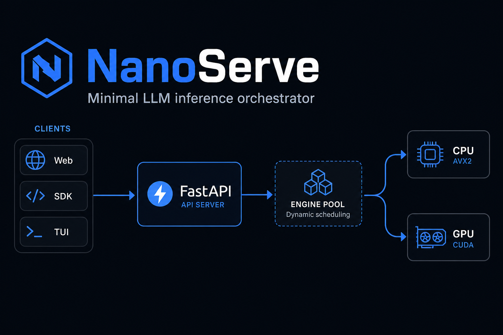
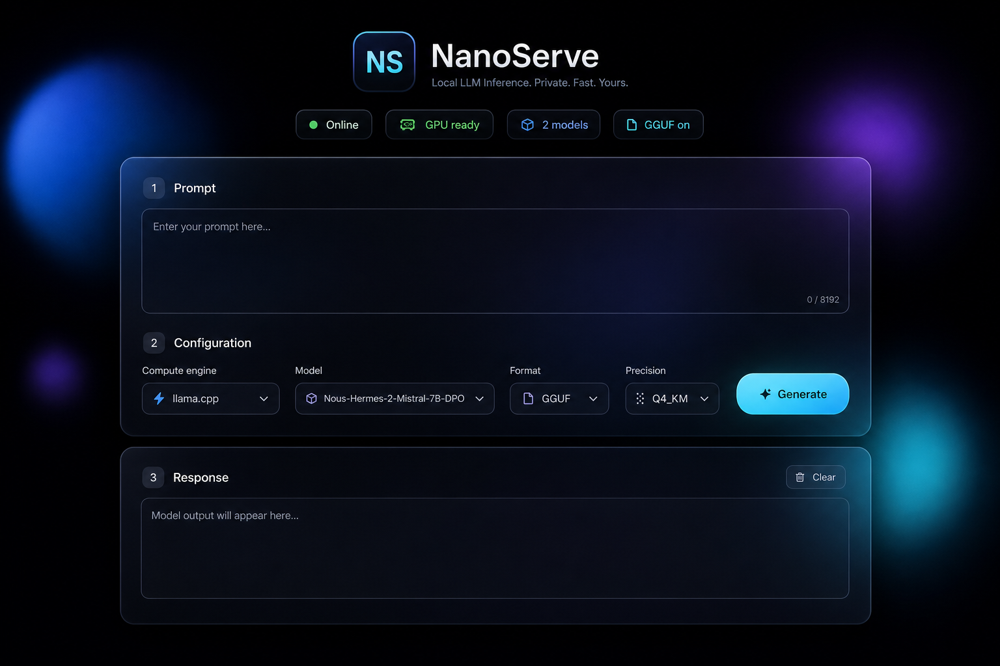
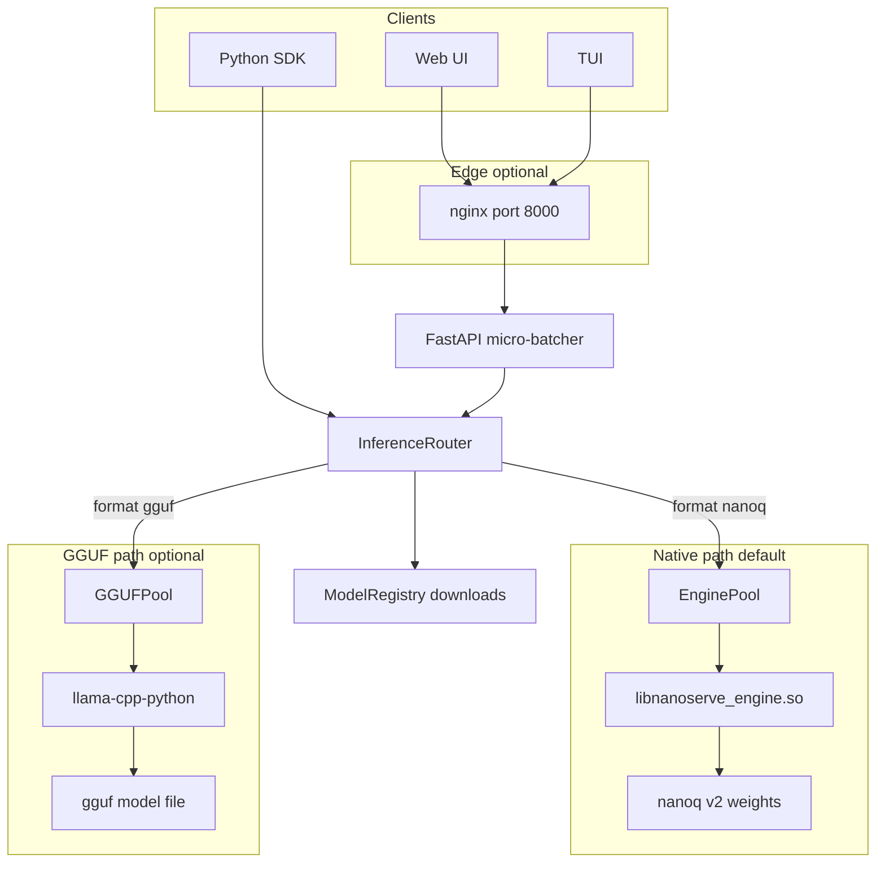
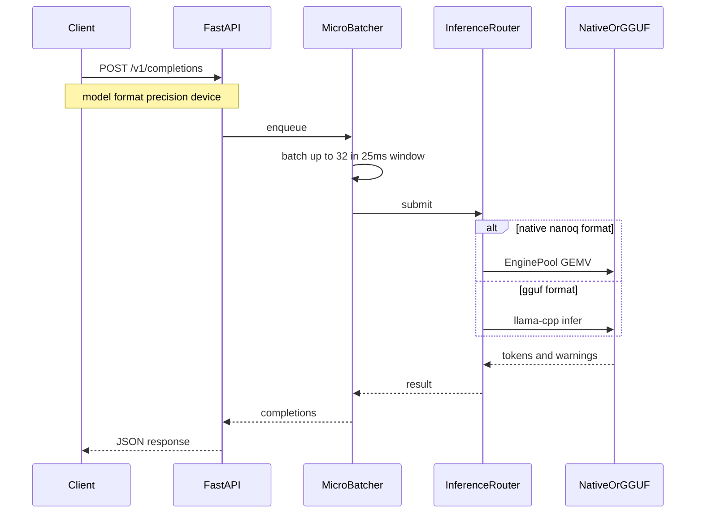

# NanoServe

<p align="center">
  
</p>

<p align="center">
  <strong>Rust allocator · C++23 engine · Python SDK · FastAPI · Web UI · TUI</strong><br/>
  Multi-model · <code>.nanoq</code> v2 (int8/fp16/fp4) · optional GGUF · frosted-glass Web UI<br/>
  CPU (AVX2 SIMD) + optional CUDA/OpenCL · Docker or native · <strong>300 concurrent users</strong>
</p>

<p align="center">
  <a href="documentation/index.html">Documentation</a> ·
  <a href="documentation/Quick-deploy-method.md"><strong>Quick deploy</strong></a> ·
  <a href="documentation/How-to-add-models-doc.md">Add models</a> ·
  <a href="documentation/Quick-test-GGUF.md">Test GGUF</a> ·
  <a href="documentation/connect-network.md">Connect over LAN</a> ·
  <a href="documentation/SETUP.md">Setup</a> ·
  <a href="documentation/USAGE.md">Usage</a> ·
  <a href="documentation/reports/FULL_TEST_REPORT.md">Test report</a>
</p>

---

## What's new

| Area | Highlights |
|------|------------|
| **Quick deploy guide** | [documentation/Quick-deploy-method.md](documentation/Quick-deploy-method.md) — setup, startup, and usage for every deployment method (Docker, native, WASM, SDK, Web UI, TUI) |
| **Add models** | [documentation/How-to-add-models-doc.md](documentation/How-to-add-models-doc.md) — download, register, and use models via Web UI, API, SDK, and TUI |
| **Quick GGUF test** | [documentation/Quick-test-GGUF.md](documentation/Quick-test-GGUF.md) — try tiny real AI models (distilgpt2, SmolLM) via Web, TUI, and phone on Wi‑Fi |
| **LAN & mesh** | [documentation/connect-network.md](documentation/connect-network.md) — phones, laptops, TUI, and multi-host mesh on one network |
| **Web UI** | Frosted-glass panels, animated gradient orbs, live health chips (GPU / models / GGUF); **health-aware** model/format controls |
| **Docker** | CPU `:8000`, GPU `:8001`, GGUF `:8002`; `.dockerignore` + build fixes; user-chosen models (no baked-in default) |
| **Deployment audit** | `scripts/audit_deployments.sh` · `scripts/simulate_tui.py` — smoke-test all Docker profiles |
| **Multi-model** | Registry, HF/URL download, LRU cache; GGUF files in `models/` auto-discovered on startup |
| **Browser WASM** | Optional fourth tier — `./scripts/build_wasm.sh` + `npx serve deployment/wasm`; load `.nanoq` before Generate |

**48 automated tests** across 10 suites (15 in the core integration suite; Emscripten build test skipped when `emcc` absent).

---

## Web UI

<p align="center">
  
</p>

Open **http://localhost:8000** after starting the server.

| Control | Options |
|---------|---------|
| **Compute engine** | CPU · GPU · Auto |
| **Model** | **Built-in demo (no model)** on `:8000` CPU — or **Select model…** on `:8002` GGUF / when models registered |
| **Format** | Auto · Native (`.nanoq`) · GGUF (disabled on CPU-only servers) |
| **Precision** | int8 (default) · fp16 · fp4 · raw |
| **Download model** | HuggingFace repo or direct URL |

**Built-in demo (`:8000`, no model):** synthetic engine output only — fixed vocabulary about the inference pipeline, **not** real AI. For real LLM text use **Docker GGUF** on `:8002` and select a model from the dropdown.

**Visual design**

- **Frosted glass** — `backdrop-filter` panels with subtle borders and depth shadows
- **Animated background** — three drifting gradient orbs (blue / purple / cyan) with a light noise overlay
- **Live status chips** — Online, GPU readiness, model count, GGUF availability (polled from `/health`)
- **Responsive layout** — single-column on mobile; configuration grid on desktop

Static assets live in `server/static/` (`index.html`, `styles.css`, `app.js`). The root URL redirects to `/static/index.html` so CSS and JS load correctly.

---

## Architecture



### Request flow



---

## Quick start

**Full guide for every method:** [documentation/Quick-deploy-method.md](documentation/Quick-deploy-method.md) — Docker (CPU / GPU / GGUF), native dev & production, browser WASM, Python SDK, Web UI, and TUI.

### Docker

```bash
docker compose up --build                        # CPU  → http://localhost:8000
docker compose --profile gpu up --build          # GPU  → http://localhost:8001
docker compose --profile gguf up --build         # GGUF → http://localhost:8002
```

### Native (no Docker)

**Prior requirements:** [documentation/REQUIREMENTS.md](documentation/REQUIREMENTS.md)

```bash
git clone git@github.com:Team-Auralis-Labs/NanoServe.git && cd NanoServe
./install.sh                                     # CPU + models extra + .env.nanoserve
ENABLE_CUDA=1 ./install.sh                       # optional NVIDIA CUDA
ENABLE_GGUF=1 ./install.sh                       # optional llama-cpp-python

source .venv/bin/activate && source .env.nanoserve
./scripts/run_native.sh                          # dev / ~150 users
./scripts/run_native_300.sh                      # production / 300 users
```

### Browser WASM (demo — no Python server)

**Guides:** [Quick deploy — WASM](documentation/Quick-deploy-method.md#7-browser-wasm-demo) · [documentation/WASM.md](documentation/WASM.md)

Requires [Emscripten](https://emscripten.org/). CPU-only `.nanoq` inference in-tab; not for production.

```bash
source /path/to/emsdk/emsdk_env.sh             # emcc on PATH
./scripts/build_wasm.sh                          # or: npm run build:wasm
npx serve deployment/wasm                        # or: npm run serve:wasm
```

Open the URL printed by `serve` → load a `.nanoq` file → Generate.

**Other devices on your Wi‑Fi:** use the host LAN IP — [Connect over LAN](documentation/connect-network.md).

---

## How to use

| Task | Command / link |
|------|----------------|
| **Quick deploy (all methods)** | [documentation/Quick-deploy-method.md](documentation/Quick-deploy-method.md) |
| **Add & use models** | [documentation/How-to-add-models-doc.md](documentation/How-to-add-models-doc.md) |
| **Quick GGUF test (tiny models)** | [documentation/Quick-test-GGUF.md](documentation/Quick-test-GGUF.md) |
| **Connect from phone / other laptop** | [documentation/connect-network.md](documentation/connect-network.md) |
| Full guide | [documentation/USAGE.md](documentation/USAGE.md) |
| Web UI | http://localhost:8000 |
| Health | `curl -s localhost:8000/health \| jq .` |
| List models | `curl -s localhost:8000/v1/models \| jq .` |
| Download model | `POST /v1/models/download` (HF or URL) |
| Completions | `POST /v1/completions` — `device`, `model`, `format`, `precision` |
| Python SDK | `python examples/sdk_demo.py` |
| TUI | `python tui/client.py --device auto --model my-model` |
| Load test | `python3 tests/load_test_report.py --preset 300` |
| **Browser WASM demo** | [documentation/WASM.md](documentation/WASM.md) — `./scripts/build_wasm.sh` |

```bash
curl -X POST http://localhost:8000/v1/completions \
  -H 'Content-Type: application/json' \
  -d '{"prompt":"Hello","max_tokens":24,"device":"auto","model":"my-model","format":"auto","precision":"int8"}'
```

```python
from nanoserve import NanoServe

engine = NanoServe(device="auto", model="my-model", format="auto")
print(engine.generate("Hello world", max_tokens=50))
engine.download("hf", repo_id="org/model", filename="model.safetensors")
print(engine.list_models())
```

### TUI commands

```
/model [id|path]              /format auto|nanoq|gguf   # /model required for GGUF
/precision int8|fp16|fp4|raw    /models
/download hf <repo> [file]      /download url <url>
```

**Deployment smoke tests:**

```bash
bash scripts/audit_deployments.sh              # Docker CPU/GPU/GGUF + WASM static checks
python3 scripts/simulate_tui.py http://localhost:8002 --expect-gguf
```

---

## Multi-model & `.nanoq` v2

**Full guide:** [documentation/How-to-add-models-doc.md](documentation/How-to-add-models-doc.md) — Web UI, API, SDK, TUI, Docker, and manual setup.

| Feature | Detail |
|---------|--------|
| **Weight format** | `.nanoq` v2 header + int8 / fp16 / fp4 payload |
| **Input** | safetensors, raw fp16 arrays, or existing `.nanoq` |
| **Quantizer CLI** | `nanoserve-quantizer weights.safetensors -o model.nanoq --precision fp16` |
| **Auto-convert** | Download pipeline quantizes by default (`NANOSERVE_AUTO_QUANTIZE=1`) |
| **Model cache** | LRU eviction via `NANOSERVE_MAX_LOADED_MODELS` (default 2) |
| **SIMD** | F16C + AVX2 on CPU; matching fp16/fp4 CUDA kernels when built with CUDA |

Environment:

```bash
export NANOSERVE_MODELS_DIR="$HOME/.nanoserve/models"
export NANOSERVE_AUTO_QUANTIZE="1"
export NANOSERVE_MAX_LOADED_MODELS="2"
export NANOSERVE_DEFAULT_PRECISION="int8"
```

---

## Optional GGUF inference

Real LLM output via **llama-cpp-python** — opt-in; default install has zero new dependencies.

**Beginner guide:** [documentation/Quick-test-GGUF.md](documentation/Quick-test-GGUF.md) — download a tiny `.gguf`, start GGUF Docker on port **8002**, test in Web UI / TUI / from your phone on the same Wi‑Fi.

```bash
mkdir -p models
# Download a .gguf into models/ (see Quick-test-GGUF.md)
docker compose --profile gguf up --build   # → http://localhost:8002
```

On `:8002`, `.gguf` files in `./models/` are **auto-registered** at startup. Select the model in the Web UI, TUI (`/model <id>`), or API (`"model": "distilgpt2-Q2_K"`). **Format must be GGUF** for real LLM output.

| Env | Default | Purpose |
|-----|---------|---------|
| `NANOSERVE_MODELS_DIR` | `/models` in GGUF Docker | Registry root; place `.gguf` files here |
| `NANOSERVE_MODEL_PATH` | unset | Optional fallback when `model` omitted (not set in compose) |
| `NANOSERVE_DEFAULT_FORMAT` | `auto` | Default runtime when format omitted |
| `NANOSERVE_GGUF_N_CTX` | 2048 | Context window |
| `NANOSERVE_GGUF_N_GPU_LAYERS` | 0 | GPU layers when `device=gpu\|auto` |
| `NANOSERVE_GGUF_N_BATCH` | 512 | Batch size |

Use **Q4_K_S** or **Q4_0** models under 8 GB RAM. For production GGUF, run a **single gunicorn worker** to avoid duplicating weights in memory.

Missing the `[gguf]` extra → native fallback with a warning (tested in `tests/test_gguf.py`).

---

## Browser WASM demo (optional)

Static-host **fourth tier** — try NanoServe in the browser without FastAPI or Docker.

| | |
|--|--|
| **Build** | `./scripts/build_wasm.sh` |
| **Serve** | `npx serve deployment/wasm` |
| **Docs** | [documentation/WASM.md](documentation/WASM.md) |
| **Tests** | `python3 tests/test_wasm_native.py` · `python3 tests/test_wasm.py` |

Keeps: frosted-glass UI, `.nanoq` v2 (int8/fp16/fp4), CPU GEMV demo. **Load a `.nanoq` file before Generate.**  
Defers: API batcher, multi-model registry, CUDA/GGUF, 300-user scaling.

---

## Scaling (non-Docker)

| Tier | Users | Command |
|------|-------|---------|
| Dev | ≤50 | `./scripts/run_native.sh` |
| Medium | ~150 | `./scripts/run_native.sh` |
| **Production** | **300** | **`./scripts/run_native_300.sh`** |

Details: [documentation/SCALING.md](documentation/SCALING.md)

---

## Test & quality reports

| Report | MD | HTML | PDF |
|--------|----|------|-----|
| Full test suite | [FULL_TEST_REPORT.md](documentation/reports/FULL_TEST_REPORT.md) | [HTML](documentation/reports/FULL_TEST_REPORT.html) | [PDF](documentation/reports/FULL_TEST_REPORT.pdf) |
| User stress (50/150/300) | [STRESS_REPORT.md](documentation/reports/STRESS_REPORT.md) | [HTML](documentation/reports/STRESS_REPORT.html) | [PDF](documentation/reports/STRESS_REPORT.pdf) |
| Valgrind (0 leaks) | [VALGRIND_REPORT.md](documentation/reports/VALGRIND_REPORT.md) | [HTML](documentation/reports/VALGRIND_REPORT.html) | [PDF](documentation/reports/VALGRIND_REPORT.pdf) |

Run tests locally:

```bash
python3 tests/test_suite.py          # 15 integration tests
python3 tests/test_gguf.py           # GGUF routing (no llama required)
python3 tests/test_nanoq_loader.py   # .nanoq v2 loader
python3 tests/test_simd_parity.py    # fp16/fp4 SIMD parity
python3 tests/test_wasm_native.py    # buffer FFI for WASM path
python3 tests/test_wasm.py           # WASM bundle + optional emcc build
# … 48 tests total across tests/test_*.py
```

Regenerate docs: `python3 scripts/generate_reports.py`

Browse: [documentation/index.html](documentation/index.html)

---

## Naming

| Context | Name |
|---------|------|
| GitHub / marketing | **NanoServe** |
| Repo | [Team-Auralis-Labs/NanoServe](https://github.com/Team-Auralis-Labs/NanoServe) |
| pip install | `pip install nanoserve` |
| Python import | `from nanoserve import NanoServe` |
| C++ shared lib | `libnanoserve_engine.so` |

---

## Project layout

```
allocator/         Rust buddy-tier memory allocator
engine/            C++23 inference (.nanoq loader, AVX2 SIMD, CUDA, OpenCL)
nanoserve/
  engine/          SDK, InferenceRouter, optional GGUF pool
  models/          Registry, download, pipeline, LRU cache
  quantizer/       int8 / fp16 / fp4 .nanoq writer
server/
  static/          Web UI (HTML, CSS animations, JS)
tui/               Terminal client + load tester
scripts/           install, production serve, audit_deployments.sh, simulate_tui.py
.dockerignore      Excludes host build artifacts from Docker context
documentation/     Quick deploy, setup, usage, WASM, assets, reports (MD/HTML/PDF)
deployment/
  nginx.conf       300-user native tier
  wasm/            Browser demo (static + optional .wasm build)
```

---

## Build options

| Flag | Default | Description |
|------|---------|-------------|
| `NANOSERVE_ENABLE_CUDA` | OFF | CUDA fp16/fp4 GEMV backend |
| `NANOSERVE_ENABLE_OPENCL` | OFF | OpenCL backend |

```bash
cd engine/build && cmake .. -DNANOSERVE_ENABLE_CUDA=ON && make -j$(nproc)
```

Optional Python extras: `[server]`, `[models]`, `[gguf]`  
Optional browser tier: `./scripts/build_wasm.sh` (requires Emscripten)

---

## Design notes

- **Native default** — `.nanoq` + C++ engine; GGUF is a second runtime behind `pip install nanoserve[gguf]`
- **Orthogonal axes** — `device` (cpu/gpu/auto) and `format` (auto/nanoq/gguf) are independent
- **Backward-compatible FFI** — `engine_init()`, `engine_infer()`, `engine_cleanup()` unchanged on demo path
- **Auto-quantize** — raw weights → int8 `.nanoq` by default; `quantize=false` or `precision=raw` skips (with warning)
- **GPU fallback** — graceful CPU fallback with warnings when GPU unavailable
- **300-user native** — nginx + 4× gunicorn via `run_native_300.sh`; same codebase as Docker demo

---

## License

See repository license file.
