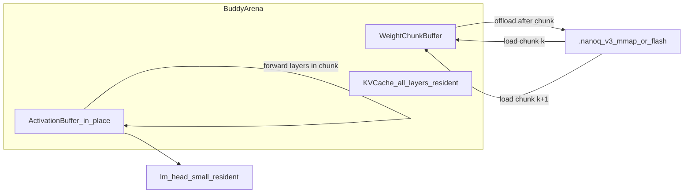
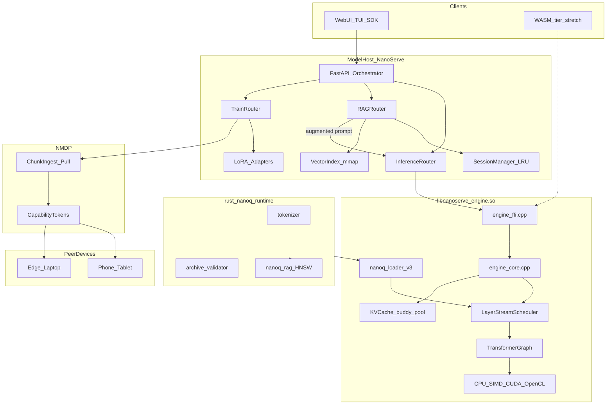
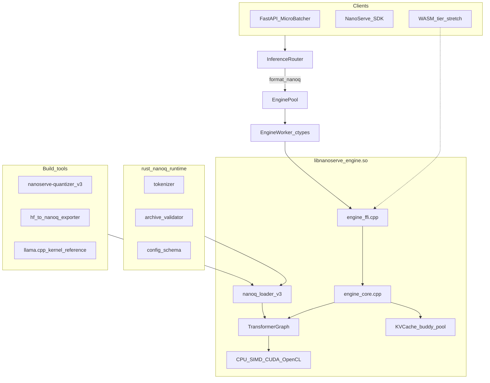
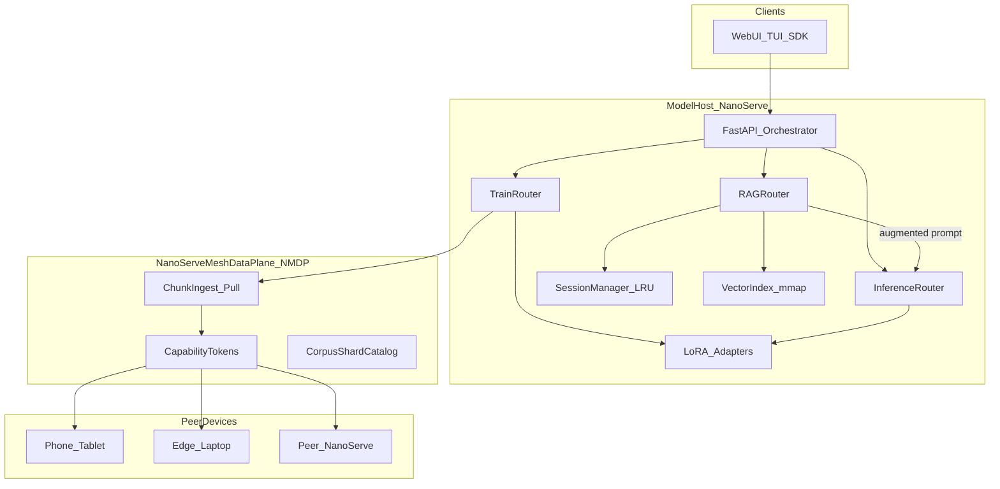
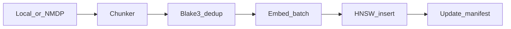
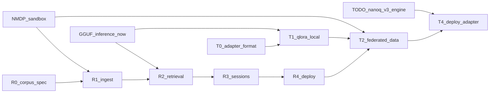
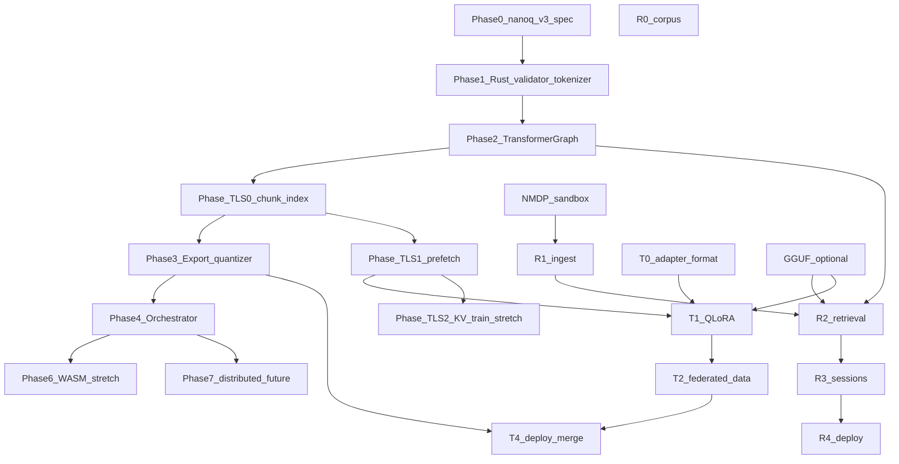

# TODO-NanoServe-Industry-grade-plan — Unified Implementation Prompt for NanoServe

> **Copy-paste this file into an agent session to implement the full NanoServe industry-grade roadmap:**
> native `.nanoq` v3 LLM runtime · Temporal Layer Streaming (TLS) · distributed RAG · lean retrain.
>
> **Supersedes (merged, do not discard detail):**
> - [TODO-nanoq-full-blown-engine.md](TODO-nanoq-full-blown-engine.md) → **Part A**
> - [TODO-RAG-Retrain.md](TODO-RAG-Retrain.md) → **Part B**

---

## Unified prompt header

You are implementing the **industry-grade NanoServe platform** — a *minimal LLM orchestrator* that runs large language models on resource-constrained devices through **Temporal Layer Streaming (TLS)**, **native `.nanoq` v3 inference**, **distributed RAG**, and **lean QLoRA retraining**.

**Dual tagline:**

- *Native `.nanoq` = real LLM* — not *GEMV demo shuffle*.
- *Grounded inference + lean retrain* — not *open file server*.

**Confirmed stack (non-negotiable):**

```
Rust buddy_alloc + nanoq_runtime (validate, tokenizer, checksums)
  → C++23 libnanoserve_engine.so (TransformerGraph + TLS + KVCache + sampling)
  → FastAPI InferenceRouter / RAGRouter / TrainRouter / NMDP
  → Python SDK + Web UI + TUI
  ↘ optional GGUF (llama-cpp-python) — compatibility lane, coexisting
```

**Core innovation — Temporal Layer Streaming (TLS):**

Load a subset of transformer layers into the buddy **arena**, forward activations **in-place** (each layer replaces the prior activation buffer), offload those weights, load the next chunk, repeat until logits. Peak RAM ≈ weight chunk + KV cache + activation buffer — enabling models **2–10× larger than device RAM** on laptops, SBCs, FPGAs, and high-capacity MCUs. TLS lives **inside** `libnanoserve_engine.so` and `.nanoq` v3 — **not** a parallel Rust/Candle stack.

---

## NanoServe motto, scope, and non-negotiables

| Rule | Detail |
|------|--------|
| **Orchestrator-first** | Python/FastAPI coordinates; no Python in inference hot loop |
| **Lean native path** | C++23 owns forward pass, TLS scheduler, sampling |
| **Rust safety net** | Archive validation, tokenizer, Blake3, buddy allocator |
| **Resource-constrained default** | mmap weights, int8/fp4, buddy KV, TLS chunk rotation |
| **GGUF coexistence** | `.nanoq` = primary native; GGUF = optional community lane |
| **Three planes** | Inference · Retrieval · Training — orthogonal, composable |
| **Sandboxed mesh data** | NMDP capability tokens only; no open file server |
| **Train lean** | LoRA/QLoRA default; full fine-tune GPU opt-in only |
| **Backward compat** | v2 demo `.nanoq`, existing `/v1/completions` API unchanged |

---

## Temporal Layer Streaming (TLS) — industrial overview

### Problem TLS solves

Traditional inference loads **all** model weights into RAM. On a 4 GB Raspberry Pi, a 7B Q4 model (~4 GB weights) cannot run. TLS **time-slices** the model: only `chunk_layers` transformer blocks reside in the weight arena at any moment; activations flow forward and are overwritten; weights are released before the next chunk loads.

### Execution model (inference)



### Memory invariant (peak RAM)

| Resident | Rule |
|----------|------|
| Weight chunk | `≤ chunk_layers × largest_layer_bytes` (`NANOSERVE_TLS_CHUNK_LAYERS`) |
| Activation buffer | Single hidden-state tensor `(batch, seq, hidden)` — overwritten each layer |
| KV cache | All layers × seq_len — **must stay resident** during autoregressive decode (offload-to-flash = Phase TLS-2 stretch) |
| Embed + lm_head + norms | Always resident (small) |

**Trade-off:** TLS trades **latency for addressable model size**. KV cache (~500 MB @ 2048 ctx for 7B) is the secondary bottleneck after weight streaming.

### Research alignment (prior art)

| System | Technique | NanoServe mapping |
|--------|-----------|-------------------|
| FlexGen | Weight/activation/KV offload hierarchy | Inspires TLS-2 KV tiering |
| llama.cpp | mmap + lazy paging | `.nanoq` v3 single-archive mmap |
| DeepSpeed ZeRO-Inference | Stream shards to compute | TLS chunk scheduler |
| SwapTransformer | Layer swap for training | TLS-Train backward pass |
| Gradient checkpointing | Recompute activations | TLS-Train on edge without storing all activations |

### Explicit non-deviations (vs generic edge-LLM proposals)

| External suggestion | NanoServe decision |
|-----------------------|-------------------|
| Standalone Rust/Candle engine | **Reject as primary** — C++23 + llama.cpp kernel subset |
| Python hot loop | **Reject** — orchestrator only |
| Scattered safetensors chunk files | **Adapt** — chunks inside `.nanoq` v3 index (single mmap) |
| Generic P2P file sharing | **Reject** — NMDP capability-gated jobs only |
| Full fine-tune default | **Reject** — QLoRA default; TLS-Train stretch after T1 |

---

## Unified target architecture



---


---

<a id="part-a-native-nanoq-v3-llm-runtime"></a>

# PART A — Native `.nanoq` v3 LLM runtime

> **Source:** [TODO-nanoq-full-blown-engine.md](TODO-nanoq-full-blown-engine.md) — preserved in full below.


> **Copy-paste this file into an agent session to implement a full native `.nanoq` LLM runtime.**

---

## Prompt header

You are implementing a **full native `.nanoq` LLM runtime** for **NanoServe** — a minimal LLM orchestrator (Rust buddy allocator, C++23 native engine, FastAPI, Python SDK). The runtime must make **`format=nanoq`** run **real autoregressive transformer inference** — efficient, low-RAM, orchestrator-ready — while **GGUF remains optional and coexisting**.

**Architecture choice (confirmed):**

- **C++23** in `libnanoserve_engine.so` (extend current engine + `.nanoq` v3)
- **Adapt llama.cpp internals** (quant kernels, RoPE, sampling) — vendor subset only; no GGUF loader at runtime
- **Rust** for safety-critical boundaries (archive validation, tokenizer, checksums)

**Tagline:** *Native `.nanoq` = real LLM* — not *GEMV demo shuffle*.

Current stack:

```
Rust buddy_alloc → C++ libnanoserve_engine.so → Python FastAPI (InferenceRouter)
                  ↘ optional GGUF (llama-cpp-python) — unchanged, coexisting
```

---

## Problem statement

Today, native `.nanoq` is a **single-matrix GEMV demo** (`engine/src/engine_core.cpp`): fake activations, 22-word vocab, one scalar dot product. Real LLM output only comes from **GGUF + llama.cpp** (`nanoserve/engine/gguf_worker.py`).

Goal: **`format=nanoq`** produces **coherent LLM text** (distilgpt2-class and beyond) without requiring llama-cpp on the native path.

---

## Non-goals (v1)

- Do **not** remove or break the GGUF path (`format=gguf`, Docker `:8002`).
- Do **not** WASM-compile full LLM in v1 (Phase 6 stretch only).
- Do **not** implement distributed tensor parallelism in v1 (Phase 7 future).
- Do **not** ship GGUF parser as primary weight loader — output format is `.nanoq` v3.
- Do **not** break v2 single-matrix demo load (legacy flag until deprecated).

---

## Design principles

| Principle | Rule |
|-----------|------|
| **Orchestrator-first** | Keep `InferenceRouter` → `EnginePool` → `EngineWorker` → FFI unchanged where possible |
| **Lean native path** | No Python in hot loop; C++23 owns forward pass + sampling |
| **Reuse, don’t reinvent** | Adapt llama.cpp tensor layouts, quant kernels, sampling — vendor subset under `third_party/llama.cpp/` |
| **Rust safety net** | Tokenizer, archive validation, Blake3 checksums, config schema |
| **Resource-constrained** | mmap weights, KV cache in buddy pool, int8/fp4 default, lazy layer load |
| **GGUF coexistence** | `.nanoq` = primary native format; GGUF stays optional for HF/community models |
| **Backward compat** | v2 single-matrix files load as **legacy demo mode** (`legacy_demo: true`) |

---

## Target architecture



---

## Phase 0 — Specification (`.nanoq` v3)

**New format:** archive container (not single matrix). Keep v2 reader for legacy.

### On-disk layout

```
[4B LE magic: 0x4E515033]   # "NQP3"
[4B LE index_len]
[index JSON: tensor catalog + offsets]
[4B LE config_len]
[config JSON: architecture, hyperparams]
[4B LE tokenizer_len]
[tokenizer blob: BPE/SentencePiece bytes]
[tensor payloads: 64-byte aligned, mmap-friendly]
[32B footer: Blake3 hash of all bytes before footer]
```

### Index entry (per tensor)

| Field | Description |
|-------|-------------|
| `name` | e.g. `blk.0.attn_q.weight` |
| `dtype` | `int8` \| `fp16` \| `fp4` \| `fp32` |
| `shape[]` | Tensor dimensions |
| `offset`, `size` | Byte range in payload section |
| `scale_offset` | Optional scales blob offset |
| `quant` | `none` \| `per-row` \| `per-block` (block_size 32/64/128) |

### Config block (architecture enum)

**v1 targets:** `gpt2`, `llama` (covers distilgpt2, SmolLM-class)

| Field | Example |
|-------|---------|
| `arch` | `"gpt2"` |
| `vocab_size` | 50257 |
| `hidden_size` | 768 |
| `n_layers` | 6 |
| `n_heads` | 12 |
| `n_kv_heads` | 12 (GQA for Llama) |
| `max_seq_len` | 2048 |
| `norm_eps` | 1e-5 |
| `rope_theta` | 10000 |
| `act_fn` | `"gelu"` |

### Files to add/extend

| File | Action |
|------|--------|
| `engine/include/nanoq_loader.hpp` | Add `NanoqArchive`, `NanoqConfig`, v3 API |
| `engine/include/nanoq_archive.hpp` | v3 mmap parser (new) |
| `engine/src/nanoq_loader.cpp` | v3 + v2 legacy fallback |
| `rust/nanoq_runtime/` | Footer hash, index sanity, bounds checks |
| `nanoserve/quantizer/quantize.py` | v3 writer |

**Acceptance:** Load distilgpt2-class fixture `.nanoq` v3; `engine_model_info` returns architecture + layer count.

---

## Phase 1 — Rust safety layer

New crate: `rust/nanoq_runtime/`

| Module | Responsibility |
|--------|----------------|
| `validate` | Parse index/config off hot path; reject OOB offsets; Blake3 footer |
| `tokenizer` | BPE (GPT-2) + SentencePiece (Llama) — encode/decode FFI |
| `manifest` | Model card metadata for registry |

**FFI surface (C ABI from Rust):**

```c
int  nanoq_archive_validate_path(const char* path);
int  nanoq_archive_validate(const uint8_t* data, size_t len);
void* nanoq_tokenizer_create(const uint8_t* data, size_t len);
void  nanoq_tokenizer_destroy(void* handle);
int  nanoq_tokenizer_encode(void* handle, const char* text, uint32_t* out_ids, size_t max_ids);
char* nanoq_tokenizer_decode(void* handle, const uint32_t* ids, size_t num_ids);
void  nanoq_string_free(char* s);
int  nanoq_tokenizer_vocab_size(void* handle);
```

Wire into `engine/src/engine_ffi.cpp`; embed tokenizer handle in `EngineHandle`.

**Acceptance:** Round-trip encode/decode for GPT-2 BPE matches `transformers` on fixture strings.

---

## Phase 2 — C++ transformer graph (core inference)

Replace demo loop in `engine/src/engine_core.cpp`.

### New components

| Component | Location | Notes |
|-----------|----------|-------|
| `TransformerModel` | `engine/include/transformer.hpp` | Owns tensor refs into mmap archive |
| `TransformerGraph` | `engine/src/transformer_gpt2.cpp`, `transformer_llama.cpp` | Architecture-specific forward |
| `KVCache` | `engine/include/kv_cache.hpp` | Per-layer K/V; allocate from buddy pool |
| `Sampler` | `engine/src/sampler.cpp` | greedy, top-k, top-p, temperature |
| `TensorOps` | `engine/src/ops/` | matmul, rms_norm, rope, softmax, silu/gelu |

### llama.cpp adaptation strategy

- **Copy/adapt** (with license header): Q4/Q8 matmul micro-kernels, RoPE, softmax, sampling
- **Do not** depend on GGUF loader at runtime
- `third_party/llama.cpp/` vendor subset — CMake option `NANOSERVE_LLAMA_CPP_KERNELS=1`
- Map `ggml_type` patterns → `.nanoq` v3 dtype enums in thin adapter header

### Backend extensions (`engine/include/backend.hpp`)

Extend beyond scalar GEMV:

- `gemm_int8`, `gemm_fp16`, `gemm_fp4` (M×K × K×N)
- `attention_qkv` fused where SIMD allows
- CUDA/OpenCL: int8/fp16 matmul first; attention on CPU if needed

### Fix existing bug

Apply per-row / per-block scales in int8 paths (`engine/src/backend_cpu.cpp`) — scales loaded but unused today.

### New FFI (backward compatible)

Keep `engine_infer()`; add optional:

```c
int engine_infer_stream(void* handle, const char* prompt, int max_tokens,
                        void (*callback)(const char* token, void* user), void* user);
int engine_reset_kv(void* handle);
int engine_set_sampler(void* handle, const char* json_opts);
```

**Acceptance:** distilgpt2 `.nanoq` v3 generates coherent English on CPU; output ≠ 22-word vocab demo.

---

## Phase 3 — Quantizer & export pipeline

Extend `nanoserve/models/pipeline.py` and quantizer.

### CLI

```bash
# Full model export (safetensors / HF repo)
nanoserve-quantizer export hf:distilgpt2 \
  --out models/distilgpt2-int8.nanoq \
  --arch gpt2 --precision int8

# Single-tensor legacy v2 still supported
nanoserve-quantizer --rows 256 --cols 1024 --out demo.nanoq
```

### Export steps

1. Load HF weights (safetensors preferred; `.bin` via safetensors conversion)
2. Map tensor names → v3 index (GPT-2 / Llama naming tables)
3. Quantize per-tensor (int8 default; fp4 for large layers optional)
4. Embed `tokenizer.json` / `spm.model`
5. Write v3 archive + Rust validation pass

### Auto-quantize path

`prepare_model()`: if safetensors dir → export v3 (not single-matrix v2).

**Acceptance:** Web UI “Download model” produces v3 `.nanoq`; `/v1/completions` with `format=nanoq` returns real text.

---

## Phase 4 — Orchestrator integration (zero API break)

| Layer | Change |
|-------|--------|
| `nanoserve/engine/router.py` | None — `format=nanoq` already routes native |
| `nanoserve/engine/worker.py` | Bind new FFI symbols if streaming added |
| `nanoserve/models/registry.py` | Store `arch`, `vocab_size`, `quantized`, v3 paths |
| `server/main.py` | Optional SSE/streaming via `engine_infer_stream` |
| `server/static/app.js` | Stream tokens when available |

**Multi-model / LRU:** Existing `ModelCache` + per-path workers — ensure `engine_reload_model` resets KV cache.

**Distributed mesh:** No new cluster protocol in v1 — each host runs full v3 model. Nginx `least_conn` unchanged (`documentation/connect-network.md`).

**Acceptance:** `bash scripts/audit_deployments.sh` passes native path with real `.nanoq` v3; distilgpt2 parity vs GGUF on same prompt (qualitative).

---

## Phase 5 — Efficiency & low-resource profile

| Technique | Implementation |
|-----------|----------------|
| **mmap weights** | `mmap()` archive; no full-RAM copy |
| **Buddy pool KV** | Reuse `allocator/` Rust buddy for K/V growth |
| **Layer-wise peak RAM** | Optional: load attention weights on demand for fp16 fallback |
| **Batching** | Extend micro-batcher to batch prefill when prompts align (same model) |
| **Threading** | `NANOSERVE_NUM_WORKERS` — one graph per worker; no GIL |
| **Defaults** | int8 v3, `max_seq_len=2048`, LRU `NANOSERVE_MAX_LOADED_MODELS=2` |

**Target budgets (distilgpt2-class, int8):**

| Metric | Target |
|--------|--------|
| Weights on disk | ~80–120 MB |
| RAM at inference | mmap + KV ~50–150 MB @ 2048 ctx |
| Latency vs GGUF Q4 | within 1.5× on same CPU (v1 goal) |

---


> **TLS cross-link (Phase 5):** Phase 5 "Layer-wise peak RAM" is the entry point for **Temporal Layer Streaming**. See [Part C — TLS implementation deep-dive](#part-c-tls-implementation-deep-dive) and [Phase TLS-0 / TLS-1](#phase-tls-0--chunk-index--correctness) in the unified build order. Env: `NANOSERVE_TLS_CHUNK_LAYERS`, `NANOSERVE_TLS_PREFETCH`, `NANOSERVE_TLS_WEIGHT_ARENA_MB`.

## Phase 6 — WASM tier (stretch)

After native v3 stable:

- Raise `deployment/wasm/nanoserve.js` cap selectively (e.g. 128 MB) with user warning
- Ship **tiny** v3 models only (distilgpt2-int8 if fits)
- Streaming via JS callback from `engine_infer_stream`
- Keep GGUF out of WASM

---

## Phase 7 — Distributed orchestrator extensions (future)

Only after single-node v3 is production-ready:

| Feature | Description |
|---------|-------------|
| **Pipeline parallelism** | Split layers across mesh hosts; coordinator in FastAPI |
| **Tensor shards in v3** | Index marks shard id; partial forward RPC |
| **Federated registry** | Sync model manifests across hosts |
| **Format routing** | Router picks host with model loaded + lowest queue |

Not in initial scope.


> **TLS cross-link (Phase 7):** Distributed pipeline parallelism (layers across mesh hosts) complements single-device TLS (layers across time). TLS on each host reduces per-node RAM; Phase 7 splits chunks across nodes. See [Unified dependency graph](#unified-dependency-graph--build-order).

---

## Testing strategy

| Test | File |
|------|------|
| v3 loader round-trip | `tests/test_nanoq_v3_loader.py` |
| Tokenizer parity | `tests/test_tokenizer_rust.py` |
| GPT-2 forward golden | `tests/test_transformer_gpt2.cpp` (native) |
| vs GGUF qualitative | `tests/test_nanoq_vs_gguf.py` (skip if no gguf) |
| FFI streaming | `tests/test_engine_stream.py` |
| WASM smoke | extend `tests/test_wasm_native.py` |
| Memory budget | `tests/test_nanoq_memory.py` (RSS cap) |

---

## File touch list (summary)

**New**

- `engine/include/transformer.hpp`, `engine/src/transformer_*.cpp`
- `engine/include/kv_cache.hpp`, `engine/src/kv_cache.cpp`
- `engine/include/nanoq_archive.hpp`
- `engine/src/ops/` (matmul, norm, rope, attn)
- `engine/src/sampler.cpp`
- `rust/nanoq_runtime/` (validate, tokenizer)
- `third_party/llama.cpp/` (vendor subset, CMake gated)
- `nanoserve/quantizer/export_hf.py`
- `tests/test_nanoq_v3_*.py`, `tests/test_transformer_gpt2.cpp`

**Modify**

- `engine/src/engine_core.cpp` — replace demo infer
- `engine/include/nanoq_loader.hpp`, `engine/src/nanoq_loader.cpp`
- `engine/include/backend.hpp`, backend sources
- `engine/src/engine_ffi.cpp`
- `engine/CMakeLists.txt` — Rust crate link, llama.cpp subset
- `nanoserve/quantizer/quantize.py`, `nanoserve/models/pipeline.py`
- `nanoserve/engine/worker.py`
- Docs: `README.md`, `documentation/How-to-add-models-doc.md`, `documentation/WASM.md`

**Do not break**

- GGUF path (`nanoserve/engine/gguf_worker.py`)
- v2 demo `.nanoq` load (legacy flag in `engine_model_info`)

---

## Implementation order (recommended)

1. **Phase 0** — v3 spec + validator (Rust) + empty graph loads
2. **Phase 1** — tokenizer FFI
3. **Phase 2** — GPT-2 graph + KV + sampler (CPU int8)
4. **Phase 3** — HF exporter for distilgpt2
5. **Phase 4** — orchestrator wiring + streaming
6. **Phase 5** — mmap, CUDA matmul, perf tuning
7. **Phase 6** — WASM stretch
8. **Phase 7** — distributed (future)

---

## Test commands

```bash
# Build engine + Rust runtime
cd rust/nanoq_runtime && cargo build --release
cd engine/build && cmake .. && make -j$(nproc)

# Export distilgpt2 to v3
nanoserve-quantizer export hf:distilgpt2 \
  --out models/distilgpt2-int8.nanoq --arch gpt2 --precision int8

# Native inference
curl -X POST localhost:8000/v1/completions \
  -H 'Content-Type: application/json' \
  -d '{"prompt":"Hello","max_tokens":32,"format":"nanoq","model":"distilgpt2-int8"}'

# Compare vs GGUF (optional)
curl -X POST localhost:8002/v1/completions \
  -H 'Content-Type: application/json' \
  -d '{"prompt":"Hello","max_tokens":32,"format":"gguf","model":"distilgpt2-Q2_K"}'

# Unit tests
python3 tests/test_nanoq_v3_loader.py
python3 tests/test_tokenizer_rust.py
python3 tests/test_nanoq_vs_gguf.py
```

---

## Acceptance checklist

- [ ] `format=nanoq` produces **real LLM text** for distilgpt2-class models
- [ ] **No llama-cpp-python** required on native path
- [ ] GGUF `:8002` profile **unchanged** and coexisting
- [ ] Memory footprint **≤ GGUF Q4** for same model class (mmap + int8)
- [ ] Existing API (`/v1/completions`, SDK, TUI) works without client changes
- [ ] Legacy v2 demo still loads with `legacy_demo: true` in model info
- [ ] Blake3 footer validation rejects tampered archives
- [ ] `engine_reset_kv` clears conversation state between prompts
- [ ] `bash scripts/audit_deployments.sh` passes with v3 model on native path

---

## Success criteria

- Native `.nanoq` is a **first-class LLM runtime**, not a GEMV demo
- Orchestrator (`InferenceRouter`, micro-batcher, mesh HTTP) gains full LLM on `format=nanoq` without API changes
- Resource profile suitable for edge / low-RAM hosts (int8 + mmap + buddy KV)
- Clear migration path from v2 demo → v3 full models
- GGUF remains the compatibility lane for community `.gguf` files

---

<a id="part-b-distributed-rag-lean-retrain"></a>

# PART B — Distributed RAG + lean retrain

> **Source:** [TODO-RAG-Retrain.md](TODO-RAG-Retrain.md) — preserved in full below.


> **Copy-paste this file into an agent session to implement distributed RAG deployment and federated model retraining.**

---

## Prompt header

You are implementing a **distributed RAG system** and **model retraining system** for **NanoServe** — a minimal LLM orchestrator (Rust buddy allocator, C++23 native engine, FastAPI, Python SDK, optional GGUF). The system must be:

- **Stateful** — multi-turn chat + retrieval context without reloading full corpora each request
- **Memory and resource efficient** — mmap indexes, int8 embeddings, LRU bounds, content-addressed dedup
- **Distributed** — model host pulls data from phones, laptops, and peer mesh nodes over the network (same LAN reachability as today's HTTP mesh)
- **Network sandboxed** — peers share **only approved corpus shards** with **only the active NanoServe job**; channel closes when the session ends

**Tagline:** *Grounded inference + lean retrain* — not *open file server*.

Current stack (unchanged baseline):

```
Rust buddy_alloc → C++ libnanoserve_engine.so → FastAPI (InferenceRouter)
                  ↘ optional GGUF (llama-cpp-python)
                  ↘ LAN HTTP mesh (documentation/connect-network.md) — no cluster protocol today
```

**Related planning docs:**

- [Part A — Native `.nanoq` v3 LLM runtime](#part-a-native-nanoq-v3-llm-runtime) — full native LLM runtime (prerequisite for native adapter merge/export)
- [TODO-plan-GGUF.md](TODO-plan-GGUF.md) — GGUF inference path (usable for RAG + train before native v3)

---

## Problem statement

NanoServe today is **stateless inference-only** (`server/main.py`, `nanoserve/engine/router.py`):

- No conversation memory beyond a single `/v1/completions` call
- No retrieval-augmented generation (RAG)
- No fine-tuning or adapter training
- Mesh = independent HTTP hosts; **no secure data-sharing protocol**

Users need:

1. **RAG at deploy time** — grounded answers from private corpora, low RAM, works on mesh hosts
2. **Retraining on the model host** — ingest training data from edge devices over the network
3. **Stateful sessions** — multi-turn chat + RAG context with bounded memory
4. **Sandboxed networking** — data visible to NanoServe **only during an active ingest/train job**

---

## Non-goals (v1)

- Do **not** build a general-purpose P2P file sync or NAS replacement
- Do **not** allow anonymous or persistent peer filesystem access
- Do **not** require full-weight fine-tuning as default — **LoRA/QLoRA only** in v1
- Do **not** implement FedAvg / federated gradient aggregation in v1 (Phase T3 stretch)
- Do **not** break existing `/v1/completions` without RAG flags
- Do **not** break GGUF (`:8002`) or native inference paths
- Do **not** bundle heavy ML stacks in default `pip install` — use optional `[rag]` and `[train]` extras
- Do **not** run training inside the WASM browser tier

---

## Design principles

| Principle | Rule |
|-----------|------|
| **Stateful but bounded** | Session TTL, max messages in memory, LRU eviction for sessions + chunk cache |
| **Memory-first** | mmap vector index + chunk store; int8/fp16 embeddings; Blake3 content-addressed dedup |
| **Distributed by default** | Corpora may live on peers; model host **pulls shards on demand** during ingest/train jobs |
| **Sandboxed networking** | NMDP active only for declared jobs; capability tokens + deny-by-default; auto-revoke on expiry |
| **Orchestrator-native** | Extend FastAPI coordinator; optional Docker profiles — no mandatory separate RAG server |
| **Format-agnostic** | RAG works with GGUF now; native `.nanoq` v3 when full engine lands |
| **Train lean** | Default LoRA/QLoRA adapters; full fine-tune opt-in on GPU hosts only |
| **Three planes** | Inference, Retrieval, Training — orthogonal, composable |

---

## Target architecture



### Three planes on the model host

| Plane | Role | Existing hook |
|-------|------|---------------|
| **Inference** | LLM token generation | `InferenceRouter` → `EnginePool` / `GGUFPool` |
| **Retrieval** | Embed → search → rerank → inject context | New `RAGRouter` |
| **Training** | LoRA/QLoRA coordinator; federated data pull | New `TrainRouter` |

---

## NanoServe Mesh Data Plane (NMDP)

**Session-scoped protocol** — not open file sharing. Analogous to today's `npx serve` reachability, but **capability-gated** and **job-bound**.

### Session lifecycle

1. **Coordinator** (model host) creates `DataJob`:

   ```json
   {
     "job_id": "uuid",
     "type": "ingest|train",
     "expires_at": "ISO8601",
     "allowed_peers": ["device-id-1", "device-id-2"],
     "max_bytes": 1073741824,
     "allowed_mime": ["text/plain", "text/markdown", "application/json"]
   }
   ```

2. Issues **capability token** (HMAC-signed JWT or macaroon) scoped to: `job_id`, peer device id, max bytes, allowed MIME/types, shard id prefix allowlist
3. **Peer** runs `nanoserve-data-agent` — exposes only manifest + chunk blobs registered for that job
4. On job complete / TTL / cancel → tokens revoked; peer agent stops serving; coordinator drops staging buffers

### Transport

| Option | Detail |
|--------|--------|
| Dedicated port | **8010** for NMDP (recommended) |
| Same port | `/v1/mesh/data/*` with strict middleware on `:8000` |
| Security | TLS required on non-localhost; **mTLS optional** for LAN mesh |
| Chunk fetch | `GET /v1/mesh/data/shard/{id}` + `Authorization: Bearer <capability>` |
| Deny | No directory listing, no arbitrary paths — **catalog entries only** |

### Peer agent (edge device)

```bash
# User explicitly selects folders; agent runs only while token valid
nanoserve-data-agent \
  --share ./my-docs \
  --job-token "<capability>" \
  --coordinator http://192.168.1.42:8010 \
  --device-id laptop-alice
```

- Builds manifest at startup (chunk ids, Blake3 hashes, byte sizes)
- Serves shards only matching the capability scope
- Exits or idles when token expires or coordinator sends cancel
- **No access** from coordinator outside active job window

### Coordinator staging

```
~/.nanoserve/staging/{job_id}/
  manifest.json          # merged peer manifests
  shards/                # pulled blobs (deleted after ingest/train)
  audit.log              # who pulled what, when
```

---

## Phase R0 — Corpus + index specification

### On-disk layout

```
~/.nanoserve/corpora/{corpus_id}/
  manifest.json          # chunk catalog + metadata
  index.hnsw             # mmap vector index (Rust)
  index.meta.json        # dim, metric, quant dtype
  chunks/
    {blake3_hex}.chunk   # content-addressed, mmap-readable
```

### Corpus manifest entry

```json
{
  "chunk_id": "c_001",
  "hash": "blake3:...",
  "source": "peer:laptop-alice|local:./docs/foo.md",
  "offset": 0,
  "length": 4096,
  "mime": "text/markdown",
  "meta": { "title": "...", "page": 1 }
}
```

### Vector index (Rust: `rust/nanoq_rag/`)

- **Algorithm:** HNSW default; IVF-PQ optional for very large corpora
- **Quantization:** int8 embeddings default (384-dim → ~384 bytes/vector + graph overhead)
- **Metric:** cosine (normalize on ingest)
- **Embedding model:** small GGUF embedder (e.g. gte-small) via existing GGUF path, or `.nanoq` embed head post v3

### Files to add

| File | Action |
|------|--------|
| `rust/nanoq_rag/Cargo.toml` | New crate: HNSW, BM25, chunk store |
| `rust/nanoq_rag/src/index.rs` | mmap HNSW insert/search |
| `rust/nanoq_rag/src/chunk_store.rs` | Blake3-addressed blobs |
| `nanoserve/rag/spec.py` | Manifest schema, corpus id helpers |

**Acceptance:** Ingest 1 MB fixture corpus; index builds; query returns top-k chunk ids with scores.

---

## Phase R1 — Ingest pipeline

### Chunkers

| Format | Handler |
|--------|---------|
| Plain text / markdown | Fixed-size + paragraph-aware splits |
| JSONL | `{ "text": "..." }` or Q&A pairs |
| PDF | Optional `[rag]` extra (`pypdf` or similar) |

### Pipeline flow



- Embed batching with backpressure; disk-spill queue for large ingest
- **Distributed ingest:** coordinator creates NMDP job → peers run data-agent → coordinator pulls shards → dedup by hash → local index

### API

```python
POST /v1/rag/corpora/ingest
{
  "corpus_id": "my-kb",
  "sources": [
    { "type": "local", "path": "/path/to/docs" },
    { "type": "mesh", "job_id": "uuid", "peer_device_ids": ["laptop-alice"] }
  ],
  "chunk_size": 512,
  "chunk_overlap": 64
}
```

**Acceptance:** Ingest from local path + mock peer agent; duplicate chunks stored once (Blake3 dedup).

---

## Phase R2 — Retrieval + rerank

### Hybrid search

| Stage | Implementation |
|-------|----------------|
| Dense | HNSW top-k (Rust) |
| Sparse | BM25 via `tantivy` or lightweight Rust inverted index |
| Fusion | RRF (reciprocal rank fusion) or weighted sum |
| Rerank | Optional cross-encoder (small GGUF / CPU); off by default |

### Context budget manager

- Given LLM `max_context` (from model config or env), fit top-k chunks without overflow
- Truncate chunks by token estimate; prioritize rerank score
- Return `{ chunk_ids[], context_text, tokens_used }` for injection

### Prompt template (injected before inference)

```
System: Answer using only the context below. Cite chunk ids when relevant.

Context:
[chunk c_001] ...
[chunk c_002] ...

User: {message}
```

### API

```python
POST /v1/rag/corpora/{corpus_id}/query
{
  "query": "What is the refund policy?",
  "top_k": 8,
  "rerank": false
}
```

**Acceptance:** Query returns ranked chunks; context fits configured token budget.

---

## Phase R3 — Stateful RAG sessions

### Session store

```
~/.nanoserve/sessions/
  {session_id}.json       # metadata, message history pointers
  {session_id}.cache      # mmap hot retrieval cache for session
```

### Session record

```json
{
  "session_id": "uuid",
  "corpus_id": "my-kb",
  "model": "distilgpt2-Q2_K",
  "format": "gguf",
  "messages": [
    { "role": "user", "content": "..." },
    { "role": "assistant", "content": "..." }
  ],
  "retrieved_chunk_ids": ["c_001", "c_003"],
  "created_at": "...",
  "expires_at": "..."
}
```

### Environment variables

```bash
NANOSERVE_SESSION_TTL_S=3600          # default session lifetime
NANOSERVE_MAX_SESSIONS=128            # LRU cap
NANOSERVE_SESSION_CHUNK_CACHE_MB=64   # per-session retrieval cache
NANOSERVE_CORPUS_CHUNK_CACHE_MB=256   # global hot chunk LRU
```

### Flow

1. `POST /v1/rag/sessions` → create session bound to corpus + model
2. `POST /v1/rag/chat` → retrieve (with session history query expansion optional) → augment prompt → `InferenceRouter.submit()`
3. Append assistant reply; update `retrieved_chunk_ids`
4. Session delete or TTL → free cache; call `engine_reset_kv` if engine session handle exists

### Separation of concerns

| State | Owner |
|-------|-------|
| Message history + retrieval cache | `SessionManager` (Python or Rust) |
| Transformer KV cache | C++ engine (`engine_reset_kv` per [Part A — Phase 2](#phase-2--c-transformer-graph-core-inference)) |

**Acceptance:** Multi-turn chat retrieves relevant chunks; memory bounded under `NANOSERVE_MAX_SESSIONS` load test.

---

## Phase R4 — Deploy integration

### FastAPI / health

Extend `GET /health`:

```json
{
  "rag_available": true,
  "corpora_registered": 2,
  "index_size_bytes": 10485760,
  "active_sessions": 5,
  "nmdp_port": 8010,
  "mesh_jobs_active": 0
}
```

### Docker profile (optional)

```yaml
# docker-compose.yml — profile: rag
nanoserve-rag:
  ports:
    - "8003:8000"
    - "8010:8010"
  environment:
    - NANOSERVE_ENABLE_RAG=1
    - NANOSERVE_NMDP_PORT=8010
  volumes:
    - nanoserve-corpora:/root/.nanoserve/corpora
```

### Web UI additions (`server/static/`)

- **Corpus** panel: create, ingest (local / URL / mesh job)
- **Chat** mode: session picker, grounded replies with chunk citations
- **Mesh job** wizard: generate capability token QR / copy for peer agent

### SDK

```python
from nanoserve import NanoServe

engine = NanoServe()
session = engine.rag_create_session(corpus_id="my-kb", model="distilgpt2-Q2_K", format="gguf")
reply = engine.rag_chat(session_id=session.id, message="Summarize the handbook")
```

**Acceptance:** End-to-end RAG chat from Web UI and SDK on GGUF host; citations visible in response metadata.

---

## Phase T0 — Adapter format + registry

### LoRA adapter pack (`.nanoadapt`)

```
[4B magic: 0x4E414453]   # "NADS"
[4B index_len]
[index JSON: lora tensors + offsets]
[config JSON: rank, alpha, target_modules, base_model_id]
[tensor payloads]
[32B Blake3 footer]
```

Alternatively: embed adapter tensors as a labeled section in `.nanoq` v3 index (post full engine).

### Registry extension

Extend `ModelEntry.extra` in `nanoserve/models/registry.py`:

```json
{
  "adapters": [
    {
      "id": "support-bot-v1",
      "path": "~/.nanoserve/adapters/support-bot-v1.nanoadapt",
      "base_model": "distilgpt2-Q2_K",
      "rank": 8,
      "created_at": "..."
    }
  ]
}
```

### Inference routing

- `InferenceRouter.submit(..., adapter_id="support-bot-v1")` → load base + adapter
- GGUF v1: document as **future** (llama.cpp LoRA); v1 may serve merged export only

**Acceptance:** Register adapter manifest; API accepts `adapter_id` field (stub ok until T1 completes).

---

## Phase T1 — Local QLoRA trainer

### Optional extra

```toml
# pyproject.toml
train = ["peft>=0.10", "bitsandbytes>=0.43", "datasets>=2.14", "accelerate>=0.27"]
```

### Trainer module (`nanoserve/train/qlora.py`)

- Input: JSONL `{ "prompt", "completion" }` or `{ "text" }` in staging shard
- Base: HuggingFace model or GGUF-exported weights path
- Output: `.nanoadapt` pack + registry entry
- CPU: rank ≤ 4, tiny datasets only; GPU profile: distilgpt2-class default

### API

```python
POST /v1/train/jobs
{
  "base_model": "distilgpt2-Q2_K",
  "adapter_id": "support-bot-v1",
  "data_job_id": "uuid",           # NMDP staging shard
  "config": { "rank": 8, "alpha": 16, "epochs": 3, "lr": 2e-4 }
}

GET /v1/train/jobs/{id}
POST /v1/train/adapters/register
```

**Acceptance:** Train adapter on local JSONL fixture; register; inference path accepts adapter_id (merged or sidecar per format support).


> **TLS-Train cross-link (Phase T1):** Local QLoRA via `[train]` extra is the default training path. For edge hosts without PyTorch, **TLS-Train** (native streamed backward + gradient checkpointing) is documented in [Part C](#part-c-tls-implementation-deep-dive) as stretch after T1. Adapter weights stay resident; base weights stream per chunk.

---

## Phase T2 — Federated data collection (NMDP)

### Train job + data job linkage

1. Create NMDP `DataJob` with `type: train` and schema:

   ```json
   { "schema": "prompt_completion", "fields": ["prompt", "completion"] }
   ```

2. Peers expose only records matching schema via data-agent
3. Coordinator validates, normalizes, writes staging shard
4. `TrainRouter` consumes staging shard — **no raw peer filesystem access**

### Security audit log

Every pull records: `job_id`, peer `device_id`, shard ids, byte count, timestamp, token id (not secret).

**Acceptance:** Mock peer serves 100 records; coordinator staging matches schema; invalid records rejected with counts in job status.

---

## Phase T3 — Distributed train modes (stretch)

| Mode | Description | v1 |
|------|-------------|-----|
| **Centralized QLoRA** | All data pulled to host; train locally | **Default** |
| **FedAvg-lite** | Peers compute adapter grads; host aggregates | Stretch |
| **Distillation** | Host generates labels; peers train tiny student | Stretch |

Do **not** implement FedAvg in v1 — document protocol sketch only:

- Peer receives base adapter snapshot + local shard
- Peer returns gradient delta pack (encrypted optional)
- Host aggregates with weighted average by sample count

---

## Phase T4 — Post-train deploy

### Deploy paths

| Path | When |
|------|------|
| **Hot-swap adapter** | Serve base + `.nanoadapt` without restart |
| **Merge export** | Combine base + adapter → new GGUF or `.nanoq` v3 snapshot |
| **Rollback** | Registry keeps prior adapter; one-click revert in UI |

### Quantize after train

- Re-run quantizer on merged weights (int8 default) before native deploy
- Depends on [Part A — Phase 3](#phase-3--quantizer--export-pipeline) for native merge; TLS-Train merge via [Part C](#part-c-tls-implementation-deep-dive)

**Acceptance:** Train → register → infer with adapter produces measurably different output vs base on held-out prompt.


> **TLS cross-link (Phase T4):** Merge export to `.nanoq` v3 benefits from TLS-ready chunked index (`chunk_id`, `layer_idx`). Hot-swap adapter + TLS inference enables 7B-class RAG hosts on 4 GB RAM. See [Part D — Device tier matrix](#part-d-device-tier-matrix).

---

## Stateful layer (cross-cutting)

### SessionManager

| Component | Language | Responsibility |
|-----------|----------|----------------|
| `SessionManager` | Python (v1) or Rust (stretch) | CRUD sessions, LRU, TTL |
| `CorpusCache` | Rust | Global chunk hot set |
| `StagingStore` | Python | NMDP job temp files with auto-cleanup |

### Lifecycle hooks

| Event | Action |
|-------|--------|
| Session create | Allocate cache file; bind corpus + model |
| Session chat | Retrieve → infer → append messages |
| Session fork | Copy history; new `session_id`; reset engine KV |
| Session delete | Unlink cache; decrement corpus ref counts |
| Job complete | Delete staging; revoke tokens; audit log finalize |

---

## API contract (additive)

### Extended completion request

```python
class GenerateRequest(BaseModel):
    prompt: str
    max_tokens: int = 24
    device: Literal["cpu", "gpu", "auto"] = "cpu"
    model: Optional[str] = None
    format: Literal["auto", "nanoq", "gguf"] = "auto"
    # RAG extensions (optional)
    session_id: Optional[str] = None
    use_rag: bool = False
    corpus_id: Optional[str] = None
    adapter_id: Optional[str] = None
```

### RAG routes

| Method | Path | Purpose |
|--------|------|---------|
| POST | `/v1/rag/corpora/ingest` | Local or mesh ingest |
| GET | `/v1/rag/corpora` | List corpora |
| POST | `/v1/rag/corpora/{id}/query` | Standalone retrieval |
| POST | `/v1/rag/sessions` | Create stateful session |
| GET | `/v1/rag/sessions/{id}` | Session metadata |
| DELETE | `/v1/rag/sessions/{id}` | End session |
| POST | `/v1/rag/chat` | Session chat (retrieve + infer) |

### Mesh data plane routes

| Method | Path | Purpose |
|--------|------|---------|
| POST | `/v1/mesh/jobs` | Create ingest/train data job |
| GET | `/v1/mesh/jobs/{id}` | Status + audit summary |
| POST | `/v1/mesh/jobs/{id}/cancel` | Revoke tokens, cleanup |
| GET | `/v1/mesh/data/shard/{id}` | Pull shard (capability auth) |

### Training routes

| Method | Path | Purpose |
|--------|------|---------|
| POST | `/v1/train/jobs` | Start QLoRA job |
| GET | `/v1/train/jobs/{id}` | Progress + metrics |
| POST | `/v1/train/adapters/register` | Register completed adapter |

---

## Environment variables

```bash
# RAG
NANOSERVE_ENABLE_RAG=0                    # 1 to enable RAG router
NANOSERVE_CORPORA_DIR=~/.nanoserve/corpora
NANOSERVE_EMBED_MODEL=gte-small.Q2_K.gguf   # GGUF embedder path or id
NANOSERVE_RAG_TOP_K=8
NANOSERVE_RAG_RERANK=0
NANOSERVE_SESSION_TTL_S=3600
NANOSERVE_MAX_SESSIONS=128
NANOSERVE_CORPUS_CHUNK_CACHE_MB=256

# NMDP (mesh data plane)
NANOSERVE_ENABLE_NMDP=0
NANOSERVE_NMDP_PORT=8010
NANOSERVE_NMDP_TLS=1                        # require TLS off localhost
NANOSERVE_NMDP_JOB_TTL_S=7200
NANOSERVE_NMDP_MAX_BYTES_PER_JOB=1073741824
NANOSERVE_NMDP_SECRET=                      # HMAC key for capability tokens

# Training
NANOSERVE_ENABLE_TRAIN=0
NANOSERVE_ADAPTERS_DIR=~/.nanoserve/adapters
NANOSERVE_TRAIN_DEFAULT_RANK=8
NANOSERVE_TRAIN_DEFAULT_EPOCHS=3
NANOSERVE_STAGING_DIR=~/.nanoserve/staging
```

---

## File touch list

### New (planned)

| Path | Purpose |
|------|---------|
| `nanoserve/rag/` | router, ingest, session, retriever, spec |
| `nanoserve/train/` | job coordinator, QLoRA trainer |
| `nanoserve/mesh/` | NMDP server, capability tokens, job store |
| `nanoserve/data_agent/` | edge CLI for sandboxed share |
| `rust/nanoq_rag/` | HNSW, BM25, Blake3 chunk store |
| `server/rag_routes.py` | FastAPI RAG endpoints |
| `server/mesh_routes.py` | NMDP endpoints |
| `server/train_routes.py` | Training endpoints |
| `documentation/RAG-Retrain.md` | User guide |
| `tests/test_rag_ingest.py` | Dedup + index |
| `tests/test_rag_session.py` | LRU + TTL |
| `tests/test_mesh_sandbox.py` | Token expiry, deny-by-default |
| `tests/test_train_qlora.py` | Local train smoke |

### Modify (planned)

| Path | Change |
|------|--------|
| `server/main.py` | Mount RAG/mesh/train routes; extend health |
| `server/static/app.js` | Corpus + session UI |
| `nanoserve/engine/router.py` | RAG prompt augmentation hook |
| `nanoserve/models/registry.py` | Corpora + adapter manifests |
| `nanoserve/__init__.py` | Export RAG/train SDK methods |
| `docker-compose.yml` | `rag`, `train` profiles |
| `pyproject.toml` | `[rag]`, `[train]` extras |
| `documentation/connect-network.md` | NMDP mesh section |
| `README.md` | RAG + retrain overview |

### Do not break

- Existing `/v1/completions` without RAG/adapter flags
- GGUF and native inference paths
- Default install size (extras opt-in)

---

## Dependencies and implementation order



**Recommended build order:**

1. **NMDP sandbox** (capability tokens, data-agent, audit) — security foundation
2. **R0–R1** — local corpus ingest + index
3. **R2–R3** — retrieval + stateful sessions
4. **R4** — UI + Docker profile
5. **T0–T1** — adapter format + local QLoRA
6. **T2** — federated data pull into train jobs
7. **T4** — hot-swap + merge export (native merge after nanoq v3)

---

## Testing strategy

| Test | File | Purpose |
|------|------|---------|
| Capability expiry | `tests/test_mesh_sandbox.py` | Revoked token → 403 |
| Dedup ingest | `tests/test_rag_ingest.py` | Same Blake3 chunk stored once |
| Session LRU | `tests/test_rag_session.py` | Bounded memory under load |
| Grounding | `tests/test_rag_chat.py` | Response includes chunk citations |
| Peer pull | `tests/test_mesh_pull.py` | Mock data-agent → staging shard |
| QLoRA smoke | `tests/test_train_qlora.py` | Adapter changes output vs base |
| Regression | `tests/test_suite.py` | Existing inference unchanged |

---

## Test commands

```bash
# Enable RAG + NMDP (after implementation)
export NANOSERVE_ENABLE_RAG=1
export NANOSERVE_ENABLE_NMDP=1
export NANOSERVE_NMDP_SECRET="dev-secret-change-me"

# Start coordinator
./scripts/run_native.sh   # or docker compose --profile rag up

# On peer laptop (same Wi-Fi)
nanoserve-data-agent \
  --share ./training-data \
  --job-token "<from POST /v1/mesh/jobs>" \
  --coordinator http://192.168.1.42:8010

# Ingest corpus from mesh
curl -X POST http://localhost:8000/v1/rag/corpora/ingest \
  -H 'Content-Type: application/json' \
  -d '{"corpus_id":"kb1","sources":[{"type":"mesh","job_id":"JOB_UUID"}]}'

# Stateful RAG chat
curl -X POST http://localhost:8000/v1/rag/sessions \
  -d '{"corpus_id":"kb1","model":"distilgpt2-Q2_K","format":"gguf"}'

curl -X POST http://localhost:8000/v1/rag/chat \
  -d '{"session_id":"SESSION_UUID","message":"What is our refund policy?"}'

# Train adapter on pulled data
curl -X POST http://localhost:8000/v1/train/jobs \
  -d '{"base_model":"distilgpt2-Q2_K","adapter_id":"bot-v1","data_job_id":"JOB_UUID"}'

# Unit tests
python3 tests/test_mesh_sandbox.py
python3 tests/test_rag_ingest.py
python3 tests/test_rag_session.py
python3 tests/test_train_qlora.py
```

---

## Acceptance checklist

- [ ] NMDP: capability token required; expired/revoked token returns 403
- [ ] NMDP: no directory listing; only catalog shard ids fetchable
- [ ] NMDP: peer agent stops serving after job cancel or TTL
- [ ] RAG: ingest local + mesh sources; Blake3 dedup verified
- [ ] RAG: hybrid retrieval returns relevant chunks for fixture corpus
- [ ] RAG: stateful multi-turn chat under `NANOSERVE_MAX_SESSIONS` cap
- [ ] RAG: responses include `chunk_ids` citations in metadata
- [ ] Train: QLoRA on local JSONL produces `.nanoadapt` artifact
- [ ] Train: federated pull from mock peer fills staging shard
- [ ] Train: inference with `adapter_id` differs from base model output
- [ ] Resource: corpus index + chunk cache stay within configured MB limits
- [ ] Regression: `/v1/completions` without RAG flags unchanged
- [ ] GGUF `:8002` profile still works alongside RAG on `:8003`
- [ ] Docs: `documentation/RAG-Retrain.md` + connect-network NMDP section

---

## Success criteria

- Model host ingests corpus from **2+ peer devices** over LAN with sandbox active **only during job**
- **Stateful** multi-turn RAG chat with grounded citations under configurable RAM cap
- **QLoRA adapter** trains on federated pulled data and deploys without full server restart
- **Zero anonymous access** to peer data outside capability scope
- System remains **lean** — `[rag]` and `[train]` optional; default install unchanged

---

## Relationship to other NanoServe work

| Doc | Relationship |
|-----|--------------|
| [Part A](#part-a-native-nanoq-v3-llm-runtime) / [TODO-nanoq-full-blown-engine.md](TODO-nanoq-full-blown-engine.md) | Native LLM + KV cache + adapter merge into `.nanoq` v3 |
| [TODO-plan-GGUF.md](TODO-plan-GGUF.md) | GGUF inference + embed models for RAG before native v3 |
| [documentation/connect-network.md](documentation/connect-network.md) | LAN mesh patterns; extend with NMDP port 8010 |
| [TODO-WASM-LEAN.md](TODO-WASM-LEAN.md) | No RAG/train in browser tier |

---

## Resource budgets (reference targets)

| Component | distilgpt2-class KB (~10k chunks) |
|-----------|-----------------------------------|
| int8 vectors (384-d) | ~4 MB vectors + ~2 MB HNSW graph |
| Chunk store | ~20–50 MB (deduped text) |
| Hot chunk cache | 64–256 MB configurable |
| Embed model (gte-small Q2) | ~25 MB mmap |
| LLM (separate slot) | per existing GGUF/native budgets |
| Staging shard (train job) | deleted after job; cap `NANOSERVE_NMDP_MAX_BYTES_PER_JOB` |
| Sessions | `NANOSERVE_MAX_SESSIONS` × ~1 MB metadata avg |

---

## Future extensions (do not implement in v1)

- FedAvg-lite federated adapter aggregation (Phase T3)
- Cross-host sharded vector index (split HNSW by corpus shard id)
- Encrypted staging at rest (age / libsodium)
- Phone-native data-agent (Termux) — document CLI only in v1
- Real-time streaming RAG citations in SSE (stretch after `engine_infer_stream`)

---

<a id="part-c-tls-implementation-deep-dive"></a>

# PART C — TLS implementation deep-dive

## Phase TLS-0 — Chunk index + correctness

**Goal:** Chunked forward pass produces logits identical (within ε) to full-model load.

### `.nanoq` v3 index extensions (backward compatible)

Add optional fields to index entries (Phase 0 spec):

| Field | Purpose |
|-------|---------|
| `chunk_id` | Group tensors by TLS load unit (default: 1 layer per chunk) |
| `layer_idx` | Transformer block index |
| `stage` | `resident` \| `streamed` (embed/head always `resident`) |
| `prefetch_hint` | Sequential read order for mmap `MADV_SEQUENTIAL` |
| `chunk_hash` | Optional Blake3 sub-hash per chunk for tamper detection |

Export pipeline (`nanoserve/quantizer/export_hf.py`) writes tensors grouped by `chunk_id`; Rust validator (`rust/nanoq_runtime/`) verifies chunk contiguity and bounds.

### C++ components

| Component | Location | Role |
|-----------|----------|------|
| `LayerStreamScheduler` | `engine/include/layer_stream.hpp` | Chunk load/unload orchestration |
| `WeightChunkArena` | `engine/src/layer_stream.cpp` | Buddy-pool slab for current chunk weights |
| `ActivationRing` | `engine/include/activation_buffer.hpp` | In-place hidden-state reuse |
| `PrefetchWorker` | `engine/src/prefetch.cpp` | Background mmap next chunk (`std::thread`) |

### Inference loop (pseudocode)

```cpp
// Per autoregressive token step:
Tensor x = embed(last_token);
for (chunk_id = 0; chunk_id < num_chunks; ++chunk_id) {
    WeightChunk chunk = scheduler.load_chunk(chunk_id);  // mmap slice → buddy arena
    for (layer in chunk.layers) {
        x = graph.forward_layer(x, layer, kv_cache[layer_idx], seq_pos);
        // x overwrites prior activation buffer — no growth
    }
    scheduler.unload_chunk(chunk_id);  // release buddy blocks
}
logits = head(norm(x));
```

**Acceptance:** `tests/test_tls_parity.py` — chunked forward == full load (logits Δ < ε) for distilgpt2 fixture.

---

## Phase TLS-1 — Prefetch + memory budget

### Double-buffer pattern

```text
Buffer A: computing chunk k
Buffer B: async prefetch chunk k+1 from mmap
On chunk k done: swap A↔B, signal prefetch k+2
```

### Environment variables

```bash
NANOSERVE_TLS=1                           # enable layer streaming (default 1 when RAM budget exceeded)
NANOSERVE_TLS_CHUNK_LAYERS=2              # layers per chunk (1 for tightest RAM)
NANOSERVE_TLS_PREFETCH=1                  # double-buffer next chunk
NANOSERVE_TLS_WEIGHT_ARENA_MB=512         # max buddy slab for weight chunk
NANOSERVE_TLS_KV_OFFLOAD=0                # stretch: page KV tiers to flash
```

**Acceptance:** `tests/test_tls_memory.py` — RSS ≤ `NANOSERVE_TLS_WEIGHT_ARENA_MB` + KV + activation margin; `tests/test_tls_prefetch.cpp` — no correctness regression vs non-prefetch.

---

## Phase TLS-2 — KV tiering + TLS-Train (stretch)

### KV cache offload (stretch)

When KV exceeds budget, tier oldest layers to mmap-backed storage (FlexGen-inspired). Default v1: cap `max_seq_len` instead.

### TLS-Train — streamed backward on constrained devices

Align with Part B Phase T1 (QLoRA) but add **native C++ path** for edge hosts without PyTorch:

| Technique | TLS integration |
|-----------|-----------------|
| Gradient checkpointing | Re-load weight chunk during backward; recompute activations |
| Optimizer state streaming | Adam moments per-chunk in `.nanoadapt` sidecar; load/update/save per pass |
| LoRA only (v1 default) | Adapter weights resident; base weights streamed |
| Full fine-tune | Opt-in GPU hosts only |

```text
for microbatch:
  for chunk in 0..N:
    load chunk weights + adapter deltas
    forward with checkpoint markers
    unload chunk
  for chunk in N-1..0:
    load chunk
    recompute forward segment
    backward → grad accum for chunk
    update adapter (+ optional chunk optimizer state)
    save chunk state to disk
    unload chunk
```

**Acceptance:** `tests/test_tls_train_lora.py` — adapter changes output after streamed backward vs base.

---

## TLS file touch list (additive)

**New**

- `engine/include/layer_stream.hpp`, `engine/src/layer_stream.cpp`
- `engine/include/activation_buffer.hpp`, `engine/src/activation_buffer.cpp`
- `engine/src/prefetch.cpp`
- `tests/test_tls_parity.py`, `tests/test_tls_memory.py`, `tests/test_tls_prefetch.cpp`
- `tests/test_tls_rag_budget.py`, `tests/test_tls_train_lora.py`

**Modify**

- `engine/include/nanoq_archive.hpp` — chunk index fields
- `engine/src/engine_core.cpp` — TLS forward path
- `nanoserve/quantizer/export_hf.py` — chunk-aware export
- `rust/nanoq_runtime/src/validate.rs` — chunk bounds + optional chunk_hash

---

<a id="part-d-device-tier-matrix"></a>

# PART D — Device tier matrix

| Tier | Target | RAM | TLS mode | RAG co-host | Training |
|------|--------|-----|----------|-------------|----------|
| **T0** | Laptop / x86_64 Linux | 8–32 GB | mmap + prefetch; `chunk_layers=4–8` | Full HNSW + 7B TLS | QLoRA via `[train]` extra |
| **T1** | SBC (Pi 4/5) | 2–8 GB | `chunk_layers=1–2`; int8/fp4; NVMe | Index + TLS 7B Q4 | LoRA rank ≤4 CPU |
| **T2** | FPGA (Zynq, Agilex) | BRAM + DDR | DMA weight chunk → BRAM; fixed pipeline | Inference only v1 | Out of scope v1 |
| **T3** | MCU (H7 + PSRAM) | 1–2 MB SRAM + PSRAM | QSPI flash stream; int8; SmolLM-135M class | Out of scope v1 | Out of scope v1 |

### RAM budget formula (inference + optional RAG)

```text
peak_ram ≈ tls_weight_arena
         + kv_cache(n_layers, seq_len, hidden, n_kv_heads)
         + activation_buffer(batch, seq, hidden)
         + resident_embed_head
         + rag_index (optional, mmap — mostly page cache)
         + rag_chunk_cache (NANOSERVE_CORPUS_CHUNK_CACHE_MB)
```

### Example: 7B Q4 on 4 GB Pi (T1)

| Component | Estimate |
|-----------|----------|
| TLS weight chunk (1 layer, Q4) | ~120–150 MB |
| KV cache (32 layers, 2048 ctx, fp16) | ~512 MB |
| Activations + embed/head | ~50 MB |
| RAG index (10k chunks, int8 384-d) | ~6 MB mmap |
| Hot chunk cache | 64 MB configurable |
| **Total** | ~750 MB–900 MB inference + RAG — feasible on 4 GB with OS headroom |

---

<a id="unified-dependency-graph--build-order"></a>

# Unified dependency graph + build order



### Recommended unified build order

1. **Phase 0–2** (Part A) — v3 spec, validator, GPT-2 graph + KV — foundation
2. **Phase TLS-0** — chunk index + single-chunk forward correctness vs full load
3. **Phase 3–4** (Part A) — export, orchestrator streaming
4. **Phase TLS-1** — prefetch + memory budget tests
5. **NMDP → R0–R4** (Part B) — RAG path on GGUF first
6. **T0–T2 → T4** (Part B) — train path
7. **Phase TLS-2** — KV offload stretch, TLS-Train native backward
8. **Phase 5–6** (Part A) — perf tuning, WASM stretch
9. **Phase 7** (Part A) — distributed pipeline (future)

Part A and Part B retain their **original recommended orders** as sub-lists; the sequence above is the **unified** priority when building the full platform.

---

# Unified testing strategy (additive)

| Test | File | Validates |
|------|------|-----------|
| TLS parity | `tests/test_tls_parity.py` | Chunked forward == full-model forward (logits Δ < ε) |
| TLS memory cap | `tests/test_tls_memory.py` | RSS ≤ weight_chunk + KV + margin |
| TLS prefetch | `tests/test_tls_prefetch.cpp` | No correctness regression; latency improvement |
| TLS + RAG cohost | `tests/test_tls_rag_budget.py` | Combined RAM within env caps |
| TLS-Train smoke | `tests/test_tls_train_lora.py` | Adapter changes output after streamed backward |

See also Part A [Testing strategy](#testing-strategy) and Part B [Testing strategy](#testing-strategy-1).

---

# Unified acceptance checklist

### Part A acceptance (native `.nanoq` v3) — preserved

- [ ] `format=nanoq` produces **real LLM text** for distilgpt2-class models
- [ ] **No llama-cpp-python** required on native path
- [ ] GGUF `:8002` profile **unchanged** and coexisting
- [ ] Memory footprint **≤ GGUF Q4** for same model class (mmap + int8)
- [ ] Existing API (`/v1/completions`, SDK, TUI) works without client changes
- [ ] Legacy v2 demo still loads with `legacy_demo: true` in model info
- [ ] Blake3 footer validation rejects tampered archives
- [ ] `engine_reset_kv` clears conversation state between prompts
- [ ] `bash scripts/audit_deployments.sh` passes with v3 model on native path

### Part B acceptance (RAG + retrain) — preserved

- [ ] NMDP: capability token required; expired/revoked token returns 403
- [ ] NMDP: no directory listing; only catalog shard ids fetchable
- [ ] NMDP: peer agent stops serving after job cancel or TTL
- [ ] RAG: ingest local + mesh sources; Blake3 dedup verified
- [ ] RAG: hybrid retrieval returns relevant chunks for fixture corpus
- [ ] RAG: stateful multi-turn chat under `NANOSERVE_MAX_SESSIONS` cap
- [ ] RAG: responses include `chunk_ids` citations in metadata
- [ ] Train: QLoRA on local JSONL produces `.nanoadapt` artifact
- [ ] Train: federated pull from mock peer fills staging shard
- [ ] Train: inference with `adapter_id` differs from base model output
- [ ] Resource: corpus index + chunk cache stay within configured MB limits
- [ ] Regression: `/v1/completions` without RAG flags unchanged
- [ ] GGUF `:8002` profile still works alongside RAG on `:8003`
- [ ] Docs: `documentation/RAG-Retrain.md` + connect-network NMDP section

### TLS + unified additions

- [ ] TLS: 7B-class Q4 model runs on 4 GB host with `chunk_layers=1` (qualitative coherence)
- [ ] TLS: peak RSS ≤ configured `NANOSERVE_TLS_WEIGHT_ARENA_MB` + KV budget
- [ ] TLS: prefetch does not change token outputs vs non-prefetch
- [ ] Unified: RAG + TLS inference coexist under `NANOSERVE_CORPUS_CHUNK_CACHE_MB` + TLS caps
- [ ] Unified: `tests/test_tls_parity.py` and `tests/test_tls_memory.py` pass in CI

---

# Unified success criteria

**Native engine (Part A):**

- Native `.nanoq` is a **first-class LLM runtime**, not a GEMV demo
- Orchestrator gains full LLM on `format=nanoq` without API changes
- Resource profile suitable for edge / low-RAM hosts (int8 + mmap + buddy KV + TLS)
- Clear migration path from v2 demo → v3 full models
- GGUF remains the compatibility lane for community `.gguf` files

**RAG + retrain (Part B):**

- Model host ingests corpus from **2+ peer devices** over LAN with sandbox active **only during job**
- **Stateful** multi-turn RAG chat with grounded citations under configurable RAM cap
- **QLoRA adapter** trains on federated pulled data and deploys without full server restart
- **Zero anonymous access** to peer data outside capability scope
- System remains **lean** — `[rag]` and `[train]` optional; default install unchanged

**TLS (Part C):**

- Models **larger than RAM** run on T1 SBCs via temporal layer streaming
- TLS integrates with buddy allocator, `.nanoq` v3 mmap, and orchestrator — no second runtime
- Training on constrained devices via TLS-Train + QLoRA (stretch) closes the retrain loop

---

# Relationship to sibling NanoServe TODO docs

| Doc | Relationship |
|-----|--------------|
| [TODO-nanoq-full-blown-engine.md](TODO-nanoq-full-blown-engine.md) | Source of Part A; kept for reference |
| [TODO-RAG-Retrain.md](TODO-RAG-Retrain.md) | Source of Part B; kept for reference |
| [TODO-plan-GGUF.md](TODO-plan-GGUF.md) | GGUF inference + embed models for RAG before native v3 |
| [TODO-WASM-LEAN.md](TODO-WASM-LEAN.md) | Browser tier; no RAG/train; tiny v3 + TLS cap in Phase 6 |
| [TODO-RUST_ALLOC-WASM.md](TODO-RUST_ALLOC-WASM.md) | Buddy allocator WASM parity |
| [documentation/connect-network.md](documentation/connect-network.md) | LAN mesh; extend with NMDP port 8010 |

---

# Document map

| Section | Content |
|---------|---------|
| [Part A](#part-a-native-nanoq-v3-llm-runtime) | Native `.nanoq` v3 LLM runtime (Phases 0–7) |
| [Part B](#part-b-distributed-rag-lean-retrain) | Distributed RAG + lean retrain (R0–R4, T0–T4, NMDP) |
| [Part C](#part-c-tls-implementation-deep-dive) | Temporal Layer Streaming deep-dive (TLS-0–TLS-2) |
| [Part D](#part-d-device-tier-matrix) | Device tier matrix (T0–T3) |
| [Unified build order](#unified-dependency-graph--build-order) | Cross-part dependencies |
| [Unified acceptance](#unified-acceptance-checklist) | Merged checklists |

