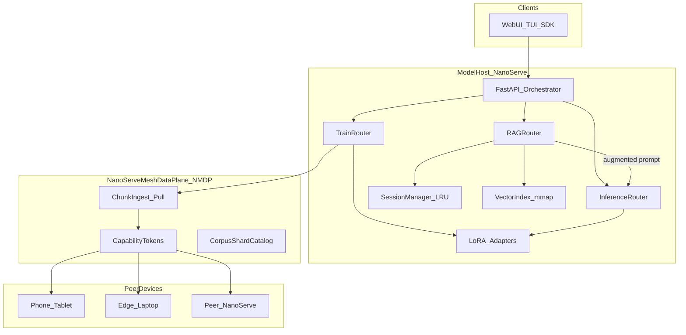
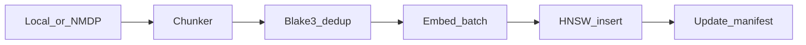
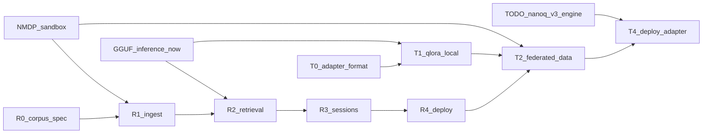

# TODO-RAG-Retrain — Implementation Prompt for NanoServe

> **Copy-paste this file into an agent session to implement distributed RAG deployment and federated model retraining.**

---

## Prompt header

You are implementing a **distributed RAG system** and **model retraining system** for **NanoServe** — a minimal LLM orchestrator (Rust buddy allocator, C++23 native engine, FastAPI, Python SDK, optional GGUF). The system must be:

- **Stateful** — multi-turn chat + retrieval context without reloading full corpora each request
- **Memory and resource efficient** — mmap indexes, int8 embeddings, LRU bounds, content-addressed dedup
- **Distributed** — model host pulls data from phones, laptops, and peer mesh nodes over the network (same LAN reachability as today's HTTP mesh)
- **Network sandboxed** — peers share **only approved corpus shards** with **only the active NanoServe job**; channel closes when the session ends

**Tagline:** *Grounded inference + lean retrain* — not *open file server*.

Current stack (unchanged baseline):

```
Rust buddy_alloc → C++ libnanoserve_engine.so → FastAPI (InferenceRouter)
                  ↘ optional GGUF (llama-cpp-python)
                  ↘ LAN HTTP mesh (documentation/connect-network.md) — no cluster protocol today
```

**Related planning docs:**

- [TODO-nanoq-full-blown-engine.md](TODO-nanoq-full-blown-engine.md) — full native LLM runtime (prerequisite for native adapter merge/export)
- [TODO-plan-GGUF.md](TODO-plan-GGUF.md) — GGUF inference path (usable for RAG + train before native v3)

---

## Problem statement

NanoServe today is **stateless inference-only** (`server/main.py`, `nanoserve/engine/router.py`):

- No conversation memory beyond a single `/v1/completions` call
- No retrieval-augmented generation (RAG)
- No fine-tuning or adapter training
- Mesh = independent HTTP hosts; **no secure data-sharing protocol**

Users need:

1. **RAG at deploy time** — grounded answers from private corpora, low RAM, works on mesh hosts
2. **Retraining on the model host** — ingest training data from edge devices over the network
3. **Stateful sessions** — multi-turn chat + RAG context with bounded memory
4. **Sandboxed networking** — data visible to NanoServe **only during an active ingest/train job**

---

## Non-goals (v1)

- Do **not** build a general-purpose P2P file sync or NAS replacement
- Do **not** allow anonymous or persistent peer filesystem access
- Do **not** require full-weight fine-tuning as default — **LoRA/QLoRA only** in v1
- Do **not** implement FedAvg / federated gradient aggregation in v1 (Phase T3 stretch)
- Do **not** break existing `/v1/completions` without RAG flags
- Do **not** break GGUF (`:8002`) or native inference paths
- Do **not** bundle heavy ML stacks in default `pip install` — use optional `[rag]` and `[train]` extras
- Do **not** run training inside the WASM browser tier

---

## Design principles

| Principle | Rule |
|-----------|------|
| **Stateful but bounded** | Session TTL, max messages in memory, LRU eviction for sessions + chunk cache |
| **Memory-first** | mmap vector index + chunk store; int8/fp16 embeddings; Blake3 content-addressed dedup |
| **Distributed by default** | Corpora may live on peers; model host **pulls shards on demand** during ingest/train jobs |
| **Sandboxed networking** | NMDP active only for declared jobs; capability tokens + deny-by-default; auto-revoke on expiry |
| **Orchestrator-native** | Extend FastAPI coordinator; optional Docker profiles — no mandatory separate RAG server |
| **Format-agnostic** | RAG works with GGUF now; native `.nanoq` v3 when full engine lands |
| **Train lean** | Default LoRA/QLoRA adapters; full fine-tune opt-in on GPU hosts only |
| **Three planes** | Inference, Retrieval, Training — orthogonal, composable |

---

## Target architecture



### Three planes on the model host

| Plane | Role | Existing hook |
|-------|------|---------------|
| **Inference** | LLM token generation | `InferenceRouter` → `EnginePool` / `GGUFPool` |
| **Retrieval** | Embed → search → rerank → inject context | New `RAGRouter` |
| **Training** | LoRA/QLoRA coordinator; federated data pull | New `TrainRouter` |

---

## NanoServe Mesh Data Plane (NMDP)

**Session-scoped protocol** — not open file sharing. Analogous to today's `npx serve` reachability, but **capability-gated** and **job-bound**.

### Session lifecycle

1. **Coordinator** (model host) creates `DataJob`:

   ```json
   {
     "job_id": "uuid",
     "type": "ingest|train",
     "expires_at": "ISO8601",
     "allowed_peers": ["device-id-1", "device-id-2"],
     "max_bytes": 1073741824,
     "allowed_mime": ["text/plain", "text/markdown", "application/json"]
   }
   ```

2. Issues **capability token** (HMAC-signed JWT or macaroon) scoped to: `job_id`, peer device id, max bytes, allowed MIME/types, shard id prefix allowlist
3. **Peer** runs `nanoserve-data-agent` — exposes only manifest + chunk blobs registered for that job
4. On job complete / TTL / cancel → tokens revoked; peer agent stops serving; coordinator drops staging buffers

### Transport

| Option | Detail |
|--------|--------|
| Dedicated port | **8010** for NMDP (recommended) |
| Same port | `/v1/mesh/data/*` with strict middleware on `:8000` |
| Security | TLS required on non-localhost; **mTLS optional** for LAN mesh |
| Chunk fetch | `GET /v1/mesh/data/shard/{id}` + `Authorization: Bearer <capability>` |
| Deny | No directory listing, no arbitrary paths — **catalog entries only** |

### Peer agent (edge device)

```bash
# User explicitly selects folders; agent runs only while token valid
nanoserve-data-agent \
  --share ./my-docs \
  --job-token "<capability>" \
  --coordinator http://192.168.1.42:8010 \
  --device-id laptop-alice
```

- Builds manifest at startup (chunk ids, Blake3 hashes, byte sizes)
- Serves shards only matching the capability scope
- Exits or idles when token expires or coordinator sends cancel
- **No access** from coordinator outside active job window

### Coordinator staging

```
~/.nanoserve/staging/{job_id}/
  manifest.json          # merged peer manifests
  shards/                # pulled blobs (deleted after ingest/train)
  audit.log              # who pulled what, when
```

---

## Phase R0 — Corpus + index specification

### On-disk layout

```
~/.nanoserve/corpora/{corpus_id}/
  manifest.json          # chunk catalog + metadata
  index.hnsw             # mmap vector index (Rust)
  index.meta.json        # dim, metric, quant dtype
  chunks/
    {blake3_hex}.chunk   # content-addressed, mmap-readable
```

### Corpus manifest entry

```json
{
  "chunk_id": "c_001",
  "hash": "blake3:...",
  "source": "peer:laptop-alice|local:./docs/foo.md",
  "offset": 0,
  "length": 4096,
  "mime": "text/markdown",
  "meta": { "title": "...", "page": 1 }
}
```

### Vector index (Rust: `rust/nanoq_rag/`)

- **Algorithm:** HNSW default; IVF-PQ optional for very large corpora
- **Quantization:** int8 embeddings default (384-dim → ~384 bytes/vector + graph overhead)
- **Metric:** cosine (normalize on ingest)
- **Embedding model:** small GGUF embedder (e.g. gte-small) via existing GGUF path, or `.nanoq` embed head post v3

### Files to add

| File | Action |
|------|--------|
| `rust/nanoq_rag/Cargo.toml` | New crate: HNSW, BM25, chunk store |
| `rust/nanoq_rag/src/index.rs` | mmap HNSW insert/search |
| `rust/nanoq_rag/src/chunk_store.rs` | Blake3-addressed blobs |
| `nanoserve/rag/spec.py` | Manifest schema, corpus id helpers |

**Acceptance:** Ingest 1 MB fixture corpus; index builds; query returns top-k chunk ids with scores.

---

## Phase R1 — Ingest pipeline

### Chunkers

| Format | Handler |
|--------|---------|
| Plain text / markdown | Fixed-size + paragraph-aware splits |
| JSONL | `{ "text": "..." }` or Q&A pairs |
| PDF | Optional `[rag]` extra (`pypdf` or similar) |

### Pipeline flow



- Embed batching with backpressure; disk-spill queue for large ingest
- **Distributed ingest:** coordinator creates NMDP job → peers run data-agent → coordinator pulls shards → dedup by hash → local index

### API

```python
POST /v1/rag/corpora/ingest
{
  "corpus_id": "my-kb",
  "sources": [
    { "type": "local", "path": "/path/to/docs" },
    { "type": "mesh", "job_id": "uuid", "peer_device_ids": ["laptop-alice"] }
  ],
  "chunk_size": 512,
  "chunk_overlap": 64
}
```

**Acceptance:** Ingest from local path + mock peer agent; duplicate chunks stored once (Blake3 dedup).

---

## Phase R2 — Retrieval + rerank

### Hybrid search

| Stage | Implementation |
|-------|----------------|
| Dense | HNSW top-k (Rust) |
| Sparse | BM25 via `tantivy` or lightweight Rust inverted index |
| Fusion | RRF (reciprocal rank fusion) or weighted sum |
| Rerank | Optional cross-encoder (small GGUF / CPU); off by default |

### Context budget manager

- Given LLM `max_context` (from model config or env), fit top-k chunks without overflow
- Truncate chunks by token estimate; prioritize rerank score
- Return `{ chunk_ids[], context_text, tokens_used }` for injection

### Prompt template (injected before inference)

```
System: Answer using only the context below. Cite chunk ids when relevant.

Context:
[chunk c_001] ...
[chunk c_002] ...

User: {message}
```

### API

```python
POST /v1/rag/corpora/{corpus_id}/query
{
  "query": "What is the refund policy?",
  "top_k": 8,
  "rerank": false
}
```

**Acceptance:** Query returns ranked chunks; context fits configured token budget.

---

## Phase R3 — Stateful RAG sessions

### Session store

```
~/.nanoserve/sessions/
  {session_id}.json       # metadata, message history pointers
  {session_id}.cache      # mmap hot retrieval cache for session
```

### Session record

```json
{
  "session_id": "uuid",
  "corpus_id": "my-kb",
  "model": "distilgpt2-Q2_K",
  "format": "gguf",
  "messages": [
    { "role": "user", "content": "..." },
    { "role": "assistant", "content": "..." }
  ],
  "retrieved_chunk_ids": ["c_001", "c_003"],
  "created_at": "...",
  "expires_at": "..."
}
```

### Environment variables

```bash
NANOSERVE_SESSION_TTL_S=3600          # default session lifetime
NANOSERVE_MAX_SESSIONS=128            # LRU cap
NANOSERVE_SESSION_CHUNK_CACHE_MB=64   # per-session retrieval cache
NANOSERVE_CORPUS_CHUNK_CACHE_MB=256   # global hot chunk LRU
```

### Flow

1. `POST /v1/rag/sessions` → create session bound to corpus + model
2. `POST /v1/rag/chat` → retrieve (with session history query expansion optional) → augment prompt → `InferenceRouter.submit()`
3. Append assistant reply; update `retrieved_chunk_ids`
4. Session delete or TTL → free cache; call `engine_reset_kv` if engine session handle exists

### Separation of concerns

| State | Owner |
|-------|-------|
| Message history + retrieval cache | `SessionManager` (Python or Rust) |
| Transformer KV cache | C++ engine (`engine_reset_kv` per TODO-nanoq-full-blown-engine) |

**Acceptance:** Multi-turn chat retrieves relevant chunks; memory bounded under `NANOSERVE_MAX_SESSIONS` load test.

---

## Phase R4 — Deploy integration

### FastAPI / health

Extend `GET /health`:

```json
{
  "rag_available": true,
  "corpora_registered": 2,
  "index_size_bytes": 10485760,
  "active_sessions": 5,
  "nmdp_port": 8010,
  "mesh_jobs_active": 0
}
```

### Docker profile (optional)

```yaml
# docker-compose.yml — profile: rag
nanoserve-rag:
  ports:
    - "8003:8000"
    - "8010:8010"
  environment:
    - NANOSERVE_ENABLE_RAG=1
    - NANOSERVE_NMDP_PORT=8010
  volumes:
    - nanoserve-corpora:/root/.nanoserve/corpora
```

### Web UI additions (`server/static/`)

- **Corpus** panel: create, ingest (local / URL / mesh job)
- **Chat** mode: session picker, grounded replies with chunk citations
- **Mesh job** wizard: generate capability token QR / copy for peer agent

### SDK

```python
from nanoserve import NanoServe

engine = NanoServe()
session = engine.rag_create_session(corpus_id="my-kb", model="distilgpt2-Q2_K", format="gguf")
reply = engine.rag_chat(session_id=session.id, message="Summarize the handbook")
```

**Acceptance:** End-to-end RAG chat from Web UI and SDK on GGUF host; citations visible in response metadata.

---

## Phase T0 — Adapter format + registry

### LoRA adapter pack (`.nanoadapt`)

```
[4B magic: 0x4E414453]   # "NADS"
[4B index_len]
[index JSON: lora tensors + offsets]
[config JSON: rank, alpha, target_modules, base_model_id]
[tensor payloads]
[32B Blake3 footer]
```

Alternatively: embed adapter tensors as a labeled section in `.nanoq` v3 index (post full engine).

### Registry extension

Extend `ModelEntry.extra` in `nanoserve/models/registry.py`:

```json
{
  "adapters": [
    {
      "id": "support-bot-v1",
      "path": "~/.nanoserve/adapters/support-bot-v1.nanoadapt",
      "base_model": "distilgpt2-Q2_K",
      "rank": 8,
      "created_at": "..."
    }
  ]
}
```

### Inference routing

- `InferenceRouter.submit(..., adapter_id="support-bot-v1")` → load base + adapter
- GGUF v1: document as **future** (llama.cpp LoRA); v1 may serve merged export only

**Acceptance:** Register adapter manifest; API accepts `adapter_id` field (stub ok until T1 completes).

---

## Phase T1 — Local QLoRA trainer

### Optional extra

```toml
# pyproject.toml
train = ["peft>=0.10", "bitsandbytes>=0.43", "datasets>=2.14", "accelerate>=0.27"]
```

### Trainer module (`nanoserve/train/qlora.py`)

- Input: JSONL `{ "prompt", "completion" }` or `{ "text" }` in staging shard
- Base: HuggingFace model or GGUF-exported weights path
- Output: `.nanoadapt` pack + registry entry
- CPU: rank ≤ 4, tiny datasets only; GPU profile: distilgpt2-class default

### API

```python
POST /v1/train/jobs
{
  "base_model": "distilgpt2-Q2_K",
  "adapter_id": "support-bot-v1",
  "data_job_id": "uuid",           # NMDP staging shard
  "config": { "rank": 8, "alpha": 16, "epochs": 3, "lr": 2e-4 }
}

GET /v1/train/jobs/{id}
POST /v1/train/adapters/register
```

**Acceptance:** Train adapter on local JSONL fixture; register; inference path accepts adapter_id (merged or sidecar per format support).

---

## Phase T2 — Federated data collection (NMDP)

### Train job + data job linkage

1. Create NMDP `DataJob` with `type: train` and schema:

   ```json
   { "schema": "prompt_completion", "fields": ["prompt", "completion"] }
   ```

2. Peers expose only records matching schema via data-agent
3. Coordinator validates, normalizes, writes staging shard
4. `TrainRouter` consumes staging shard — **no raw peer filesystem access**

### Security audit log

Every pull records: `job_id`, peer `device_id`, shard ids, byte count, timestamp, token id (not secret).

**Acceptance:** Mock peer serves 100 records; coordinator staging matches schema; invalid records rejected with counts in job status.

---

## Phase T3 — Distributed train modes (stretch)

| Mode | Description | v1 |
|------|-------------|-----|
| **Centralized QLoRA** | All data pulled to host; train locally | **Default** |
| **FedAvg-lite** | Peers compute adapter grads; host aggregates | Stretch |
| **Distillation** | Host generates labels; peers train tiny student | Stretch |

Do **not** implement FedAvg in v1 — document protocol sketch only:

- Peer receives base adapter snapshot + local shard
- Peer returns gradient delta pack (encrypted optional)
- Host aggregates with weighted average by sample count

---

## Phase T4 — Post-train deploy

### Deploy paths

| Path | When |
|------|------|
| **Hot-swap adapter** | Serve base + `.nanoadapt` without restart |
| **Merge export** | Combine base + adapter → new GGUF or `.nanoq` v3 snapshot |
| **Rollback** | Registry keeps prior adapter; one-click revert in UI |

### Quantize after train

- Re-run quantizer on merged weights (int8 default) before native deploy
- Depends on [TODO-nanoq-full-blown-engine.md](TODO-nanoq-full-blown-engine.md) for native merge

**Acceptance:** Train → register → infer with adapter produces measurably different output vs base on held-out prompt.

---

## Stateful layer (cross-cutting)

### SessionManager

| Component | Language | Responsibility |
|-----------|----------|----------------|
| `SessionManager` | Python (v1) or Rust (stretch) | CRUD sessions, LRU, TTL |
| `CorpusCache` | Rust | Global chunk hot set |
| `StagingStore` | Python | NMDP job temp files with auto-cleanup |

### Lifecycle hooks

| Event | Action |
|-------|--------|
| Session create | Allocate cache file; bind corpus + model |
| Session chat | Retrieve → infer → append messages |
| Session fork | Copy history; new `session_id`; reset engine KV |
| Session delete | Unlink cache; decrement corpus ref counts |
| Job complete | Delete staging; revoke tokens; audit log finalize |

---

## API contract (additive)

### Extended completion request

```python
class GenerateRequest(BaseModel):
    prompt: str
    max_tokens: int = 24
    device: Literal["cpu", "gpu", "auto"] = "cpu"
    model: Optional[str] = None
    format: Literal["auto", "nanoq", "gguf"] = "auto"
    # RAG extensions (optional)
    session_id: Optional[str] = None
    use_rag: bool = False
    corpus_id: Optional[str] = None
    adapter_id: Optional[str] = None
```

### RAG routes

| Method | Path | Purpose |
|--------|------|---------|
| POST | `/v1/rag/corpora/ingest` | Local or mesh ingest |
| GET | `/v1/rag/corpora` | List corpora |
| POST | `/v1/rag/corpora/{id}/query` | Standalone retrieval |
| POST | `/v1/rag/sessions` | Create stateful session |
| GET | `/v1/rag/sessions/{id}` | Session metadata |
| DELETE | `/v1/rag/sessions/{id}` | End session |
| POST | `/v1/rag/chat` | Session chat (retrieve + infer) |

### Mesh data plane routes

| Method | Path | Purpose |
|--------|------|---------|
| POST | `/v1/mesh/jobs` | Create ingest/train data job |
| GET | `/v1/mesh/jobs/{id}` | Status + audit summary |
| POST | `/v1/mesh/jobs/{id}/cancel` | Revoke tokens, cleanup |
| GET | `/v1/mesh/data/shard/{id}` | Pull shard (capability auth) |

### Training routes

| Method | Path | Purpose |
|--------|------|---------|
| POST | `/v1/train/jobs` | Start QLoRA job |
| GET | `/v1/train/jobs/{id}` | Progress + metrics |
| POST | `/v1/train/adapters/register` | Register completed adapter |

---

## Environment variables

```bash
# RAG
NANOSERVE_ENABLE_RAG=0                    # 1 to enable RAG router
NANOSERVE_CORPORA_DIR=~/.nanoserve/corpora
NANOSERVE_EMBED_MODEL=gte-small.Q2_K.gguf   # GGUF embedder path or id
NANOSERVE_RAG_TOP_K=8
NANOSERVE_RAG_RERANK=0
NANOSERVE_SESSION_TTL_S=3600
NANOSERVE_MAX_SESSIONS=128
NANOSERVE_CORPUS_CHUNK_CACHE_MB=256

# NMDP (mesh data plane)
NANOSERVE_ENABLE_NMDP=0
NANOSERVE_NMDP_PORT=8010
NANOSERVE_NMDP_TLS=1                        # require TLS off localhost
NANOSERVE_NMDP_JOB_TTL_S=7200
NANOSERVE_NMDP_MAX_BYTES_PER_JOB=1073741824
NANOSERVE_NMDP_SECRET=                      # HMAC key for capability tokens

# Training
NANOSERVE_ENABLE_TRAIN=0
NANOSERVE_ADAPTERS_DIR=~/.nanoserve/adapters
NANOSERVE_TRAIN_DEFAULT_RANK=8
NANOSERVE_TRAIN_DEFAULT_EPOCHS=3
NANOSERVE_STAGING_DIR=~/.nanoserve/staging
```

---

## File touch list

### New (planned)

| Path | Purpose |
|------|---------|
| `nanoserve/rag/` | router, ingest, session, retriever, spec |
| `nanoserve/train/` | job coordinator, QLoRA trainer |
| `nanoserve/mesh/` | NMDP server, capability tokens, job store |
| `nanoserve/data_agent/` | edge CLI for sandboxed share |
| `rust/nanoq_rag/` | HNSW, BM25, Blake3 chunk store |
| `server/rag_routes.py` | FastAPI RAG endpoints |
| `server/mesh_routes.py` | NMDP endpoints |
| `server/train_routes.py` | Training endpoints |
| `documentation/RAG-Retrain.md` | User guide |
| `tests/test_rag_ingest.py` | Dedup + index |
| `tests/test_rag_session.py` | LRU + TTL |
| `tests/test_mesh_sandbox.py` | Token expiry, deny-by-default |
| `tests/test_train_qlora.py` | Local train smoke |

### Modify (planned)

| Path | Change |
|------|--------|
| `server/main.py` | Mount RAG/mesh/train routes; extend health |
| `server/static/app.js` | Corpus + session UI |
| `nanoserve/engine/router.py` | RAG prompt augmentation hook |
| `nanoserve/models/registry.py` | Corpora + adapter manifests |
| `nanoserve/__init__.py` | Export RAG/train SDK methods |
| `docker-compose.yml` | `rag`, `train` profiles |
| `pyproject.toml` | `[rag]`, `[train]` extras |
| `documentation/connect-network.md` | NMDP mesh section |
| `README.md` | RAG + retrain overview |

### Do not break

- Existing `/v1/completions` without RAG/adapter flags
- GGUF and native inference paths
- Default install size (extras opt-in)

---

## Dependencies and implementation order



**Recommended build order:**

1. **NMDP sandbox** (capability tokens, data-agent, audit) — security foundation
2. **R0–R1** — local corpus ingest + index
3. **R2–R3** — retrieval + stateful sessions
4. **R4** — UI + Docker profile
5. **T0–T1** — adapter format + local QLoRA
6. **T2** — federated data pull into train jobs
7. **T4** — hot-swap + merge export (native merge after nanoq v3)

---

## Testing strategy

| Test | File | Purpose |
|------|------|---------|
| Capability expiry | `tests/test_mesh_sandbox.py` | Revoked token → 403 |
| Dedup ingest | `tests/test_rag_ingest.py` | Same Blake3 chunk stored once |
| Session LRU | `tests/test_rag_session.py` | Bounded memory under load |
| Grounding | `tests/test_rag_chat.py` | Response includes chunk citations |
| Peer pull | `tests/test_mesh_pull.py` | Mock data-agent → staging shard |
| QLoRA smoke | `tests/test_train_qlora.py` | Adapter changes output vs base |
| Regression | `tests/test_suite.py` | Existing inference unchanged |

---

## Test commands

```bash
# Enable RAG + NMDP (after implementation)
export NANOSERVE_ENABLE_RAG=1
export NANOSERVE_ENABLE_NMDP=1
export NANOSERVE_NMDP_SECRET="dev-secret-change-me"

# Start coordinator
./scripts/run_native.sh   # or docker compose --profile rag up

# On peer laptop (same Wi-Fi)
nanoserve-data-agent \
  --share ./training-data \
  --job-token "<from POST /v1/mesh/jobs>" \
  --coordinator http://192.168.1.42:8010

# Ingest corpus from mesh
curl -X POST http://localhost:8000/v1/rag/corpora/ingest \
  -H 'Content-Type: application/json' \
  -d '{"corpus_id":"kb1","sources":[{"type":"mesh","job_id":"JOB_UUID"}]}'

# Stateful RAG chat
curl -X POST http://localhost:8000/v1/rag/sessions \
  -d '{"corpus_id":"kb1","model":"distilgpt2-Q2_K","format":"gguf"}'

curl -X POST http://localhost:8000/v1/rag/chat \
  -d '{"session_id":"SESSION_UUID","message":"What is our refund policy?"}'

# Train adapter on pulled data
curl -X POST http://localhost:8000/v1/train/jobs \
  -d '{"base_model":"distilgpt2-Q2_K","adapter_id":"bot-v1","data_job_id":"JOB_UUID"}'

# Unit tests
python3 tests/test_mesh_sandbox.py
python3 tests/test_rag_ingest.py
python3 tests/test_rag_session.py
python3 tests/test_train_qlora.py
```

---

## Acceptance checklist

- [ ] NMDP: capability token required; expired/revoked token returns 403
- [ ] NMDP: no directory listing; only catalog shard ids fetchable
- [ ] NMDP: peer agent stops serving after job cancel or TTL
- [ ] RAG: ingest local + mesh sources; Blake3 dedup verified
- [ ] RAG: hybrid retrieval returns relevant chunks for fixture corpus
- [ ] RAG: stateful multi-turn chat under `NANOSERVE_MAX_SESSIONS` cap
- [ ] RAG: responses include `chunk_ids` citations in metadata
- [ ] Train: QLoRA on local JSONL produces `.nanoadapt` artifact
- [ ] Train: federated pull from mock peer fills staging shard
- [ ] Train: inference with `adapter_id` differs from base model output
- [ ] Resource: corpus index + chunk cache stay within configured MB limits
- [ ] Regression: `/v1/completions` without RAG flags unchanged
- [ ] GGUF `:8002` profile still works alongside RAG on `:8003`
- [ ] Docs: `documentation/RAG-Retrain.md` + connect-network NMDP section

---

## Success criteria

- Model host ingests corpus from **2+ peer devices** over LAN with sandbox active **only during job**
- **Stateful** multi-turn RAG chat with grounded citations under configurable RAM cap
- **QLoRA adapter** trains on federated pulled data and deploys without full server restart
- **Zero anonymous access** to peer data outside capability scope
- System remains **lean** — `[rag]` and `[train]` optional; default install unchanged

---

## Relationship to other NanoServe work

| Doc | Relationship |
|-----|--------------|
| [TODO-nanoq-full-blown-engine.md](TODO-nanoq-full-blown-engine.md) | Native LLM + KV cache + adapter merge into `.nanoq` v3 |
| [TODO-plan-GGUF.md](TODO-plan-GGUF.md) | GGUF inference + embed models for RAG before native v3 |
| [documentation/connect-network.md](documentation/connect-network.md) | LAN mesh patterns; extend with NMDP port 8010 |
| [TODO-WASM-LEAN.md](TODO-WASM-LEAN.md) | No RAG/train in browser tier |

---

## Resource budgets (reference targets)

| Component | distilgpt2-class KB (~10k chunks) |
|-----------|-----------------------------------|
| int8 vectors (384-d) | ~4 MB vectors + ~2 MB HNSW graph |
| Chunk store | ~20–50 MB (deduped text) |
| Hot chunk cache | 64–256 MB configurable |
| Embed model (gte-small Q2) | ~25 MB mmap |
| LLM (separate slot) | per existing GGUF/native budgets |
| Staging shard (train job) | deleted after job; cap `NANOSERVE_NMDP_MAX_BYTES_PER_JOB` |
| Sessions | `NANOSERVE_MAX_SESSIONS` × ~1 MB metadata avg |

---

## Future extensions (do not implement in v1)

- FedAvg-lite federated adapter aggregation (Phase T3)
- Cross-host sharded vector index (split HNSW by corpus shard id)
- Encrypted staging at rest (age / libsodium)
- Phone-native data-agent (Termux) — document CLI only in v1
- Real-time streaming RAG citations in SSE (stretch after `engine_infer_stream`)
