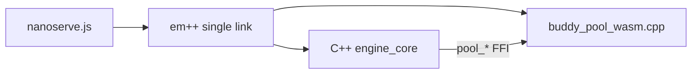
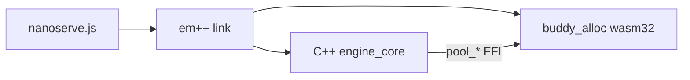

# TODO-RUST_ALLOC-WASM — Implementation Prompt for NanoServe

> **Copy-paste this file into an agent session to port the real Rust `buddy_alloc` crate into the optional browser WASM build.**

---

## Prompt header

You are implementing an **opt-in Rust buddy allocator link** for NanoServe's **browser WASM tier**. The WASM demo already ships (see `TODO-WASM-LEAN.md` — implemented). Today it uses a C++ stub (`engine/src/buddy_pool_wasm.cpp`) instead of the production Rust allocator (`allocator/src/lib.rs`). Your job is to add a **dual-build path**: keep the lean stub as default, enable real Rust allocator via `--with-rust-allocator`.

**Tagline:** *Native parity in the browser* — not *Replace the lean demo.*

Current stacks:

```
Production:  Rust buddy_alloc → C++ libnanoserve_engine.so → Python FastAPI
WASM today:  buddy_pool_wasm.cpp stub → C++ engine (Emscripten) → nanoserve.js
WASM target: buddy_alloc (wasm32) → C++ engine (Emscripten) → nanoserve.js  [opt-in flag]
```

**Prerequisite:** WASM lean tier must already work (`./scripts/build_wasm.sh`, `deployment/wasm/`, buffer FFI, slim UI). Do not re-implement those.

**Local-only doc:** After implementation, add `TODO-RUST_ALLOC-WASM.md` to `.gitignore` alongside `TODO-WASM-LEAN.md` and `TODO-plan-GGUF.md` if this file should stay off the remote.

---

## Non-goals

- Do **not** WASM-compile FastAPI, gunicorn, nginx, or the Python SDK.
- Do **not** port CUDA, OpenCL, WebGPU, or GGUF to WASM.
- Do **not** change native/Docker/GGUF build paths or `./install.sh` defaults.
- Do **not** remove `buddy_pool_wasm.cpp` — it remains the **default** lean build.
- Do **not** export Rust symbols to JavaScript — Rust stays internal behind the existing C `pool_*` ABI.
- Do **not** claim 300-user scaling or production allocator hardening for the browser tier.
- Do **not** break the default `./scripts/build_wasm.sh` (stub path must still produce ~125 KiB `.wasm`).

---

## Design principles

| Principle | Rule |
|-----------|------|
| Lean default | `./scripts/build_wasm.sh` unchanged → C++ stub, ~125 KiB engine |
| Opt-in Rust | `./scripts/build_wasm.sh --with-rust-allocator` → real `buddy_alloc` |
| No bloat by default | Rust path is explicit; size regression test on stub build |
| Native parity (opt-in) | Same `pool_*` C ABI as `allocator/src/lib.rs` |
| Single module | One `.wasm` file; static-link Rust into Emscripten output |
| Resource-aware | Shrink WASM `pool_create` sizes (see Phase 1b) — applies to **both** builds |
| Zero server impact | `server/main.py`, router, Docker untouched |

---

## Current vs target architecture

### Current (shipped)



- Build: `deployment/wasm/build.sh` links `engine/src/buddy_pool_wasm.cpp`
- Stub behavior: pre-reserves `std::vector` arena; `pool_allocate` returns `arena.data()`; `pool_free` is a no-op
- Bundle: **~125 KiB** `.wasm` (audit: 128,215 B)

### Target (opt-in)



Same C ABI symbols (from `allocator/src/lib.rs`):

| Symbol | Role |
|--------|------|
| `pool_create(size)` | Create refcounted buddy arena |
| `pool_acquire(pool)` | Additional handle to same arena |
| `pool_release(pool)` | Drop handle; free arena when last ref gone |
| `pool_allocate(pool, req_size)` | Buddy split/alloc |
| `pool_free(pool, ptr, size)` | Buddy merge/free |
| `pool_destroy(pool)` | Alias for `pool_release` |

---

## Dual-build strategy (recommended)

| Mode | Command | Allocator source | Expected `.wasm` size |
|------|---------|------------------|------------------------|
| **Default (unchanged)** | `./scripts/build_wasm.sh` | `buddy_pool_wasm.cpp` | ~125 KiB |
| **Rust parity** | `./scripts/build_wasm.sh --with-rust-allocator` | `libbuddy_alloc.a` (wasm32) | ~175–400 KiB (cap: **< 512 KiB**) |

**Alternative (not recommended):** always replace stub with Rust — simpler tree, but regresses lean-tier philosophy and breaks size regression without a flag.

Build script must enforce **mutually exclusive** sources: never link both stub and Rust in one build.

---

## Allocator gap analysis

### What the stub lacks vs Rust

| Behavior | Rust `buddy_alloc` | `buddy_pool_wasm.cpp` stub |
|----------|-------------------|---------------------------|
| Buddy split on alloc | Yes | No (single bump pointer) |
| Buddy merge on free | Yes | No (`pool_free` no-op) |
| `Arc` refcount handles | Yes | No |
| Arena power-of-two rounding | Yes | Uses exact `resize(size)` |
| Valgrind/RSS parity | Native tested | Not equivalent |

### What WASM engine actually uses pools for

From `engine/src/engine_core.cpp`:

- `pool_create(64 * 1024 * 1024)` + `pool_create(16 * 1024 * 1024)` at engine init — **80 MB reserved** today
- Synthetic weights: `pool_allocate(weights_pool, 1024)` 
- Loaded `.nanoq` models: weights live in `NanoqModel` `std::vector`s — **not** in buddy pool
- Per-infer scratch: `pool_allocate(scratch_pool, 4096)` then `pool_free`

Rust parity matters most for long-lived sessions and future larger scratch buffers; the **80 MB reservation** is the bigger browser resource issue (fix in Phase 1b regardless of Rust vs stub).

---

## Phase 0 — Prerequisites and constraints

### Toolchain

| Requirement | Purpose |
|-------------|---------|
| [Emscripten SDK](https://emscripten.org/) (`emcc`) | Already required for WASM tier |
| Rust + `cargo` | Build `buddy_alloc` for wasm32 |
| `rustup target add wasm32-unknown-unknown` | wasm32 static lib output |

### Verify baseline before starting

```bash
source /path/to/emsdk/emsdk_env.sh   # if needed
./scripts/build_wasm.sh               # stub build must succeed
python3 tests/test_wasm.py            # all tests pass (emcc test skips if absent)
python3 tests/test_wasm_native.py     # native buffer FFI (needs .so built)
```

---

## Phase 1 — Rust crate wasm32 build

### 1a. `allocator/Cargo.toml` changes

Current:

```toml
[lib]
crate-type = ["cdylib"]
```

Target:

```toml
[lib]
crate-type = ["cdylib", "staticlib"]

[profile.release]
opt-level = 3
lto = true
panic = "abort"   # wasm32: avoid unwinding bloat when linked via em++

# Optional explicit wasm profile:
# [profile.release-wasm]
# inherits = "release"
# panic = "abort"
```

Notes:

- `staticlib` produces `libbuddy_alloc.a` for `em++` static link
- Keep `cdylib` so native `cargo build --release` → `libbuddy_alloc.so` unchanged
- `panic = "abort"` reduces wasm binary size; acceptable for demo tier

### 1b. WASM-specific pool sizes (`engine/src/engine_core.cpp`)

Add compile-time constants when `NANOSERVE_WASM` is defined (already set in `deployment/wasm/build.sh`):

```cpp
#ifdef NANOSERVE_WASM
constexpr size_t kWeightsPoolBytes = 2 * 1024 * 1024;    // 2 MB (was 64 MB)
constexpr size_t kScratchPoolBytes = 512 * 1024;         // 512 KB (was 16 MB)
#else
constexpr size_t kWeightsPoolBytes = 64 * 1024 * 1024;
constexpr size_t kScratchPoolBytes = 16 * 1024 * 1024;
#endif
```

Replace hard-coded `pool_create(64 * 1024 * 1024)` / `pool_create(16 * 1024 * 1024)` in `engine_create_impl_bytes`.

**Apply to both stub and Rust builds** — this is independent of allocator choice but critical for browser resource philosophy.

### Build command

```bash
cd allocator && cargo build --target wasm32-unknown-unknown --release
```

Artifact:

```
allocator/target/wasm32-unknown-unknown/release/libbuddy_alloc.a
```

---

## Phase 2 — Emscripten link integration

### Approach A (recommended): single-module static link

In `deployment/wasm/build.sh`, when `--with-rust-allocator`:

```bash
RUST_LIB="$ROOT/allocator/target/wasm32-unknown-unknown/release/libbuddy_alloc.a"

ENGINE_SOURCES=(
  "$ROOT/engine/src/engine_ffi.cpp"
  "$ROOT/engine/src/engine_core.cpp"
  "$ROOT/engine/src/nanoq_loader.cpp"
  "$ROOT/engine/src/backend_cpu.cpp"
  "$ROOT/engine/src/backend_factory.cpp"
  "$ROOT/engine/src/backend_cuda_stub.cpp"
  "$ROOT/engine/src/backend_opencl_stub.cpp"
  # NOTE: omit buddy_pool_wasm.cpp
)

em++ -O3 -std=c++23 \
  -I"$ROOT/engine/include" \
  -DNANOSERVE_WASM=1 \
  "${ENGINE_SOURCES[@]}" \
  "$RUST_LIB" \
  -o "$OUT/nanoserve_engine.js" \
  -sWASM=1 \
  -sMODULARIZE=1 \
  -sEXPORT_NAME=createNanoServeModule \
  -sALLOW_MEMORY_GROWTH=1 \
  -sENVIRONMENT=web \
  -sERROR_ON_UNDEFINED_SYMBOLS=1 \
  -sEXPORTED_FUNCTIONS='["_engine_init","_engine_init_with_model_bytes","_engine_reload_model_bytes","_engine_infer","_engine_model_info","_engine_cleanup","_malloc","_free"]' \
  -sEXPORTED_RUNTIME_METHODS='["cwrap","UTF8ToString","getValue","HEAPU8"]' \
  -sFILESYSTEM=0 \
  -sNO_EXIT_RUNTIME=1
```

If undefined symbols from Rust std appear, try wrapping the archive:

```bash
em++ ... -Wl,--whole-archive "$RUST_LIB" -Wl,--no-whole-archive ...
```

### Approach B (fallback)

If static `.a` link fails:

```bash
rustc --crate-type staticlib --target wasm32-unknown-unknown -O \
  --out-dir "$BUILD" allocator/src/lib.rs
# Pass emitted .o to em++ instead of .a
```

Document which approach worked in `documentation/WASM.md`.

### `engine/CMakeLists.wasm.cmake` (optional alignment)

Mirror the dual path in CMake for `emcmake` users:

- `NANOSERVE_WASM_RUST_ALLOC=ON` → link `libbuddy_alloc.a`, exclude `buddy_pool_wasm.cpp`
- Default OFF → current stub sources

Keep `deployment/wasm/build.sh` as the primary entry (matches current repo).

### Export list (unchanged)

Do **not** add Rust symbols to `EXPORTED_FUNCTIONS`. JS API (`deployment/wasm/nanoserve.js`) unchanged.

---

## Phase 3 — Build script UX

### `deployment/wasm/build.sh`

```bash
WITH_RUST=0
for arg in "$@"; do
  [[ "$arg" == "--with-rust-allocator" ]] && WITH_RUST=1
done

if [[ $WITH_RUST -eq 1 ]]; then
  command -v cargo >/dev/null || { echo "[!] cargo not found"; exit 1; }
  rustup target list --installed | grep -q wasm32-unknown-unknown || \
    rustup target add wasm32-unknown-unknown
  echo "[*] Building Rust buddy_alloc for wasm32..."
  (cd "$ROOT/allocator" && cargo build --target wasm32-unknown-unknown --release)
  # ... em++ with RUST_LIB, no buddy_pool_wasm.cpp
else
  echo "[*] Building WASM engine (lean stub allocator)..."
  # ... current em++ with buddy_pool_wasm.cpp
fi
```

### `scripts/build_wasm.sh`

Pass through all arguments:

```bash
exec "$ROOT/deployment/wasm/build.sh" "$@"
```

### Optional `package.json`

```json
{
  "scripts": {
    "build:wasm": "./scripts/build_wasm.sh",
    "build:wasm:rust": "./scripts/build_wasm.sh --with-rust-allocator"
  }
}
```

### `engine/src/buddy_pool_wasm.cpp` header comment

Add at top of file:

```cpp
// Default lean WASM build only. For native buddy parity in browser,
// rebuild with: ./scripts/build_wasm.sh --with-rust-allocator
```

---

## Phase 4 — Tests and acceptance

### Test matrix

| Test | File | Purpose |
|------|------|---------|
| Stub Emscripten build | `tests/test_wasm.py::test_emscripten_build` | Default path unchanged |
| Rust Emscripten build | `tests/test_wasm.py::test_emscripten_build_rust_allocator` (new) | `--with-rust-allocator` succeeds |
| Bundle size (stub) | extend `test_emscripten_build` | `.wasm` < 200 KiB (buffer above ~125 KiB) |
| Bundle size (Rust) | new test | `.wasm` < 512 KiB |
| Native buffer FFI | `tests/test_wasm_native.py` | Unchanged — validates Rust on `.so` |
| Token parity | new test or manual | Same `.nanoq` + prompt → identical output stub vs Rust |

### Suggested new test (`tests/test_wasm.py`)

```python
@unittest.skipUnless(shutil.which("emcc") and shutil.which("cargo"), "emcc/cargo required")
def test_emscripten_build_rust_allocator(self):
    proc = subprocess.run(
        [str(ROOT / "scripts/build_wasm.sh"), "--with-rust-allocator"],
        cwd=str(ROOT), capture_output=True, text=True, env=os.environ.copy(),
    )
    self.assertEqual(proc.returncode, 0, proc.stdout + proc.stderr)
    wasm = ROOT / "deployment/wasm/nanoserve_engine.wasm"
    self.assertTrue(wasm.exists())
    size = wasm.stat().st_size
    self.assertLess(size, 512 * 1024, f"Rust WASM too large: {size} bytes")
```

### Optional parity subprocess test

Build both variants sequentially; run a small native harness or document manual browser check comparing `infer` output for fixed seed `.nanoq`.

### Acceptance checklist

- [ ] `./scripts/build_wasm.sh` → stub build works, demo loads, ~125 KiB
- [ ] `./scripts/build_wasm.sh --with-rust-allocator` → Rust linked, demo works, < 512 KiB
- [ ] WASM pool sizes reduced (2 MB + 512 KB) in both builds
- [ ] Token parity: stub vs Rust produce identical output for same `.nanoq` + prompt
- [ ] Native `./install.sh` / Docker / GGUF paths untouched; `tests/test_suite.py` passes
- [ ] `documentation/WASM.md` documents dual build
- [ ] `README.md` one-line note under Browser WASM
- [ ] No duplicate allocator symbols at link time

---

## Phase 5 — Documentation updates

### `documentation/WASM.md`

Add section **Allocator: stub vs Rust**:

| Build | Allocator | When to use |
|-------|-----------|-------------|
| Default | `buddy_pool_wasm.cpp` | Lean demo, smallest download |
| `--with-rust-allocator` | `allocator/src/lib.rs` | Parity testing, long-lived sessions |

### `README.md`

Under Browser WASM row, add:

> Optional Rust allocator: `./scripts/build_wasm.sh --with-rust-allocator` (larger `.wasm`, native buddy parity).

### `Extensive-TEST-REPORT.md` (optional)

Note Rust WASM build size and test results when audit is re-run.

---

## Bundle size targets

| Artifact | Stub (default) | Rust (opt-in) |
|----------|----------------|---------------|
| `nanoserve_engine.wasm` | ~125 KiB (< 200 KiB test cap) | < 512 KiB |
| `nanoserve_engine.js` | ~13 KiB | similar |
| Demo `.nanoq` | ~2 KiB | unchanged |
| Hard ceiling (legacy) | < 2 MB | < 2 MB |

If Rust build exceeds 512 KiB after optimization, document measured size and adjust cap — do not silently bloat.

---

## Risks and mitigations

| Risk | Mitigation |
|------|------------|
| Binary bloat (+50–300 KiB) | Opt-in flag only; `panic=abort`, LTO, size test |
| `em++` + Rust static link failures | Approach B (`rustc --emit=obj`); CI matrix entry |
| 80 MB pool reservation in browser | Phase 1b `NANOSERVE_WASM` smaller pools |
| Link both stub + Rust | Build script enforces XOR source list |
| `Mutex` overhead in single-thread WASM | Acceptable for demo; future: `#[cfg(target_arch = "wasm32")]` lightweight lock |
| Rust std pulls in unexpected symbols | `-sERROR_ON_UNDEFINED_SYMBOLS=1`; `--whole-archive` if needed |
| Default build regression | Keep stub path as first-class; Rust test is separate |

---

## File touch list

| File | Phase | Action |
|------|-------|--------|
| `TODO-RUST_ALLOC-WASM.md` | 0 | This file |
| `allocator/Cargo.toml` | 1 | Add `staticlib`, `panic = "abort"` for release |
| `engine/src/engine_core.cpp` | 1b | `NANOSERVE_WASM` smaller `pool_create` sizes |
| `deployment/wasm/build.sh` | 2–3 | `--with-rust-allocator` branch, Rust static link |
| `scripts/build_wasm.sh` | 3 | Pass-through `"$@"` |
| `engine/CMakeLists.wasm.cmake` | 2 | Optional `NANOSERVE_WASM_RUST_ALLOC` (stretch) |
| `engine/src/buddy_pool_wasm.cpp` | 3 | Header comment only |
| `tests/test_wasm.py` | 4 | `test_emscripten_build_rust_allocator` + size checks |
| `documentation/WASM.md` | 5 | Dual-build docs |
| `README.md` | 5 | One-line Rust allocator note |
| `package.json` | 5 | Optional `build:wasm:rust` script |
| `.gitignore` | 5 | Add `TODO-RUST_ALLOC-WASM.md` (local-only, optional) |

**Do not touch:** `server/main.py`, `nanoserve/engine/router.py`, Docker files, GGUF modules, native `engine/CMakeLists.txt` link line.

---

## Test commands (after implementation)

```bash
# Baseline stub build (must still work)
source /path/to/emsdk/emsdk_env.sh   # if needed
./scripts/build_wasm.sh
python3 tests/test_wasm.py

# Rust allocator build
./scripts/build_wasm.sh --with-rust-allocator
# or: npm run build:wasm:rust

# Serve and manual smoke test
npx serve deployment/wasm
# Browser: WASM ready → load demo.nanoq → Generate

# Native paths unchanged
python3 tests/test_wasm_native.py
python3 tests/test_suite.py

# Compare wasm sizes
ls -lh deployment/wasm/nanoserve_engine.wasm
```

---

## Quick start (implementer)

1. Read `allocator/src/lib.rs` (C ABI) and `engine/src/buddy_pool_wasm.cpp` (stub to replace opt-in).
2. Phase 1b: shrink WASM pool sizes in `engine_core.cpp`.
3. Phase 1a: update `allocator/Cargo.toml` for `staticlib` + `panic=abort`.
4. Phase 2–3: dual branch in `deployment/wasm/build.sh`.
5. Phase 4: add Rust build test; verify stub test still passes.
6. Phase 5: update `documentation/WASM.md` and README.

---

## Reference: existing files to read before implementing

| File | Why |
|------|-----|
| `allocator/src/lib.rs` | Buddy pool C ABI to link into wasm |
| `allocator/Cargo.toml` | Crate type and release profile |
| `engine/src/buddy_pool_wasm.cpp` | Default stub (keep for lean build) |
| `engine/src/engine_core.cpp` | `pool_create` / `pool_allocate` / `pool_free` usage |
| `deployment/wasm/build.sh` | Current Emscripten link command |
| `engine/CMakeLists.wasm.cmake` | Optional CMake mirror |
| `scripts/build_wasm.sh` | Repo-root entry |
| `tests/test_wasm.py` | Emscripten build smoke tests |
| `tests/test_wasm_native.py` | Native buffer FFI (Rust allocator on `.so`) |
| `documentation/WASM.md` | Browser tier docs to extend |
| `TODO-WASM-LEAN.md` | Original WASM tier spec (already implemented) |

---

## Deferred (do not implement in this port)

- `no_std` / custom global allocator for further wasm size reduction
- Wasm SIMD128 buddy optimizations
- Separate `.wasm` module for allocator (dynamic link)
- Playwright headless browser allocator stress CI
- WebGPU host buffers using buddy pool
- Removing stub entirely (would break lean default)

---

## Final acceptance checklist

- [ ] Default `./scripts/build_wasm.sh` produces working stub build (~125 KiB)
- [ ] `./scripts/build_wasm.sh --with-rust-allocator` links real Rust allocator
- [ ] Rust build `.wasm` < 512 KiB (engine only)
- [ ] WASM pool reservation ≤ ~2.5 MB (not 80 MB)
- [ ] Identical infer output stub vs Rust for fixed `.nanoq` fixture
- [ ] All existing WASM tests pass; new Rust build test added
- [ ] Native/Docker/GGUF unchanged
- [ ] Docs updated (`documentation/WASM.md`, README note)
- [ ] `buddy_pool_wasm.cpp` retained with comment pointing to Rust flag

---

## License

Same as NanoServe repository.
