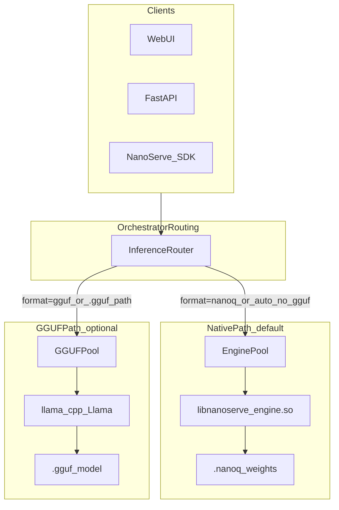

# TODO-plan-GGUF — Implementation Prompt for NanoServe

> **Copy-paste this file into an agent session to implement or extend optional GGUF support.**

---

## Prompt header

You are implementing **optional GGUF inference** for **NanoServe** — a minimal LLM orchestrator (Rust buddy allocator, C++23 native engine, FastAPI, Python SDK). GGUF must be **opt-in**, **lean**, and **orthogonal** to existing CPU/GPU device routing. The native `.nanoq` + `libnanoserve_engine.so` path remains the **default** with zero new dependencies.

---

## Non-goals (v1)

- Do **not** replace `.nanoq` or the custom C++ engine as default.
- Do **not** bundle `llama-cpp-python` in default `pip install` or default Docker images.
- Do **not** implement a full native GGUF parser in C++ (document as Phase 2 stretch only).
- Do **not** conflate `format=gguf` with `device=cpu|gpu` — they are separate axes.

---

## Design principles

| Principle | Rule |
|-----------|------|
| Minimal / no bloat | GGUF via optional `[gguf]` extra only |
| Resource-constrained | mmap GGUF, `n_ctx=2048`, Q4_K_S/Q4_0, single model instance per process |
| Preserve motto | Native path unchanged; GGUF is second runtime |
| UX parity | Model format dropdown like Compute Engine dropdown |

---

## Architecture



### Routing rules

| Input | Route |
|-------|-------|
| `format=nanoq` | Native `EnginePool` |
| `format=gguf` | `GGUFPool` → `llama-cpp-python` |
| `format=auto` | `.gguf` path → GGUF; `.nanoq` → native; else native demo |
| `device=cpu\|gpu\|auto` | Within runtime: native CUDA/OpenCL or GGUF `n_gpu_layers` |

---

## API contract (additive)

### `POST /v1/completions` request

```python
class GenerateRequest(BaseModel):
    prompt: str
    max_tokens: int = 24
    device: Literal["cpu", "gpu", "auto"] = "cpu"
    model: str | None = None          # path to .gguf or .nanoq
    format: Literal["auto", "nanoq", "gguf"] = "auto"
```

### Response

```python
class GenerateResponse(BaseModel):
    id: str
    text: str
    latency_ms: float
    device: str = "cpu"
    format: str = "nanoq"             # actual runtime used
    model: str | None = None
    warnings: list[str] = []
```

### `GET /health`

```python
{
    "native_available": True,
    "gguf_available": bool,           # llama-cpp-python importable
    "gguf_model_loaded": bool,
    "active_format": "nanoq" | "gguf",
    # ... existing fields
}
```

---

## Environment variables

```bash
NANOSERVE_MODEL_PATH=/path/to/model.gguf   # default model if request omits model
NANOSERVE_DEFAULT_FORMAT=auto
NANOSERVE_GGUF_N_CTX=2048
NANOSERVE_GGUF_N_THREADS=0                 # 0 = auto (os.cpu_count())
NANOSERVE_GGUF_N_GPU_LAYERS=0              # >0 when device=gpu
NANOSERVE_GGUF_N_BATCH=512
```

---

## File touch list

| File | Action |
|------|--------|
| `nanoserve/engine/gguf_probe.py` | `gguf_available()` import probe |
| `nanoserve/engine/gguf_worker.py` | Lazy shared `Llama` load, infer |
| `nanoserve/engine/gguf_pool.py` | Thread pool + device → n_gpu_layers |
| `nanoserve/engine/router.py` | `InferenceRouter` format + fallback |
| `nanoserve/engine/worker.py` | Extend `InferResult` with `format`, `model` |
| `nanoserve/engine/client.py` | `NanoServe(model=, format=)` |
| `server/main.py` | Router, API fields, batcher tuple |
| `server/static/index.html` | Format dropdown + model path |
| `tui/client.py` | `/format`, `/model` commands |
| `pyproject.toml` | `[gguf]` optional extra |
| `install.sh` | `ENABLE_GGUF=1` |
| `docker-compose.yml` | `gguf` profile service |
| `tests/test_gguf.py` | Probe, fallback, routing tests |

---

## Phase 1 — Probe and router stub

1. Add `gguf_probe.py` with `gguf_available() -> bool`.
2. Add `router.py` with `resolve_format()` and `InferenceRouter` delegating to native pool when GGUF unavailable.
3. Extend `/health` with `gguf_available`, `native_available`, `gguf_model_loaded`, `active_format`.
4. Wire `server/main.py` to use `InferenceRouter` instead of bare `EnginePool`.

**Acceptance:** All existing tests pass; `/health` shows new fields; GGUF requests fall back to native with warning when extra missing.

---

## Phase 2 — GGUF worker and pool

1. `gguf_worker.py`: process-level shared model (lock), mmap via `Llama(model_path=..., n_ctx=..., verbose=False)`.
2. `gguf_pool.py`: `submit(prompt, max_tokens, device, model_path)` → `InferResult`.
3. Device mapping: `gpu`/`auto` + CUDA → `n_gpu_layers` from env; else `0`.

**Acceptance:** With `[gguf]` installed and valid `.gguf`, inference returns real tokens.

---

## Phase 3 — API, SDK, batcher

1. Extend `GenerateRequest` / `GenerateResponse`.
2. Batcher queue tuple: `(req_id, prompt, max_tokens, device, format, model, fut, t0)`.
3. `NanoServe(model=, format=)` in SDK.

**Acceptance:** curl with `"format":"gguf","model":"/path/model.gguf"` works; native unchanged.

---

## Phase 4 — UI, TUI, docs

1. Web UI: **Model format** (Auto / Native / GGUF) + optional model path input.
2. TUI: `/format gguf`, `/model /path/to/model.gguf`.
3. Update `documentation/USAGE.md`, `documentation/REQUIREMENTS.md`, README "Optional GGUF" section.

**RAM guidance:** Q4_K_S or Q4_0 for &lt;8 GB; single gunicorn worker recommended for GGUF prod (avoid duplicating weights).

---

## Phase 5 — Packaging and tests

1. `pyproject.toml`: `gguf = ["llama-cpp-python>=0.2.90"]`.
2. `ENABLE_GGUF=1 ./install.sh` → `pip install -e ".[server,gguf]"`.
3. Docker `gguf` profile: install `[server,gguf]` in optional service.
4. `tests/test_gguf.py`: probe, resolve_format, fallback without llama installed.

---

## Test commands

```bash
# Default (no GGUF)
python3 tests/test_suite.py

# GGUF routing (no llama required)
python3 tests/test_gguf.py

# With GGUF extra + model
pip install -e ".[server,gguf]"
export NANOSERVE_MODEL_PATH=/path/to/tiny.gguf
curl -X POST localhost:8000/v1/completions \
  -H 'Content-Type: application/json' \
  -d '{"prompt":"Hello","max_tokens":16,"format":"gguf","device":"cpu"}'
```

---

## Acceptance checklist

- [ ] Default install: no new deps; 14 existing tests pass
- [ ] `format=nanoq` identical to pre-GGUF behavior
- [ ] `format=gguf` + model path returns tokens when `[gguf]` installed
- [ ] Missing GGUF extra → native fallback + warning
- [ ] Web UI: format + device independent
- [ ] `/health`: `gguf_available`, `native_available`
- [ ] README + REQUIREMENTS document `ENABLE_GGUF=1`
- [ ] Default Docker image unchanged; GGUF behind profile

---

## Future Phase 2 (do not implement in v1)

- C++ `libllama` backend behind `ComputeBackend`
- GGUF → `.nanoq` conversion tool
- Shared model service for multi-gunicorn GGUF deployments
