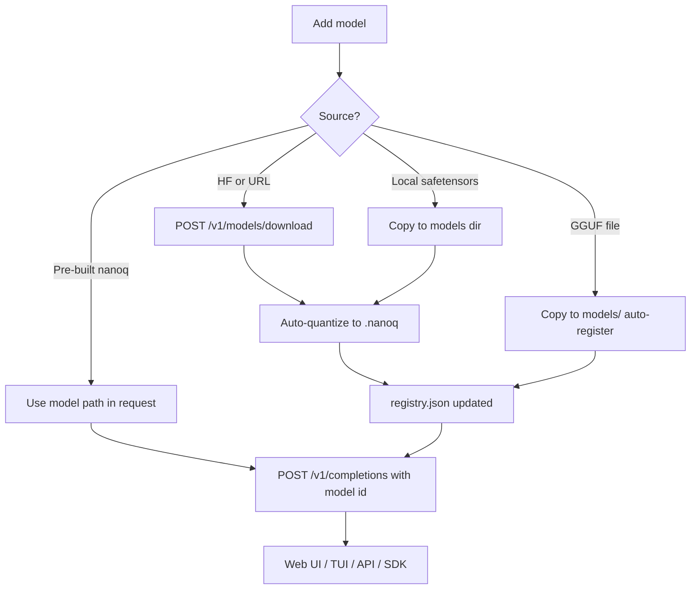

# How to Add Models to NanoServe

Register, download, quantize, and use models via **Web UI**, **HTTP API**, **Python SDK**, and **TUI**.

**Related:** [Quick-deploy-method.md](Quick-deploy-method.md) · [USAGE.md](USAGE.md) · [connect-network.md](connect-network.md)

---

## Default behavior (no model)

Fresh `docker compose up` (`:8000`) or `./install.sh` + server start ships **no real LLM weights**. With **Model = Built-in demo (no model)** (or omitting `model` in API/SDK on CPU):

- The C++ engine uses **synthetic demo weights** (1024 int8 values + fixed 22-word vocabulary)
- Output is deterministic demo text about the inference pipeline — **not** real LLM inference
- `/health` shows `models_registered: 0`, `gguf_available: false` on CPU Docker

**Docker GGUF (`:8002`):** drop `.gguf` files in `./models/` — auto-registered at startup. **You must select a model** in Web UI, TUI, or API for `format=gguf`.

Add a model using any method below to run real `.nanoq` or `.gguf` weights.

---

## Supported formats

| Format | Extension | Runtime | Notes |
|--------|-----------|---------|-------|
| **Native quantized** | `.nanoq` v2 | C++ engine | int8, fp16, fp4 — preferred |
| **Safetensors** | `.safetensors` | Auto-converted to `.nanoq` | Requires `[models]` extra |
| **GGUF** | `.gguf` | llama-cpp-python | Requires `[gguf]` extra |
| **Raw weights** | `.bin`, `.pt` | Converted or passthrough | `precision=raw` not recommended |

---

## Where models are stored

| Setting | Default | Purpose |
|---------|---------|---------|
| `NANOSERVE_MODELS_DIR` | `~/.nanoserve/models` (Docker GGUF: `/models`) | Registry root; `.gguf` in this dir auto-register on startup |
| `NANOSERVE_MODEL_PATH` | unset | Optional fallback when `model` omitted — **not set in docker-compose** |

**Auto-quantize:** `NANOSERVE_AUTO_QUANTIZE=1` (default) converts safetensors → int8 `.nanoq` on first use.

**LRU cache:** `NANOSERVE_MAX_LOADED_MODELS=2` — max models loaded in engine memory at once.

---

## Prerequisites

### Native install

```bash
./install.sh                              # includes [models] via ENABLE_MODELS=1
ENABLE_GGUF=1 ./install.sh                # + llama-cpp-python for .gguf
source .venv/bin/activate && source .env.nanoserve
./scripts/run_native.sh
```

### Docker

Default CPU image installs `[server]` only. For HuggingFace download inside the container, extend the image or run:

```bash
docker compose exec nanoserve pip install "nanoserve[models]"
```

For **GGUF Docker profile** (`--profile gguf`, port **8002**), compose already sets:

```yaml
environment:
  - NANOSERVE_MODELS_DIR=/models
volumes:
  - ./models:/models
```

Copy `.gguf` files into `./models/` on the host — they appear in the Web UI dropdown after restart (auto-registered). Select the model before generating with **Format: GGUF**.

---

## 1. Web UI

Open **http://localhost:8000** (or host LAN IP — see [connect-network.md](connect-network.md)).

### Download from HuggingFace or URL

1. Click **Download model**
2. Choose **Source:** HuggingFace or Direct URL
3. Enter **Repo ID** (e.g. `org/model`) or **URL**
4. Optional: **Filename** (`model.safetensors`), **Local model ID**
5. Set **Precision** in the config grid (int8 default) before download
6. Click **Download** — model appears in the **Model** dropdown

### Use an existing `.gguf` or `.nanoq` file

- **GGUF Docker:** copy into `./models/` → auto-registered at startup → select in dropdown
- **Native:** copy into `$NANOSERVE_MODELS_DIR` → restart server or call sync (restart triggers `registry.sync_local()`)

### Generate with a model

1. **CPU demo (`:8000`):** leave **Built-in demo (no model)**, Format **Auto** — synthetic output only
2. **GGUF (`:8002`):** select model in dropdown (**required**), Format **GGUF**
3. Set **Precision** if converting raw safetensors weights
4. Click **Generate**

---

## 2. HTTP API

Base URL: `http://localhost:8000` (adjust port for Docker GPU `:8001`, GGUF `:8002`).

### List models

```bash
curl -s http://localhost:8000/v1/models | jq .
```

### Download from HuggingFace

```bash
curl -X POST http://localhost:8000/v1/models/download \
  -H 'Content-Type: application/json' \
  -d '{
    "source": "hf",
    "repo_id": "org/model-repo",
    "filename": "model.safetensors",
    "model_id": "my-model",
    "precision": "int8"
  }'
```

Response includes `model.id`, `resolved_path`, `format`, `quantized`, and `warnings`.

### Download from URL

```bash
curl -X POST http://localhost:8000/v1/models/download \
  -H 'Content-Type: application/json' \
  -d '{
    "source": "url",
    "url": "https://example.com/weights.safetensors",
    "model_id": "url-model",
    "precision": "fp16"
  }'
```

### Get one model

```bash
curl -s http://localhost:8000/v1/models/my-model | jq .
```

### Delete a model

```bash
curl -X DELETE http://localhost:8000/v1/models/my-model
```

### Run inference with a model

```bash
curl -X POST http://localhost:8000/v1/completions \
  -H 'Content-Type: application/json' \
  -d '{
    "prompt": "Hello world",
    "max_tokens": 32,
    "device": "auto",
    "model": "my-model",
    "format": "auto",
    "precision": "int8"
  }'
```

### Use a filesystem path (no registry)

Pass an absolute path as `model` if the file exists on the server:

```bash
curl -X POST http://localhost:8000/v1/completions \
  -H 'Content-Type: application/json' \
  -d '{"prompt":"Hi","max_tokens":16,"model":"/path/to/model.nanoq","format":"nanoq"}'
```

### GGUF inference

Requires `[gguf]` installed and a `.gguf` file registered (or in `NANOSERVE_MODELS_DIR`):

```bash
curl -X POST http://localhost:8002/v1/completions \
  -H 'Content-Type: application/json' \
  -d '{"prompt":"Hello","max_tokens":32,"format":"gguf","device":"cpu","model":"distilgpt2-Q2_K"}'
```

`model` is **required** when `format=gguf` unless `NANOSERVE_MODEL_PATH` is set.

### API field reference

| Field | Values | Purpose |
|-------|--------|---------|
| `source` | `hf`, `url` | Download source |
| `repo_id` | string | HuggingFace repo |
| `filename` | string | File in HF repo |
| `url` | string | Direct download URL |
| `model_id` | string | Local registry ID |
| `precision` | `int8`, `fp16`, `fp4`, `raw` | Quantization on convert |
| `quantize` | `true`/`false`/`null` | Override auto-quantize |
| `format` | `auto`, `nanoq`, `gguf` | Inference runtime |
| `model` | id or path | Which weights to use |

---

## 3. Python SDK

Install with models support:

```bash
pip install -e ".[models]"
pip install -e ".[gguf]"    # optional, for GGUF
```

### Download and register

```python
from nanoserve import NanoServe

engine = NanoServe(device="auto")

# HuggingFace
result = engine.download(
    "hf",
    repo_id="org/model",
    filename="model.safetensors",
    model_id="my-model",
    precision="int8",
)
print(result["entry"]["id"], result["resolved_path"])

# Direct URL
engine.download(
    "url",
    url="https://example.com/weights.safetensors",
    model_id="url-model",
    precision="fp16",
)

print(engine.list_models())
```

### Generate with a model

```python
engine = NanoServe(device="auto", model="my-model", format="auto")
text = engine.generate("Explain buddy allocators", max_tokens=32)
print(text, engine.last_device, engine.last_warnings)
```

### Point at a local `.nanoq` file (in-process)

```python
engine = NanoServe(device="cpu", model="/tmp/demo.nanoq", format="nanoq")
print(engine.generate("Hello", max_tokens=24))
```

### Quantize offline (no server)

```python
from nanoserve import Quantizer
import numpy as np

weights = np.random.randn(256, 1024).astype(np.float32)
Quantizer.from_weights(weights, "model-int8.nanoq", precision="int8", name="demo")
```

**CLI:**

```bash
nanoserve-quantizer weights.safetensors --out model-int8.nanoq --precision int8
nanoserve-quantizer --rows 256 --cols 1024 --out demo.nanoq   # random demo weights
```

### SDK vs remote server

The SDK runs **in-process** (loads `libnanoserve_engine.so` locally). To use models on a **remote** Docker/native host, call the **HTTP API** with `httpx` instead — see [connect-network.md](connect-network.md).

Demo script:

```bash
python examples/sdk_demo.py
```

---

## 4. Terminal UI (TUI)

Connect to a running server:

```bash
pip install httpx rich
python tui/client.py http://localhost:8000 --device auto
```

Remote host:

```bash
python tui/client.py http://192.168.1.42:8000 --model my-model --format auto
```

### Slash commands

| Command | Example | Action |
|---------|---------|--------|
| `/models` | `/models` | List registered models |
| `/download hf` | `/download hf org/model model.safetensors` | HF download + auto-select |
| `/download url` | `/download url https://example.com/w.safetensors` | URL download |
| `/model` | `/model my-model` | Select model (empty = default demo) |
| `/format` | `/format nanoq` | Set runtime format |
| `/precision` | `/precision fp16` | Set quantize precision for downloads |
| `/device` | `/device gpu` | CPU / GPU / auto |

After `/download`, the TUI sets `current_model` to the new ID automatically.

Type a normal prompt (not starting with `/`) to run completion against the selected model.

---

## 5. Manual setup (copy files)

### Step A — Copy weights to the models directory

```bash
mkdir -p ~/.nanoserve/models/my-local-model
cp /path/to/model.nanoq ~/.nanoserve/models/my-local-model/
# or
cp /path/to/model.gguf ~/.nanoserve/models/my-local-model/
```

### Step B — Register via download API or use path directly

**Option 1:** Use path in completions:

```bash
curl -X POST localhost:8000/v1/completions \
  -d '{"prompt":"Hi","max_tokens":16,"model":"'"$HOME"'/.nanoserve/models/my-local-model/model.nanoq"}' \
  -H 'Content-Type: application/json'
```

**Option 2:** Download/register flow converts safetensors automatically; for pre-built `.nanoq`, edit `registry.json` or use SDK registry (advanced).

### Step C — Optional default via environment (advanced)

```bash
export NANOSERVE_MODEL_PATH=/path/to/model.gguf   # optional fallback only
```

Normally you **select** the model in Web UI / TUI / API instead of relying on this env var.

---

## 6. Docker GGUF quick setup

```bash
mkdir -p ./models
cp /path/to/model.gguf ./models/

docker compose --profile gguf up --build
```

Open http://localhost:8002 → **Model:** select your file → **Format: GGUF** → Generate.

Verify: `curl -s localhost:8002/v1/models | jq .`

---

## 7. Workflow summary



---

## Client cheat sheet

| Action | Web UI | API | SDK | TUI |
|--------|--------|-----|-----|-----|
| List models | Model dropdown | `GET /v1/models` | `engine.list_models()` | `/models` |
| Download HF | Download modal | `POST /v1/models/download` | `engine.download("hf", ...)` | `/download hf org/repo file` |
| Download URL | Download modal | `POST /v1/models/download` | `engine.download("url", ...)` | `/download url https://…` |
| Select model | Model dropdown | `"model": "id"` | `NanoServe(model="id")` | `/model id` |
| Set format | Format dropdown | `"format": "nanoq"` | `format="nanoq"` | `/format nanoq` |
| Set precision | Precision dropdown | `"precision": "fp16"` | `precision="fp16"` | `/precision fp16` |
| Generate | Generate button | `POST /v1/completions` | `engine.generate(...)` | type prompt |
| Delete model | — | `DELETE /v1/models/{id}` | registry API | — |

---

## Troubleshooting

| Issue | Fix |
|-------|-----|
| `501 huggingface-hub required` | `pip install nanoserve[models]` (Docker: exec into container) |
| Download OK but empty model list | Refresh Web UI; `GET /v1/models` |
| Still demo output | CPU `:8000` = built-in demo; use `:8002` GGUF + selected model |
| GGUF fails / 400 | Select model in UI/API; `format=gguf` requires `model` field |
| `Model not found` | Check `model_id` in registry; `GET /v1/models` |
| Quantize warning / raw fallback | Set `precision=int8`; check safetensors readable |
| Docker no disk for HF | Mount volume for `NANOSERVE_MODELS_DIR` |
| Large model OOM | Use Q4 GGUF; reduce `NANOSERVE_MAX_LOADED_MODELS` |

---

## Environment variables

```bash
export NANOSERVE_MODELS_DIR="$HOME/.nanoserve/models"
export NANOSERVE_MODEL_PATH=""              # optional fallback only — prefer UI/API model selection
export NANOSERVE_AUTO_QUANTIZE="1"            # convert safetensors on use
export NANOSERVE_DEFAULT_PRECISION="int8"
export NANOSERVE_MAX_LOADED_MODELS="2"
export NANOSERVE_DEFAULT_FORMAT="auto"        # or gguf when using GGUF stack
```

---

## See also

| Doc | Content |
|-----|---------|
| [USAGE.md](USAGE.md) | Full API and client usage |
| [Quick-deploy-method.md](Quick-deploy-method.md) | Start Docker / native server |
| [connect-network.md](connect-network.md) | Use models from other devices |
| [SETUP.md](SETUP.md) | Install and GGUF build flags |
