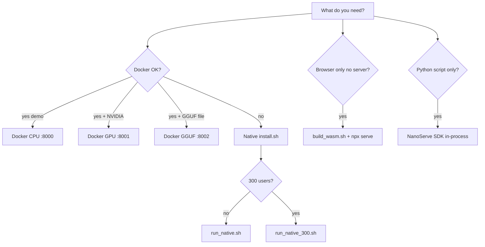

# NanoServe — Quick Deploy by Method

One-page setup, startup, and usage for **every** way to run NanoServe.

| Method | Best for | Server required | URL / entry |
|--------|----------|-----------------|-------------|
| [Docker CPU](#1-docker-cpu-default) | Fastest try, CI, demo | Yes (container) | http://localhost:8000 |
| [Docker GPU](#2-docker-gpu-profile) | NVIDIA GPU in container | Yes | http://localhost:8001 |
| [Docker GGUF](#3-docker-gguf-profile) | Real LLM via llama.cpp | Yes | http://localhost:8002 |
| [Native dev](#4-native-install-dev-server) | Local development (~150 users) | Yes (uvicorn) | http://localhost:8000 |
| [Native production](#5-native-production-300-users) | 300 concurrent users | Yes (nginx + gunicorn) | http://localhost:8000 |
| [Native + CUDA/OpenCL/GGUF](#6-native-optional-build-flags) | Full feature native stack | Yes | http://localhost:8000 |
| [Browser WASM](#7-browser-wasm-demo) | In-browser demo, no Python | No | Static host (e.g. :3000) |
| [Python SDK (in-process)](#8-python-sdk-in-process) | Scripts, notebooks, tests | No | `from nanoserve import NanoServe` |
| [Web UI](#9-web-ui-all-server-methods) | Interactive browser client | Yes (any server above) | http://localhost:8000 |
| [TUI](#10-terminal-ui-tui) | Terminal client + load tests | Yes | `python tui/client.py` |

**Related docs:** [SETUP.md](SETUP.md) · [USAGE.md](USAGE.md) · [How-to-add-models-doc.md](How-to-add-models-doc.md) · [connect-network.md](connect-network.md) · [SCALING.md](SCALING.md) · [WASM.md](WASM.md) · [REQUIREMENTS.md](REQUIREMENTS.md)

---

## 1. Docker CPU (default)

**Use when:** You want a self-contained demo with no host toolchain.

**Important:** Port **8000** runs the **built-in synthetic demo** — not a real LLM. Output uses a fixed engine vocabulary (“quantized inference buddy allocator…”). For real AI, use [Docker GGUF](#3-docker-gguf-profile) on port **8002**.

### Prerequisites

- Docker 20+
- Git

### Setup

```bash
git clone git@github.com:Team-Auralis-Labs/NanoServe.git && cd NanoServe
docker compose up --build
```

First run builds the CPU image (`runtime-cpu`) and starts `nanoserve` on port **8000**.

**Build hygiene:** A `.dockerignore` excludes host `engine/build/`, `allocator/target/`, and venvs so CMake/Rust caches do not break in-container builds. The Dockerfile sets `PYTHONPATH=/app` so the server starts correctly.

### Startup

```bash
docker compose up              # foreground
docker compose up -d           # detached
docker compose down            # stop
docker compose logs -f         # logs
```

### Usage

| Task | Command |
|------|---------|
| Web UI | Open http://localhost:8000 — **Model: Built-in demo (no model)**; **Format: Auto** |
| Health | `curl -s localhost:8000/health \| jq .` |
| Completions | See [HTTP API snippet](#http-api-quick-reference) below |
| List models | `curl -s localhost:8000/v1/models \| jq .` |

### Stop

```bash
docker compose down
```

---

## 2. Docker GPU (profile)

**Use when:** You have NVIDIA GPU + [NVIDIA Container Toolkit](https://docs.nvidia.com/datacenter/cloud-native/container-toolkit/install-guide.html) installed and Docker configured for `--gpus`.

### Setup & startup

```bash
docker compose --profile gpu up --build
```

Service `nanoserve-gpu` listens on **http://localhost:8001** (maps container 8000 → host 8001).

**Build notes:** The GPU image uses `nvidia/cuda:12.4.1-devel` for compilation. `engine/nvcc_wrapper.sh` resolves `nvcc` under `/usr/local/cuda` or `/usr/lib/cuda`. If compose fails with `could not select device driver "nvidia"`, install the Container Toolkit — the image may still build without it.

### Usage

Same API and Web UI as CPU; set `"device": "gpu"` or `"device": "auto"` in completions. Web UI shows **Built-in demo (no model)** unless you add registered models.

```bash
curl -s localhost:8001/health | jq '.gpu_cuda, .gpu_available'
```

### Stop

```bash
docker compose --profile gpu down
```

---

## 3. Docker GGUF (profile)

**Use when:** You want real LLM inference via **llama-cpp-python** in a container.

### Prerequisites

- A `.gguf` model file in `./models/` on the host (user-provided — **no default model in compose**)

### Setup

```bash
mkdir -p models
# Download or copy your-model.gguf into ./models/

docker compose --profile gguf up --build
```

GGUF service runs on **http://localhost:8002**. Volume: `./models:/models` (read-write — registry writes `registry.json` here).  
Environment: `NANOSERVE_MODELS_DIR=/models` — `.gguf` files are **auto-registered** at startup.

### Usage

1. Open http://localhost:8002
2. **Model** dropdown → select your model (e.g. `distilgpt2-Q2_K`)
3. **Format** → **GGUF**
4. **Generate**

```bash
curl -s http://localhost:8002/v1/models | jq .
curl -X POST http://localhost:8002/v1/completions \
  -H 'Content-Type: application/json' \
  -d '{"prompt":"Hello","max_tokens":32,"format":"gguf","device":"cpu","model":"distilgpt2-Q2_K"}'
```

**Required:** pass `"model"` for GGUF (Web UI, TUI `/model`, or API). Omitting model returns HTTP 400.

Optional override: `export NANOSERVE_MODEL_PATH=/models/your.gguf` before compose (advanced — not set by default).

### Stop

```bash
docker compose --profile gguf down
```

---

## 4. Native install — dev server

**Use when:** Developing on Linux with full control; up to ~150 concurrent users (single uvicorn).

### Prerequisites

See [REQUIREMENTS.md](REQUIREMENTS.md): Rust, CMake, C++23, Python ≥ 3.10.

### Setup (one time)

```bash
git clone git@github.com:Team-Auralis-Labs/NanoServe.git && cd NanoServe
./install.sh
```

`install.sh` builds the Rust allocator, C++ engine, Python venv, and writes `.env.nanoserve`.

### Startup

```bash
source .venv/bin/activate && source .env.nanoserve
./scripts/run_native.sh
```

Server: **http://localhost:8000** (uvicorn, `NANOSERVE_NUM_WORKERS` defaults to `nproc`).

### Usage

| Task | How |
|------|-----|
| Web UI | http://localhost:8000 |
| SDK | `python examples/sdk_demo.py` |
| TUI | `python tui/client.py --device auto` |
| API | [HTTP API](#http-api-quick-reference) |

### Stop

`Ctrl+C` in the terminal running uvicorn.

---

## 5. Native production (300 users)

**Use when:** Serving 150–300 concurrent users without Docker.

### Prerequisites

- Completed [Native install](#4-native-install-dev-server)
- **nginx** + **gunicorn** (install via apt on Debian/Ubuntu)

### Startup

```bash
source .venv/bin/activate && source .env.nanoserve
./scripts/run_native_300.sh
```

Uses nginx on port **8000** → 4× gunicorn workers (configurable via `NANOSERVE_UVICORN_WORKERS`).

Details: [SCALING.md](SCALING.md)

### Usage

Same Web UI, API, TUI, and SDK as dev mode — point clients at http://localhost:8000.

### Stop

`Ctrl+C` or stop nginx/gunicorn processes started by `scripts/serve_production.sh`.

---

## 6. Native optional build flags

Extend `./install.sh` for GPU backends or GGUF on the **native** path (not Docker).

| Flag | Effect |
|------|--------|
| `ENABLE_CUDA=1` | Build CUDA GEMV backend (NVIDIA) |
| `ENABLE_OPENCL=1` | Build OpenCL backend |
| `ENABLE_GGUF=1` | Install `llama-cpp-python` extra |
| `ENABLE_MODELS=0` | Skip `[models]` pip extra |

### Setup examples

```bash
# CPU + models (default)
./install.sh

# CUDA + models
ENABLE_CUDA=1 ./install.sh

# GGUF for real LLM output
ENABLE_GGUF=1 ./install.sh
# Pick model via Web UI / TUI /model / API — optional:
# export NANOSERVE_MODEL_PATH=/path/to/model.gguf

# All optional features
ENABLE_CUDA=1 ENABLE_GGUF=1 ./install.sh
```

### Startup

Same as [dev](#4-native-install-dev-server) or [production](#5-native-production-300-users):

```bash
source .venv/bin/activate && source .env.nanoserve
./scripts/run_native.sh          # dev
# or
./scripts/run_native_300.sh      # 300 users
```

### GGUF usage (native)

```bash
curl -X POST http://localhost:8000/v1/completions \
  -H 'Content-Type: application/json' \
  -d '{"prompt":"Hello","max_tokens":16,"format":"gguf","device":"cpu","model":"my-model-id"}'
```

| Env var | Default | Purpose |
|---------|---------|---------|
| `NANOSERVE_MODELS_DIR` | `~/.nanoserve/models` | Registry root; drop `.gguf` here for auto-discovery |
| `NANOSERVE_MODEL_PATH` | unset | Optional fallback when `model` omitted |
| `NANOSERVE_GGUF_N_CTX` | 2048 | Context window |
| `NANOSERVE_GGUF_N_GPU_LAYERS` | 0 | GPU layers when `device=gpu\|auto` |
| `NANOSERVE_GGUF_N_BATCH` | 512 | Batch size |

---

## 7. Browser WASM (demo)

**Use when:** Trying NanoServe in the browser with **no Python server, no Docker**. Demo tier only — not for production.

Full details: [WASM.md](WASM.md)

### Prerequisites

- [Emscripten SDK](https://emscripten.org/) (`emcc` on PATH)
- Node.js (optional, for `npx serve`)

### Setup & build

```bash
source /path/to/emsdk/emsdk_env.sh    # if emcc not on PATH
./scripts/build_wasm.sh               # or: npm run build:wasm
```

Outputs: `deployment/wasm/nanoserve_engine.wasm`, loader JS, slim UI.

### Startup

```bash
npx serve deployment/wasm             # or: npm run serve:wasm
```

Open the URL printed (typically http://localhost:3000).

### Usage

1. Wait for **WASM ready** status chip.
2. **Load .nanoq file** (or use bundled `assets/demo.nanoq` if built).
3. Enter prompt → **Generate** → see latency meta tags.

**Generate is blocked until a model is loaded** — you must click **Load .nanoq file** first.

**JS API (browser console or embed):**

```javascript
await NanoServeWasm.init();
NanoServeWasm.loadModel(arrayBuffer);
const { text, latencyMs } = NanoServeWasm.infer('Hello', { maxTokens: 24 });
NanoServeWasm.dispose();
```

**Includes:** `.nanoq` v2 (int8/fp16/fp4), CPU GEMV demo, frosted-glass UI.  
**Excludes:** FastAPI, multi-model registry, CUDA, GGUF, 300-user scaling.

### Stop

`Ctrl+C` on the static file server.

---

## 8. Python SDK (in-process)

**Use when:** Calling inference from Python without running FastAPI — scripts, tests, pipelines.

### Setup

```bash
./install.sh                         # or: pip install -e .
source .venv/bin/activate && source .env.nanoserve
```

### Usage

```python
from nanoserve import NanoServe, Quantizer
import numpy as np

# Quantize weights to .nanoq v2
w = np.random.randn(64, 128).astype(np.float32)
Quantizer.from_weights(w, "/tmp/demo.nanoq", precision="int8", name="demo")

# In-process inference
engine = NanoServe(device="auto", model="/tmp/demo.nanoq", format="nanoq")
print(engine.generate("Hello world", max_tokens=32))
print(engine.list_models())
```

**CLI quantizer:**

```bash
nanoserve-quantizer weights.safetensors -o model.nanoq --precision fp16
```

**Demo script:**

```bash
python examples/sdk_demo.py
```

**Download models (requires `[models]` extra):**

```python
engine.download("hf", repo_id="org/model", filename="model.safetensors")
```

No HTTP server required — loads `libnanoserve_engine.so` directly via ctypes.

---

## 9. Web UI (all server methods)

**Use when:** Interactive use of any **server-backed** deployment (Docker or native).

### Startup

Start any server method that exposes FastAPI on port 8000 (or 8001/8002 for Docker profiles):

- [Docker CPU](#1-docker-cpu-default) → :8000
- [Docker GPU](#2-docker-gpu-profile) → :8001
- [Docker GGUF](#3-docker-gguf-profile) → :8002
- [Native dev / production](#4-native-install-dev-server) → :8000

### Usage

1. Open **http://localhost:8000** (adjust port: GPU **8001**, GGUF **8002**).
2. **Compute engine:** CPU · GPU · Auto
3. **Model:** **Built-in demo (no model)** on CPU `:8000` — or **Select model…** on GGUF `:8002` / when models exist
4. **Format:** Auto · Native (`.nanoq`) · GGUF (disabled when `/health` reports `gguf_available: false`)
5. **Precision:** int8 · fp16 · fp4 · raw
6. **Download model:** HuggingFace repo or URL
7. Click **Generate**

Live status chips poll `/health` for online state, GPU, model count, and GGUF availability. The UI adapts labels and disables GGUF on CPU-only servers.

Static assets: `server/static/` (`index.html`, `styles.css`, `app.js`).

---

## 10. Terminal UI (TUI)

**Use when:** Terminal-based chat against a running server.

### Prerequisites

- Running NanoServe server ([native](#4-native-install-dev-server) or [Docker](#1-docker-cpu-default))
- `pip install httpx rich` (usually via `[server]` extra)

### Startup

```bash
source .venv/bin/activate
python tui/client.py http://127.0.0.1:8000 --device auto
```

**Options:** `--model`, `--format auto|nanoq|gguf`, `--precision int8|fp16|fp4|raw`

### Usage (slash commands)

```
/device cpu|gpu|auto
/model [id|path]
/format auto|nanoq|gguf
/precision int8|fp16|fp4|raw
/models
/download hf <repo> [file]
/download url <url>
/help
exit
```

### Load test

```bash
python tui/load_test.py --users 50 --device auto
python3 tests/load_test_report.py --preset 300    # full report
```

---

## HTTP API quick reference

Works on any server deployment (ports 8000 / 8001 / 8002 as applicable).

```bash
# Health
curl -s http://localhost:8000/health | jq .

# List models
curl -s http://localhost:8000/v1/models | jq .

# Completions
curl -X POST http://localhost:8000/v1/completions \
  -H 'Content-Type: application/json' \
  -d '{
    "prompt": "Hello",
    "max_tokens": 24,
    "device": "auto",
    "model": "my-model",
    "format": "auto",
    "precision": "int8"
  }'

# Download model (HF)
curl -X POST http://localhost:8000/v1/models/download \
  -H 'Content-Type: application/json' \
  -d '{
    "source": "hf",
    "repo_id": "org/model",
    "filename": "model.safetensors",
    "precision": "int8"
  }'
```

More fields and examples: [USAGE.md](USAGE.md)

---

## Environment variables (common)

After native install, these are in `.env.nanoserve`:

```bash
export NANOSERVE_MODELS_DIR="$HOME/.nanoserve/models"
export NANOSERVE_AUTO_QUANTIZE="1"
export NANOSERVE_MAX_LOADED_MODELS="2"
export NANOSERVE_DEFAULT_PRECISION="int8"
export NANOSERVE_ENGINE_LIB="$PWD/engine/build/libnanoserve_engine.so"
export LD_LIBRARY_PATH="$PWD/allocator/target/release:$LD_LIBRARY_PATH"
```

---

## Method chooser



---

## Troubleshooting

| Issue | Fix |
|-------|-----|
| `libnanoserve_engine.so: cannot open` | `source .env.nanoserve` |
| `ModuleNotFoundError: No module named 'server'` in Docker | Fixed in current Dockerfile (`PYTHONPATH=/app`); rebuild image |
| CMake `CMakeCache.txt` path mismatch in Docker build | Fixed: `.dockerignore` + `rm -rf engine/build` before cmake; rebuild |
| Web UI unstyled | Use http://localhost:8000/ (redirects to `/static/index.html`) |
| “Select model for GGUF” on `:8000` | Use `:8002` with `--profile gguf`, or set Format to **Auto** on CPU demo |
| Fake demo words on `:8000` | Expected — built-in demo; use `:8002` + GGUF + selected model for real AI |
| GPU not detected | Check `/health`; NVIDIA Container Toolkit for compose GPU profile |
| GPU compose: `could not select device driver nvidia` | Install [NVIDIA Container Toolkit](https://docs.nvidia.com/datacenter/cloud-native/container-toolkit/install-guide.html) |
| GGUF format fails | Docker `--profile gguf`; select model in UI/API (`model` field required) |
| WASM build fails | `source emsdk/emsdk_env.sh`; see [WASM.md](WASM.md) |
| WASM Generate error | Load a `.nanoq` file first |
| Port in use | Change `PORT=8001 ./scripts/run_native.sh` or stop conflicting service |
| Verify all profiles | `bash scripts/audit_deployments.sh` |

Full troubleshooting: [SETUP.md#troubleshooting](SETUP.md)

---

## See also

| Doc | Content |
|-----|---------|
| [SETUP.md](SETUP.md) | Full install guide |
| [USAGE.md](USAGE.md) | API, SDK, TUI details |
| [SCALING.md](SCALING.md) | 300-user tuning |
| [WASM.md](WASM.md) | Browser demo deep dive |
| [REQUIREMENTS.md](REQUIREMENTS.md) | Native prerequisites |
| [index.html](index.html) | Documentation hub |
