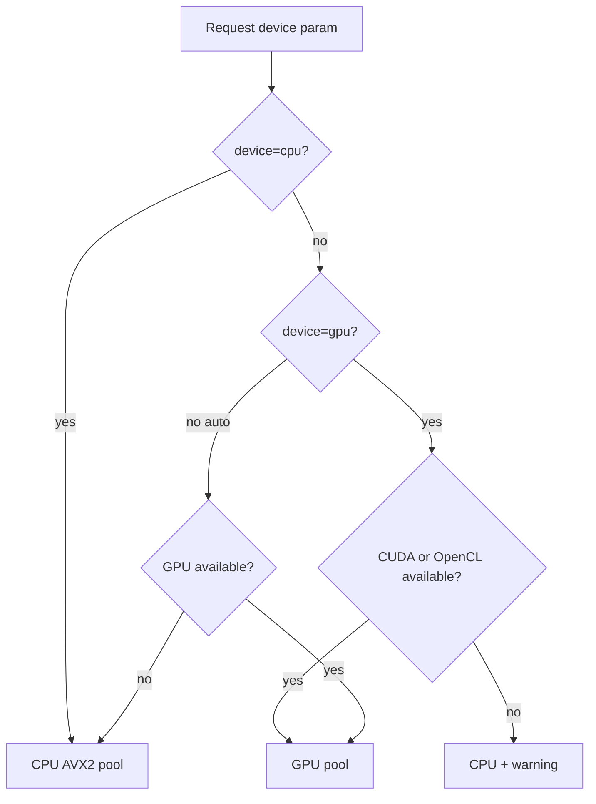

# NanoServe — Setup & Usage Guide

Complete guide for installing, running, and testing NanoServe in every mode.

## Table of contents

1. [Platform status](#platform-status)
2. [Naming](#naming)
3. [Prerequisites](#prerequisites)
4. [Native install (no Docker)](#native-install-no-docker)
5. [Python SDK](#python-sdk)
6. [HTTP server & Web UI](#http-server--web-ui)
7. [Terminal UI (TUI)](#terminal-ui-tui)
8. [Device selection](#device-selection)
9. [Docker deployment](#docker-deployment)
10. [Building GPU backends](#building-gpu-backends)
11. [C++23 engine](#c23-engine)
12. [Testing](#testing)
13. [Troubleshooting](#troubleshooting)

---

## Platform status

| Component | Status | Notes |
|-----------|--------|-------|
| **Web UI** | Working | http://localhost:8000 — prompt, model/format/precision, Compute Engine, download |
| **Model registry** | Working | `GET /v1/models`, download HF/URL, auto-quantize to `.nanoq` |
| **Multi-model** | Working | Per-request `model` id; LRU cache (`NANOSERVE_MAX_LOADED_MODELS`) |
| **GGUF (optional)** | Optional | `pip install nanoserve[gguf]` — real inference via llama-cpp-python |

For GGUF production use a **single gunicorn worker** to avoid duplicating model weights. Prefer Q4_K_S or Q4_0 quantizations under 8 GB RAM.

```bash
ENABLE_GGUF=1 ./install.sh
# Select model via Web UI, TUI /model, or API — optional fallback:
# export NANOSERVE_MODEL_PATH=/path/to/model.gguf
export NANOSERVE_GGUF_N_GPU_LAYERS=0   # set >0 for GPU offload
```
| **CUDA backend** | Working | INT8 GEMV kernel; verified on NVIDIA RTX 3060; CPU/CUDA output parity confirmed |
| **OpenCL backend** | Optional | Code complete; requires `ocl-icd-opencl-dev` + `opencl-headers` at build time |
| **CPU backend** | Working | AVX2 SIMD; default path, backward-compatible FFI |
| **Python SDK** | Working | `pip install -e .` → `from nanoserve import NanoServe` |
| **TUI** | Working | `--device` flag + `/device gpu` slash commands |

GPU priority at runtime: **CUDA → OpenCL → CPU fallback** (with warnings in API response).

---

## Naming

| Context | Name |
|---------|------|
| GitHub / marketing | **NanoServe** |
| Repo folder | `NanoServe` |
| pip install | `pip install nanoserve` (PyPI lowercases) |
| Python import | `from nanoserve import NanoServe` |
| C++ shared lib | `libnanoserve_engine.so` |

---

## Prerequisites

**Full checklist:** [REQUIREMENTS.md](REQUIREMENTS.md) (non-Docker prior requirements).

| Component | Version | Required for |
|-----------|---------|--------------|
| Rust | stable | allocator build |
| CMake | ≥ 3.16 | engine build |
| GCC/Clang C++23 | recent | engine build |
| Python | ≥ 3.10 | SDK & server |
| nginx + gunicorn | latest | **300-user non-Docker production** |
| CUDA Toolkit | 11.x–12.x | CUDA backend (optional) |
| OpenCL ICD | any | OpenCL backend (optional) |
| Docker | 20+ | container deployment |
| NVIDIA Container Toolkit | latest | GPU Docker profile |
| valgrind | 3.x | memory audit (optional) |

Debian/Ubuntu base:

```bash
sudo apt-get install -y build-essential cmake curl python3 python3-pip python3-venv git nginx
```

---

## Native install (no Docker)

```bash
git clone https://github.com/<your-org>/NanoServe.git && cd NanoServe
./install.sh                  # CPU — writes .env.nanoserve
ENABLE_CUDA=1 ./install.sh    # + NVIDIA CUDA
ENABLE_OPENCL=1 ./install.sh  # + OpenCL

source .venv/bin/activate && source .env.nanoserve
./scripts/run_native.sh       # dev / ~150 users — http://localhost:8000
./scripts/run_native_300.sh   # production / 300 users (nginx + gunicorn)
```

See [USAGE.md](USAGE.md) for Web UI, API, SDK, and TUI.  
See [SCALING.md](SCALING.md) for env tuning.  
Reports: [reports/FULL_TEST_REPORT.md](reports/FULL_TEST_REPORT.md).

---

## Python SDK

Install: `pip install -e .`

### Quantizer

```python
from nanoserve import Quantizer
import numpy as np

weights = np.random.randn(256, 1024).astype(np.float32)
q, scales = Quantizer.quantize_int8(weights)
Quantizer.write_nanoq("model-int8.nanoq", q, scales, 256, 1024)
```

CLI:

```bash
python -m nanoserve.quantizer --rows 256 --cols 1024 --out model-int8.nanoq
nanoserve-quantizer --out model-int8.nanoq
```

### In-process inference

```python
from nanoserve import NanoServe

engine = NanoServe(device="auto")
text = engine.generate("Explain buddy allocators", max_tokens=32)
print(text, engine.last_device, engine.last_warnings)

# async
import asyncio
async def run():
    engine = NanoServe(device="gpu")
    return await engine.generate_async("Hello", max_tokens=16)
asyncio.run(run())
```

Demo script: `python examples/sdk_demo.py`

---

## HTTP server & Web UI

The Web UI is a single-page app served at `/` by FastAPI. It is **fully working** in native and Docker installs.

```bash
python server/main.py
# or: uvicorn server.main:app --host 0.0.0.0 --port 8000
```

- **Web UI:** http://localhost:8000 — textarea prompt, max tokens, **Compute Engine** dropdown (CPU / GPU / Auto)
- **Health:** http://localhost:8000/health — reports `gpu_cuda`, `gpu_opencl`, `gpu_available`
- **Completions:** `POST /v1/completions`

Request body:

```json
{
  "prompt": "Hello world",
  "max_tokens": 50,
  "device": "cpu"
}
```

`device` options: `"cpu"` (default), `"gpu"`, `"auto"`.

---

## Terminal UI (TUI)

```bash
python tui/client.py http://127.0.0.1:8000 --device cpu
```

Interactive commands:

| Command | Action |
|---------|--------|
| `/device gpu` | Switch to GPU |
| `/device cpu` | Switch to CPU |
| `/device auto` | Auto-select best backend |
| `/help` | Show commands |
| `exit` | Quit |

Load test:

```bash
python tui/load_test.py --users 50 --device auto
```

---

## Device selection



Priority for GPU: **CUDA → OpenCL → CPU fallback**.

---

## Docker deployment

**Build hygiene:** `.dockerignore` excludes host `engine/build/`, `allocator/target/`, and venvs. Dockerfile sets `PYTHONPATH=/app`, wipes build dirs before compile, and uses `--break-system-packages` only on Ubuntu 24.04 CPU builder.

### CPU (default)

```bash
docker compose up --build
```

Port **8000** — **built-in synthetic demo** (not a real LLM). Web UI: **Built-in demo (no model)**, Format **Auto**.

### GPU profile

```bash
docker compose --profile gpu up --build
```

Requires [NVIDIA Container Toolkit](https://docs.nvidia.com/datacenter/cloud-native/container-toolkit/install-guide.html) for GPU passthrough at runtime. Image build uses CUDA 12 devel + portable `engine/nvcc_wrapper.sh`.

| Service | Port | Image target |
|---------|------|--------------|
| nanoserve | 8000 | runtime-cpu |
| nanoserve-gpu | 8001 | runtime-gpu |
| nanoserve-gguf | 8002 | runtime-gguf |

### GGUF profile

```bash
mkdir -p models && cp your-model.gguf models/
docker compose --profile gguf up --build
```

Port **8002** — `NANOSERVE_MODELS_DIR=/models`, auto-registers `.gguf` files. **Select model** in Web UI / API before `format=gguf`.

Runtime images contain compiled `.so` files and the Python wheel — no CUDA dev toolkit in final CPU/GGUF layers.

**Smoke test:** `bash scripts/audit_deployments.sh`

---

## Building GPU backends

### CUDA

Requires NVIDIA driver + CUDA toolkit. Build with:

```bash
cd engine/build
cmake .. -DNANOSERVE_ENABLE_CUDA=ON
make -j$(nproc)
```

**Status:** Verified working — tiled INT8 GEMV matmul kernel, buddy-allocator host buffers, CPU/CUDA parity on RTX 3060.

CUDA 11.x–12.x: `engine/nvcc_wrapper.sh` resolves `nvcc` under `/usr/local/cuda` or `/usr/lib/cuda` and uses the system `g++` host compiler (configured in CMake when CUDA is enabled).

### OpenCL

Requires dev headers at build time:

```bash
sudo apt-get install -y ocl-icd-opencl-dev opencl-headers
cd engine/build
cmake .. -DNANOSERVE_ENABLE_OPENCL=ON
make -j$(nproc)
```

**Status:** Implementation complete; enable when OpenCL ICD is installed. Falls back to CPU if unavailable.

### Verify probes

```python
from nanoserve.engine.worker import EngineWorker
print("CUDA:", EngineWorker.probe_cuda())
print("OpenCL:", EngineWorker.probe_opencl())
```

---

## C++23 engine

The inference engine is built as **C++23** (`CMAKE_CXX_STANDARD 23` in `engine/CMakeLists.txt`).

Modern features in use:

- `std::span`, `std::string_view`, `std::unique_ptr`, `std::make_unique`
- `enum class EngineBackendKind`
- Designated initializers (`PoolBufferView{}`)

CUDA `.cu` translation units use CUDA C++17 (standard for device code); all host `.cpp` files are C++23.

---

## Testing

### 1. SDK import test

```bash
pip install -e .
python -c "from nanoserve import NanoServe, Quantizer; print('ok')"
```

### 2. Quantizer CLI

```bash
python -m nanoserve.quantizer --out /tmp/test.nanoq
ls -la /tmp/test.nanoq
```

### 3. SDK demo

```bash
export LD_LIBRARY_PATH=$(pwd)/allocator/target/release:$LD_LIBRARY_PATH
export NANOSERVE_ENGINE_LIB=$(pwd)/engine/build/libnanoserve_engine.so
python examples/sdk_demo.py
```

### 4. API smoke test

```bash
# start server in another terminal, then:
curl -s http://localhost:8000/health | python -m json.tool
curl -s -X POST http://localhost:8000/v1/completions \
  -H 'Content-Type: application/json' \
  -d '{"prompt":"hi","max_tokens":8,"device":"cpu"}' | python -m json.tool
curl -s -X POST http://localhost:8000/v1/completions \
  -H 'Content-Type: application/json' \
  -d '{"prompt":"hi","max_tokens":8,"device":"gpu"}' | python -m json.tool
```

### 5. GPU fallback test (no GPU)

Expect `"device": "cpu"` and a warning in `"warnings"`.

### 6. Load test

```bash
python tui/load_test.py --users 20 --device cpu
```

### 7. C allocator demo (unchanged)

```bash
gcc -std=c17 -O2 -o c_examples/pool_demo c_examples/pool_demo.c \
  -Lallocator/target/release -lbuddy_alloc -lpthread -ldl
LD_LIBRARY_PATH=allocator/target/release ./c_examples/pool_demo
```

---

## Troubleshooting

| Issue | Fix |
|-------|-----|
| `libnanoserve_engine.so: cannot open` | Set `NANOSERVE_ENGINE_LIB` and `LD_LIBRARY_PATH` |
| `ModuleNotFoundError: server` in Docker | Rebuild image (`PYTHONPATH=/app` in Dockerfile) |
| Docker build: CMakeCache path mismatch | Pull latest (`.dockerignore` + `rm -rf engine/build`); do not copy host build into context |
| GPU always falls back to CPU | Rebuild with `-DNANOSERVE_ENABLE_CUDA=ON`; check `nvidia-smi`; Container Toolkit for Docker GPU |
| CUDA Docker build fails (nvcc) | Ensure CUDA devel base; see `engine/nvcc_wrapper.sh` |
| OpenCL not detected | Install `ocl-icd-opencl-dev opencl-headers`; rebuild with `-DNANOSERVE_ENABLE_OPENCL=ON` |
| Import error for `nanoserve` | Run `pip install -e .` from repo root |
| CMake version error | Requires CMake ≥ 3.22 |
| GGUF requires model | Select in UI or pass `"model"` in API when `format=gguf` |

---

To generate HTML/PDF locally:

```bash
pip install fpdf2
python3 scripts/generate_reports.py
# → documentation/SETUP.html, SETUP.pdf, reports/*.html, reports/*.pdf
```
