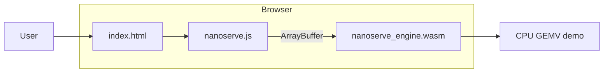

# Browser WASM demo (optional fourth tier)

Run NanoServe **in your browser** — no Python server, no Docker. CPU-only `.nanoq` v2 inference via WebAssembly.

> **Demo tier only.** Production deployments use [Docker](SETUP.md#docker) or [native install](SETUP.md#native-no-docker).

---

## Prerequisites

| Requirement | Purpose |
|-------------|---------|
| [Emscripten SDK](https://emscripten.org/docs/getting_started/downloads.html) | Compile C++ engine to WASM |
| Node.js (optional) | `npx serve` for static hosting |
| Python + `nanoserve` (optional) | Generate demo `.nanoq` during build |

Install Emscripten:

```bash
git clone https://github.com/emscripten-core/emsdk.git
cd emsdk && ./emsdk install latest && ./emsdk activate latest
source ./emsdk_env.sh
```

---

## Build

```bash
./scripts/build_wasm.sh
# or
npm run build:wasm
```

Outputs:

```
deployment/wasm/
  nanoserve_engine.wasm   # CPU engine + buddy pool stub
  nanoserve_engine.js     # Emscripten loader
  index.html              # Slim frosted-glass UI
  nanoserve.js            # JS API wrapper
  app.js                  # UI logic
  styles.css              # Shared theme from server/static/
  assets/demo.nanoq       # Optional tiny demo model (generated)
```

---

## Serve

```bash
npx serve deployment/wasm
# or
npm run serve:wasm
```

Open **http://localhost:3000** (or the port `serve` prints).

1. Wait for **WASM ready** status chip.
2. Click **Load .nanoq file** or use the bundled `demo.nanoq` if built.
3. Enter a prompt and click **Generate**.

---

## JS API

```javascript
await NanoServeWasm.init();
NanoServeWasm.loadModel(arrayBuffer);  // from FileReader or fetch
const { text, latencyMs } = NanoServeWasm.infer('Hello', { maxTokens: 24 });
console.log(NanoServeWasm.modelInfo());  // { dtype, rows, cols, ... }
NanoServeWasm.dispose();
```

Model size cap: **16 MB** in browser (configurable in `nanoserve.js`).

---

## What works vs production

| Feature | WASM demo | Docker / native |
|---------|-----------|-----------------|
| `.nanoq` v2 int8/fp16/fp4 | Yes | Yes |
| Frosted-glass Web UI | Slim version | Full server UI |
| FastAPI / micro-batcher | No | Yes |
| Multi-model registry | No | Yes |
| HuggingFace download | No | Yes |
| CUDA / OpenCL | No | Optional |
| GGUF / llama.cpp | No | Optional |
| 300-user scaling | No | Yes |

---

## Native buffer FFI tests

The same buffer API used by WASM is tested against the native `.so`:

```bash
cd engine/build && cmake .. && make -j$(nproc)
python3 tests/test_wasm_native.py
python3 tests/test_wasm.py
```

---

## Troubleshooting

| Issue | Fix |
|-------|-----|
| `emcc not found` | `source /path/to/emsdk/emsdk_env.sh` |
| WASM load failed in browser | Run `./scripts/build_wasm.sh` first |
| Styles missing | Serve via HTTP (`npx serve`), not `file://` |
| Model too large | Use smaller `.nanoq` or raise cap in `nanoserve.js` |

---

## Architecture



See also: [TODO-WASM-LEAN.md](../TODO-WASM-LEAN.md) (local planning doc).
