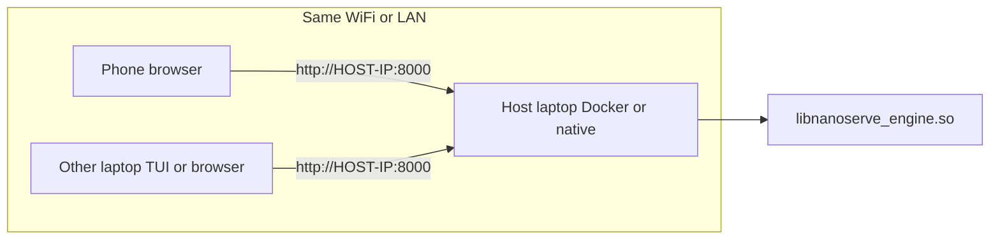
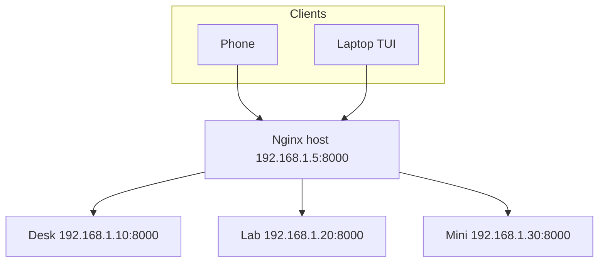

# Connect to NanoServe over the Network

How phones, laptops, and other devices reach a **host machine** running NanoServe, and how to wire **multiple hosts** into a simple LAN mesh.

**Prerequisite:** Start a server on the host first — see [Quick-deploy-method.md](Quick-deploy-method.md).

---

## Overview

NanoServe listens on **all interfaces** (`0.0.0.0`) inside Docker and native dev mode. Remote clients use the host’s **LAN IP address** and port — not `localhost`.

| Client | Web UI | TUI | Python SDK (in-process) | HTTP API |
|--------|--------|-----|-------------------------|----------|
| Same machine | ✅ `localhost:8000` | ✅ | ✅ local `.so` | ✅ |
| Other laptop (same Wi‑Fi) | ✅ browser | ✅ `tui/client.py http://IP:8000` | ❌ use HTTP instead | ✅ |
| Phone / tablet | ✅ mobile browser | ❌ needs terminal | ❌ | ✅ via apps/scripts |

There is **no built-in cluster protocol**. A “mesh” means several independent NanoServe hosts on one network, with clients or a reverse proxy choosing which host to call.

---

## Step 1 — Find the host IP

On the machine running Docker or native NanoServe:

```bash
# Linux
hostname -I | awk '{print $1}'

# or
ip -4 addr show | grep -oP '(?<=inet\s)\d+(\.\d+){3}' | grep -v 127.0.0.1
```

Example: `192.168.1.42`

All devices must be on the **same subnet** (same Wi‑Fi or wired LAN). Guest networks often **block device-to-device** traffic — use the main LAN.

---

## Step 2 — Default ports

| Deployment | Host port | URL from another device |
|------------|-----------|-------------------------|
| Docker CPU | 8000 | `http://192.168.1.42:8000` |
| Docker GPU | 8001 | `http://192.168.1.42:8001` |
| Docker GGUF | 8002 | `http://192.168.1.42:8002` |
| Native dev / production | 8000 | `http://192.168.1.42:8000` |

Replace `192.168.1.42` with your host IP.

---

## Step 3 — Open the firewall (host)

If connections time out from other devices, allow inbound ports on the **host** (not inside the container):

```bash
# Ubuntu / Debian (ufw)
sudo ufw allow 8000/tcp comment 'NanoServe CPU'
sudo ufw allow 8001/tcp comment 'NanoServe GPU'
sudo ufw allow 8002/tcp comment 'NanoServe GGUF'
sudo ufw status
```

Docker publishes `0.0.0.0:8000→8000` by default — no extra Docker networking config is required.

---

## Web UI — phone, tablet, or laptop

1. Start the server on the host (`docker compose up` or `./scripts/run_native.sh`).
2. On the client device, open a browser:
   ```
   http://<HOST-IP>:8000    # CPU built-in demo
   http://<HOST-IP>:8002    # GGUF — select model + Format GGUF
   ```
3. Use the UI as on localhost — prompt, model, format, Generate.

**GGUF from phone:** use port **8002**, select your model in the dropdown, set **Format → GGUF**, then Generate. Port 8000 alone is the synthetic demo only.

The Web UI calls relative paths (`/health`, `/v1/completions`), so it works with any reachable IP. No app install needed on mobile.

**Verify from another machine:**

```bash
curl -s http://192.168.1.42:8000/health | jq .
```

---

## TUI — other laptop (terminal)

The TUI is an HTTP client. Install deps on the **client** laptop only:

```bash
pip install httpx rich
git clone <repo> && cd NanoServe   # or copy tui/client.py
python tui/client.py http://192.168.1.42:8000 --device auto
```

GPU stack on host port 8001:

```bash
python tui/client.py http://192.168.1.42:8001 --device gpu
```

Slash commands (`/model`, `/format`, `/download`, etc.) work the same as localhost.

**Load test against a remote host:**

```bash
python tui/load_test.py --url http://192.168.1.42:8000 --users 50 --device auto
python3 tests/load_test_report.py --url http://192.168.1.42:8000 --users 200 --device cpu
```

Audit note: 200 concurrent LAN clients at `192.168.20.15:8000` passed with 100% success (see `Extensive-TEST-REPORT.md`).

---

## HTTP API — any device

Any client that can send HTTP works over the network:

```bash
curl -X POST http://192.168.1.42:8000/v1/completions \
  -H 'Content-Type: application/json' \
  -d '{"prompt":"Hello from my phone","max_tokens":24,"device":"auto"}'
```

From Python on a remote machine (not the in-process SDK):

```python
import httpx

r = httpx.post(
    "http://192.168.1.42:8000/v1/completions",
    json={"prompt": "Hello", "max_tokens": 32, "device": "auto"},
    timeout=60.0,
)
print(r.json()["text"])
```

The **`NanoServe` Python SDK** loads `libnanoserve_engine.so` locally — it does **not** connect to a remote Docker host. Use **HTTP** (above) or run the SDK on each machine that needs in-process inference.

---

## Architecture — single host, many clients



GPU inference runs **on the host**; remote devices only send HTTP — they do not need an NVIDIA GPU.

---

## Multi-host mesh on one network

NanoServe has **no native peer-to-peer mesh**. You can still run **multiple hosts**, each with its own IP and role, and expose them as a **logical mesh** clients can choose from.

### Pattern A — Client-side host picker (simplest)

Run NanoServe on several machines:

| Host name | IP | Port | Role |
|-----------|-----|------|------|
| `desk-cpu` | 192.168.1.10 | 8000 | Docker CPU |
| `desk-gpu` | 192.168.1.10 | 8001 | Docker GPU (same machine) |
| `lab-box` | 192.168.1.20 | 8000 | Native + CUDA |
| `mini-pc` | 192.168.1.30 | 8000 | Low-power CPU fallback |

Clients pick the URL:

```bash
# Heavy GPU job → GPU host
python tui/client.py http://192.168.1.10:8001 --device gpu

# Light CPU job → lab box
python tui/client.py http://192.168.1.20:8000 --device cpu
```

Web UI: bookmark each host URL in the phone browser.

### Pattern B — Shared host registry (team mesh)

Create a small JSON file everyone on the LAN uses (shared drive, git, or wiki):

```json
{
  "hosts": [
    {"id": "primary-gpu", "url": "http://192.168.1.10:8001", "device": "gpu", "tags": ["cuda", "fast"]},
    {"id": "primary-cpu", "url": "http://192.168.1.10:8000", "device": "cpu", "tags": ["stable"]},
    {"id": "lab", "url": "http://192.168.1.20:8000", "device": "auto", "tags": ["models", "gguf"]}
  ],
  "default": "primary-cpu"
}
```

Helper script on client laptops:

```python
#!/usr/bin/env python3
"""Pick a mesh host and run one completion."""
import json, sys, httpx

registry = json.load(open("nanoserve-mesh.json"))
host = next(h for h in registry["hosts"] if h["id"] == (sys.argv[1] if len(sys.argv) > 1 else registry["default"]))
r = httpx.post(f"{host['url']}/v1/completions", json={"prompt": "mesh test", "max_tokens": 16, "device": host["device"]})
print(host["id"], r.json()["text"])
```

Each host keeps its **own model registry** (`~/.nanoserve/models` or container volume). Download models on the host that will serve them, or use the same NFS/sync path if you share storage.

### Pattern C — Nginx front door (optional aggregation node)

Put a **dedicated machine or the strongest host** in front as a load balancer. Extend [`deployment/nginx.conf`](../deployment/nginx.conf):

```nginx
upstream nanoserve_mesh {
    least_conn;
    server 192.168.1.10:8000;   # desk CPU
    server 192.168.1.20:8000;   # lab box
    server 192.168.1.30:8000;   # mini PC
}

server {
    listen 8000;
    client_max_body_size 1m;

    location / {
        proxy_pass http://nanoserve_mesh;
        proxy_http_version 1.1;
        proxy_set_header Host $host;
        proxy_set_header X-Real-IP $remote_addr;
        proxy_read_timeout 120s;
    }
}
```

Clients then use **one URL**: `http://192.168.1.5:8000` (the nginx node).



**Limits:** Round-robin spreads load but **does not share model state** — each backend has its own registry and loaded weights. Sticky sessions or host-specific URLs are better when models differ per machine.

### Pattern D — Role-based mesh (recommended for mixed hardware)

| Tier | Hosts | Use for |
|------|-------|---------|
| **GPU pool** | Machines with NVIDIA + `--profile gpu` or `ENABLE_CUDA=1` | `"device":"gpu"` completions |
| **CPU pool** | Any host | Default traffic, phones, light jobs |
| **GGUF pool** | Hosts with `ENABLE_GGUF=1` + large RAM | `"format":"gguf"` real LLM |

Document URLs in your mesh registry; route by `device` and `format` in client code or TUI startup URL.

---

## Security notes

| Topic | Guidance |
|-------|----------|
| **Authentication** | None by default — anyone on the LAN can call the API |
| **Internet exposure** | Do not port-forward without TLS + auth (reverse proxy, VPN) |
| **Home lab** | LAN-only access is fine; isolate guest Wi‑Fi |
| **HTTPS** | Add nginx/Caddy + TLS if exposing beyond trusted LAN |

---

## Troubleshooting

| Symptom | Fix |
|---------|-----|
| Connection refused | Server not running; wrong port; check `docker compose ps` |
| Timeout from phone | Guest Wi‑Fi AP isolation — switch to main LAN |
| Works on laptop, not phone | Firewall on host; verify same subnet |
| Web UI loads, Generate fails | Check browser dev tools; test `curl` to `/v1/completions` |
| TUI “connection error” | Use `http://IP:port` not `localhost`; check firewall |
| GPU host slow from Wi‑Fi | Expected — network + host GPU; use wired LAN for load tests |
| Mesh host wrong model | Models are per-host; download on that host or share `NANOSERVE_MODELS_DIR` |

---

## Quick reference

```bash
# On host — get IP
hostname -I | awk '{print $1}'

# On client — health check
curl -s http://<HOST-IP>:8000/health | jq .

# On client — Web UI
# Browser → http://<HOST-IP>:8000

# On client — TUI
python tui/client.py http://<HOST-IP>:8000 --device auto

# On client — load test mesh node
python3 tests/load_test_report.py --url http://<HOST-IP>:8000 --users 50 --device cpu
```

---

## See also

| Doc | Content |
|-----|---------|
| [Quick-deploy-method.md](Quick-deploy-method.md) | Start Docker / native / WASM |
| [USAGE.md](USAGE.md) | API fields and SDK |
| [SCALING.md](SCALING.md) | 300 users on one host |
| [SETUP.md](SETUP.md) | Full install |
