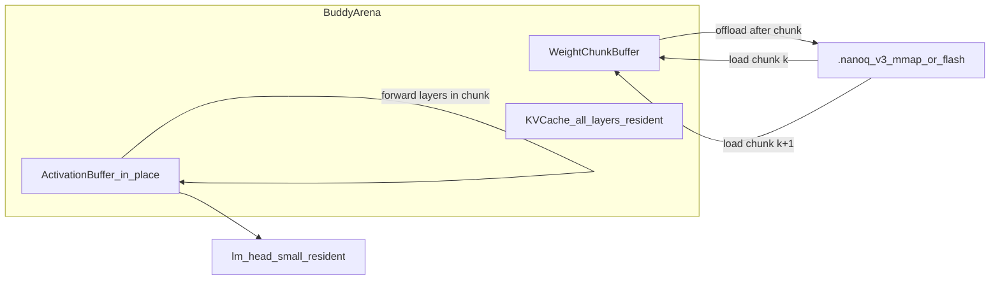
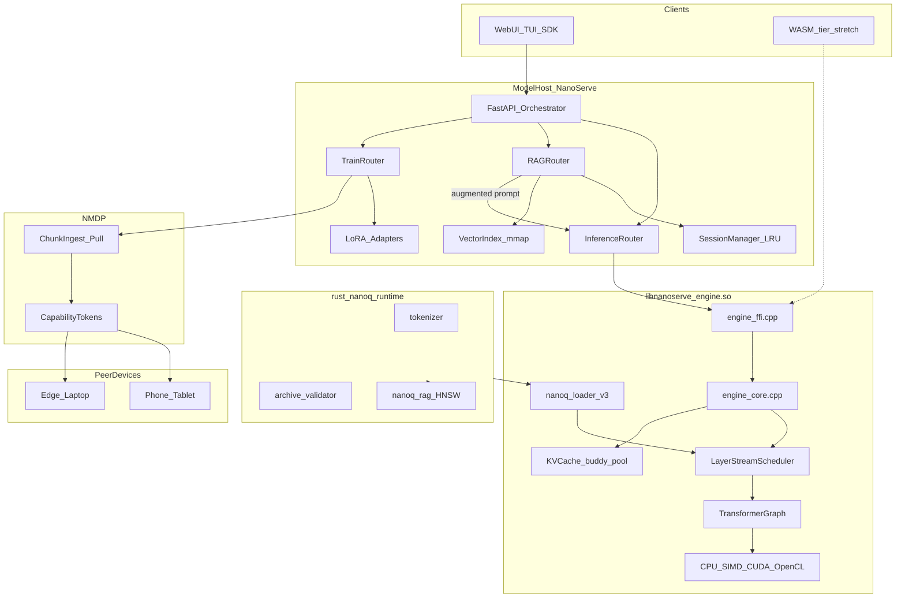
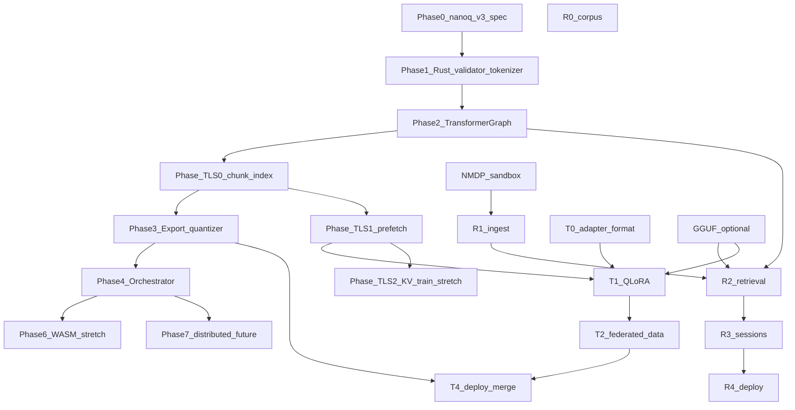

# TODO Phase 00 — Context and program-wide criteria

> **Read this once before Phase 01.** Copy relevant sections into Agent sessions as needed.
>
> **Master plan:** [TODO-NanoServe-Industry-grade-plan.md](../TODO-NanoServe-Industry-grade-plan.md)
> **Index:** [TODO-Phase-INDEX.md](TODO-Phase-INDEX.md)

---

## Purpose

This file holds **program-wide context** extracted from the master industry plan: vision, architecture, non-deviations, unified acceptance, and success criteria. Individual phase files (01–10) contain implementation scope plus appended verbatim spec sections.

---

## When to use

| Situation | Action |
|-----------|--------|
| Starting any phase | Skim motto + non-negotiables below |
| **Starting Phase 02 or later** | Read [TODO-Phase-01-Handoff.md](TODO-Phase-01-Handoff.md) — lessons, deferrals, regression tests |
| Agent session | Paste Phase 00 **+** handoff (if Phase 02+) **+** target Phase NN file |
| Final sign-off | Verify **Unified acceptance checklist** at bottom |

---

## Unified prompt header

You are implementing the **industry-grade NanoServe platform** — a *minimal LLM orchestrator* that runs large language models on resource-constrained devices through **Temporal Layer Streaming (TLS)**, **native `.nanoq` v3 inference**, **distributed RAG**, and **lean QLoRA retraining**.

**Dual tagline:**

- *Native `.nanoq` = real LLM* — not *GEMV demo shuffle*.
- *Grounded inference + lean retrain* — not *open file server*.

**Confirmed stack (non-negotiable):**

```
Rust buddy_alloc + nanoq_runtime (validate, tokenizer, checksums)
  → C++23 libnanoserve_engine.so (TransformerGraph + TLS + KVCache + sampling)
  → FastAPI InferenceRouter / RAGRouter / TrainRouter / NMDP
  → Python SDK + Web UI + TUI
  ↘ optional GGUF (llama-cpp-python) — compatibility lane, coexisting
```

**Core innovation — Temporal Layer Streaming (TLS):**

Load a subset of transformer layers into the buddy **arena**, forward activations **in-place** (each layer replaces the prior activation buffer), offload those weights, load the next chunk, repeat until logits. Peak RAM ≈ weight chunk + KV cache + activation buffer — enabling models **2–10× larger than device RAM** on laptops, SBCs, FPGAs, and high-capacity MCUs. TLS lives **inside** `libnanoserve_engine.so` and `.nanoq` v3 — **not** a parallel Rust/Candle stack.

---

## NanoServe motto, scope, and non-negotiables

| Rule | Detail |
|------|--------|
| **Orchestrator-first** | Python/FastAPI coordinates; no Python in inference hot loop |
| **Lean native path** | C++23 owns forward pass, TLS scheduler, sampling |
| **Rust safety net** | Archive validation, tokenizer, Blake3, buddy allocator |
| **Resource-constrained default** | mmap weights, int8/fp4, buddy KV, TLS chunk rotation |
| **GGUF coexistence** | `.nanoq` = primary native; GGUF = optional community lane |
| **Three planes** | Inference · Retrieval · Training — orthogonal, composable |
| **Sandboxed mesh data** | NMDP capability tokens only; no open file server |
| **Train lean** | LoRA/QLoRA default; full fine-tune GPU opt-in only |
| **Backward compat** | v2 demo `.nanoq`, existing `/v1/completions` API unchanged |

---

## Temporal Layer Streaming (TLS) — industrial overview

### Problem TLS solves

Traditional inference loads **all** model weights into RAM. On a 4 GB Raspberry Pi, a 7B Q4 model (~4 GB weights) cannot run. TLS **time-slices** the model: only `chunk_layers` transformer blocks reside in the weight arena at any moment; activations flow forward and are overwritten; weights are released before the next chunk loads.

### Execution model (inference)



### Memory invariant (peak RAM)

| Resident | Rule |
|----------|------|
| Weight chunk | `≤ chunk_layers × largest_layer_bytes` (`NANOSERVE_TLS_CHUNK_LAYERS`) |
| Activation buffer | Single hidden-state tensor `(batch, seq, hidden)` — overwritten each layer |
| KV cache | All layers × seq_len — **must stay resident** during autoregressive decode (offload-to-flash = Phase TLS-2 stretch) |
| Embed + lm_head + norms | Always resident (small) |

**Trade-off:** TLS trades **latency for addressable model size**. KV cache (~500 MB @ 2048 ctx for 7B) is the secondary bottleneck after weight streaming.

### Research alignment (prior art)

| System | Technique | NanoServe mapping |
|--------|-----------|-------------------|
| FlexGen | Weight/activation/KV offload hierarchy | Inspires TLS-2 KV tiering |
| llama.cpp | mmap + lazy paging | `.nanoq` v3 single-archive mmap |
| DeepSpeed ZeRO-Inference | Stream shards to compute | TLS chunk scheduler |
| SwapTransformer | Layer swap for training | TLS-Train backward pass |
| Gradient checkpointing | Recompute activations | TLS-Train on edge without storing all activations |

### Explicit non-deviations (vs generic edge-LLM proposals)

| External suggestion | NanoServe decision |
|-----------------------|-------------------|
| Standalone Rust/Candle engine | **Reject as primary** — C++23 + llama.cpp kernel subset |
| Python hot loop | **Reject** — orchestrator only |
| Scattered safetensors chunk files | **Adapt** — chunks inside `.nanoq` v3 index (single mmap) |
| Generic P2P file sharing | **Reject** — NMDP capability-gated jobs only |
| Full fine-tune default | **Reject** — QLoRA default; TLS-Train stretch after T1 |

---

## Unified target architecture



---

---

# Unified acceptance checklist

### Part A acceptance (native `.nanoq` v3) — preserved

- [ ] `format=nanoq` produces **real LLM text** for distilgpt2-class models
- [ ] **No llama-cpp-python** required on native path
- [ ] GGUF `:8002` profile **unchanged** and coexisting
- [ ] Memory footprint **≤ GGUF Q4** for same model class (mmap + int8)
- [ ] Existing API (`/v1/completions`, SDK, TUI) works without client changes
- [ ] Legacy v2 demo still loads with `legacy_demo: true` in model info
- [ ] Blake3 footer validation rejects tampered archives
- [ ] `engine_reset_kv` clears conversation state between prompts
- [ ] `bash scripts/audit_deployments.sh` passes with v3 model on native path

### Part B acceptance (RAG + retrain) — preserved

- [ ] NMDP: capability token required; expired/revoked token returns 403
- [ ] NMDP: no directory listing; only catalog shard ids fetchable
- [ ] NMDP: peer agent stops serving after job cancel or TTL
- [ ] RAG: ingest local + mesh sources; Blake3 dedup verified
- [ ] RAG: hybrid retrieval returns relevant chunks for fixture corpus
- [ ] RAG: stateful multi-turn chat under `NANOSERVE_MAX_SESSIONS` cap
- [ ] RAG: responses include `chunk_ids` citations in metadata
- [ ] Train: QLoRA on local JSONL produces `.nanoadapt` artifact
- [ ] Train: federated pull from mock peer fills staging shard
- [ ] Train: inference with `adapter_id` differs from base model output
- [ ] Resource: corpus index + chunk cache stay within configured MB limits
- [ ] Regression: `/v1/completions` without RAG flags unchanged
- [ ] GGUF `:8002` profile still works alongside RAG on `:8003`
- [ ] Docs: `documentation/RAG-Retrain.md` + connect-network NMDP section

### TLS + unified additions

- [ ] TLS: 7B-class Q4 model runs on 4 GB host with `chunk_layers=1` (qualitative coherence)
- [ ] TLS: peak RSS ≤ configured `NANOSERVE_TLS_WEIGHT_ARENA_MB` + KV budget
- [ ] TLS: prefetch does not change token outputs vs non-prefetch
- [ ] Unified: RAG + TLS inference coexist under `NANOSERVE_CORPUS_CHUNK_CACHE_MB` + TLS caps
- [ ] Unified: `tests/test_tls_parity.py` and `tests/test_tls_memory.py` pass in CI

---

# Post-build verification standard (Phases 01–10)

Every phase implementation file (01–10) defines a **four-part post-build gate** to run after **each and every** phase build — before the human checkpoint and before starting the next phase.

| Gate | Purpose | Common tooling |
|------|---------|----------------|
| **1. Unit & integration** | Phase features + prior-phase regression | `tests/test_*.py`, native C++ tests, `scripts/audit_deployments.sh` |
| **2. Performance benchmarks** | Latency, throughput, export/ingest/train time | `/usr/bin/time`, phase reports in `documentation/reports/PHASE##_BENCH.md` |
| **3. Memory leak & RSS** | No C/Python leaks; RSS plateau under load | `./scripts/valgrind.sh`, `tests/memory_rss_audit.py`, `tests/memory_concurrent_audit.py`, `tests/memory_server_audit.py`, `tests/test_*_memory.py` |
| **4. Load & stress** | Concurrent users against live server | `tests/load_test_report.py --preset 50\|150\|300`, `tests/test_suite.py` stress loops |

**Sign-off artifact:** `documentation/reports/PHASE##_VERIFY.md` per phase (matrix + bench + load JSON paths).

### Program-wide test index

| Area | Test / script | Phase |
|------|---------------|-------|
| v3 loader + archive | `tests/test_nanoq_v3_loader.py` | 01 |
| Tokenizer (Rust) | `tests/test_tokenizer_rust.py` | 01 |
| GPT-2 forward golden | `engine/build/test_transformer_gpt2` | 01 |
| Legacy v2 loader | `tests/test_nanoq_loader.py` | 01 |
| TLS parity | `tests/test_tls_parity.py` | 02, 03, 09 |
| vs GGUF qualitative | `tests/test_nanoq_vs_gguf.py` | 02 |
| FFI streaming | `tests/test_engine_stream.py` | 02 |
| TLS memory cap | `tests/test_tls_memory.py` | 03, 09 |
| TLS prefetch (native) | `engine/build/test_tls_prefetch` | 03 |
| NanoQ RSS cap | `tests/test_nanoq_memory.py` | 01, 03 |
| NMDP sandbox | `tests/test_mesh_sandbox.py` | 04, 08 |
| Mesh pull | `tests/test_mesh_pull.py` | 04, 08 |
| RAG ingest + dedup | `tests/test_rag_ingest.py` | 05, 06 |
| RAG sessions (LRU/TTL) | `tests/test_rag_session.py` | 06 |
| RAG chat + citations | `tests/test_rag_chat.py` | 06 |
| QLoRA train smoke | `tests/test_train_qlora.py` | 07, 08 |
| TLS + RAG RAM budget | `tests/test_tls_rag_budget.py` | 09 |
| TLS-Train LoRA | `tests/test_tls_train_lora.py` | 09 |
| WASM smoke | `tests/test_wasm_native.py`, `tests/test_wasm.py` | 10 |
| Full regression | `tests/test_suite.py`, `tests/test_gguf.py`, `tests/test_simd_parity.py` | all |
| Deployment audit | `scripts/audit_deployments.sh` | 02+ |
| Valgrind (C engine) | `scripts/valgrind.sh` → `documentation/valgrind_report*.txt` | 01+ |
| Load presets | `tests/load_test_report.py --preset 50\|150\|300` | 01+ (300 at release / Phase 10) |

### Load preset guidance

| Preset | When required | Notes |
|--------|---------------|-------|
| **50** | Every phase (01–10) | Minimum gate; ≥98% success rate |
| **150** | Phases 03, 06, 08, 09 | TLS, sessions, federated paths |
| **300** | Phase 10 / release sign-off | Full production stress; archive in `documentation/reports/` |

---

# Unified success criteria

**Native engine (Part A):**

- Native `.nanoq` is a **first-class LLM runtime**, not a GEMV demo
- Orchestrator gains full LLM on `format=nanoq` without API changes
- Resource profile suitable for edge / low-RAM hosts (int8 + mmap + buddy KV + TLS)
- Clear migration path from v2 demo → v3 full models
- GGUF remains the compatibility lane for community `.gguf` files

**RAG + retrain (Part B):**

- Model host ingests corpus from **2+ peer devices** over LAN with sandbox active **only during job**
- **Stateful** multi-turn RAG chat with grounded citations under configurable RAM cap
- **QLoRA adapter** trains on federated pulled data and deploys without full server restart
- **Zero anonymous access** to peer data outside capability scope
- System remains **lean** — `[rag]` and `[train]` optional; default install unchanged

**TLS (Part C):**

- Models **larger than RAM** run on T1 SBCs via temporal layer streaming
- TLS integrates with buddy allocator, `.nanoq` v3 mmap, and orchestrator — no second runtime
- Training on constrained devices via TLS-Train + QLoRA (stretch) closes the retrain loop

---

# Relationship to sibling NanoServe TODO docs

| Doc | Relationship |
|-----|--------------|
| [TODO-nanoq-full-blown-engine.md](TODO-nanoq-full-blown-engine.md) | Source of Part A; kept for reference |
| [TODO-RAG-Retrain.md](TODO-RAG-Retrain.md) | Source of Part B; kept for reference |
| [TODO-plan-GGUF.md](TODO-plan-GGUF.md) | GGUF inference + embed models for RAG before native v3 |
| [TODO-WASM-LEAN.md](TODO-WASM-LEAN.md) | Browser tier; no RAG/train; tiny v3 + TLS cap in Phase 6 |
| [TODO-RUST_ALLOC-WASM.md](TODO-RUST_ALLOC-WASM.md) | Buddy allocator WASM parity |
| [documentation/connect-network.md](documentation/connect-network.md) | LAN mesh; extend with NMDP port 8010 |

---

# Document map

| Section | Content |
|---------|---------|
| [Part A](#part-a-native-nanoq-v3-llm-runtime) | Native `.nanoq` v3 LLM runtime (Phases 0–7) |
| [Part B](#part-b-distributed-rag-lean-retrain) | Distributed RAG + lean retrain (R0–R4, T0–T4, NMDP) |
| [Part C](#part-c-tls-implementation-deep-dive) | Temporal Layer Streaming deep-dive (TLS-0–TLS-2) |
| [Part D](#part-d-device-tier-matrix) | Device tier matrix (T0–T3) |
| [Unified build order](#unified-dependency-graph--build-order) | Cross-part dependencies |
| [Unified acceptance](#unified-acceptance-checklist) | Merged checklists |

### Unified dependency graph + build order

<a id="unified-dependency-graph--build-order"></a>

# Unified dependency graph + build order



### Recommended unified build order

1. **Phase 0–2** (Part A) — v3 spec, validator, GPT-2 graph + KV — foundation
2. **Phase TLS-0** — chunk index + single-chunk forward correctness vs full load
3. **Phase 3–4** (Part A) — export, orchestrator streaming
4. **Phase TLS-1** — prefetch + memory budget tests
5. **NMDP → R0–R4** (Part B) — RAG path on GGUF first
6. **T0–T2 → T4** (Part B) — train path
7. **Phase TLS-2** — KV offload stretch, TLS-Train native backward
8. **Phase 5–6** (Part A) — perf tuning, WASM stretch
9. **Phase 7** (Part A) — distributed pipeline (future)

Part A and Part B retain their **original recommended orders** as sub-lists; the sequence above is the **unified** priority when building the full platform.
