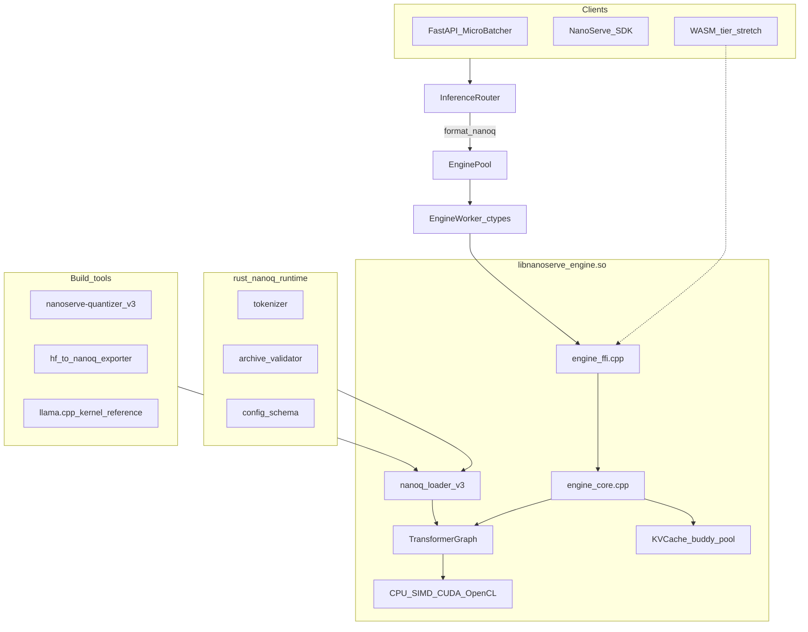

# TODO Phase 01 — Native Foundation

> **Copy-paste this file into Agent mode to implement Phase 01.**
>
> **Master plan:** [TODO-NanoServe-Industry-grade-plan.md](../TODO-NanoServe-Industry-grade-plan.md) — Part A: Phase 0, 1, 2
> **Index:** [TODO-Phase-INDEX.md](TODO-Phase-INDEX.md)

---

## Goal

Ship the **native `.nanoq` v3 foundation**: archive spec, Rust validator/tokenizer, and C++ transformer graph with KV cache and sampling — so `format=nanoq` produces **real LLM text** (distilgpt2-class), not the 22-word GEMV demo.

---

## Prerequisites

- Existing NanoServe repo builds (`engine/`, `allocator/`, `nanoserve/`, `server/`)
- No prior phase required (this is Phase 01)

---

## Scope

### Phase 0 — `.nanoq` v3 specification

**On-disk layout:**

```
[4B LE magic: 0x4E515033]   # "NQP3"
[4B LE index_len]
[index JSON: tensor catalog + offsets]
[4B LE config_len]
[config JSON: architecture, hyperparams]
[4B LE tokenizer_len]
[tokenizer blob: BPE/SentencePiece bytes]
[tensor payloads: 64-byte aligned, mmap-friendly]
[32B footer: Blake3 hash of all bytes before footer]
```

**Index entry fields:** `name`, `dtype` (int8|fp16|fp4|fp32), `shape[]`, `offset`, `size`, `scale_offset`, `quant`

**Config v1 targets:** `gpt2`, `llama` (distilgpt2, SmolLM-class)

### Phase 1 — Rust safety layer (`rust/nanoq_runtime/`)

| Module | Responsibility |
|--------|----------------|
| `validate` | Parse index/config; reject OOB; Blake3 footer |
| `tokenizer` | BPE (GPT-2) + SentencePiece (Llama) |
| `manifest` | Model card metadata |

**FFI (C ABI):**

```c
int  nanoq_archive_validate_path(const char* path);
int  nanoq_archive_validate(const uint8_t* data, size_t len);
void* nanoq_tokenizer_create(const uint8_t* data, size_t len);
void  nanoq_tokenizer_destroy(void* handle);
int  nanoq_tokenizer_encode(void* handle, const char* text, uint32_t* out_ids, size_t max_ids);
char* nanoq_tokenizer_decode(void* handle, const uint32_t* ids, size_t num_ids);
void  nanoq_string_free(char* s);
int  nanoq_tokenizer_vocab_size(void* handle);
```

Wire into `engine/src/engine_ffi.cpp`.

### Phase 2 — C++ transformer graph

| Component | Location |
|-----------|----------|
| `TransformerModel` | `engine/include/transformer.hpp` |
| `TransformerGraph` | `engine/src/transformer_gpt2.cpp`, `transformer_llama.cpp` |
| `KVCache` | `engine/include/kv_cache.hpp` |
| `Sampler` | `engine/src/sampler.cpp` |
| `TensorOps` | `engine/src/ops/` |

- Adapt llama.cpp kernel subset (`third_party/llama.cpp/`, `NANOSERVE_LLAMA_CPP_KERNELS=1`)
- Extend `backend.hpp`: `gemm_int8`, `gemm_fp16`, `gemm_fp4`, `attention_qkv`
- **Fix:** apply per-row/per-block scales in int8 paths (`backend_cpu.cpp`)
- Optional FFI: `engine_infer_stream`, `engine_reset_kv`, `engine_set_sampler`

---

## Implementation steps

1. Implement v3 archive parser (`nanoq_archive.hpp`, extend `nanoq_loader.cpp`) with v2 legacy fallback
2. Create `rust/nanoq_runtime/` — validate + tokenizer + link from CMake
3. Replace demo loop in `engine_core.cpp` with `TransformerGraph` forward + KV + sampler
4. Vendor llama.cpp subset; map dtypes to `.nanoq` v3 enums
5. Add golden tests for GPT-2 forward
6. Ensure `legacy_demo: true` still works for v2 single-matrix files

---

## Files to add/modify

**New:** `engine/include/transformer.hpp`, `transformer_*.cpp`, `kv_cache.*`, `nanoq_archive.hpp`, `engine/src/ops/`, `sampler.cpp`, `rust/nanoq_runtime/`, `third_party/llama.cpp/`, `tests/test_nanoq_v3_*.py`, `tests/test_transformer_gpt2.cpp`

**Modify:** `engine_core.cpp`, `nanoq_loader.*`, `backend*.cpp`, `engine_ffi.cpp`, `engine/CMakeLists.txt`

---

## Automated verification

> **Post-build gate:** After **every** Phase 01 build, run **all four** subsections below before the human checkpoint. Do not start the next phase until every row in the verification matrix passes.

### 1. Unit & integration tests

```bash
cd rust/nanoq_runtime && cargo build --release
cd engine/build && cmake .. -DNANOSERVE_LLAMA_CPP_KERNELS=1 && make -j$(nproc)

python3 tests/test_nanoq_v3_loader.py
python3 tests/test_tokenizer_rust.py
# native golden (when built):
# ./engine/build/test_transformer_gpt2

python3 tests/test_suite.py
python3 tests/test_nanoq_loader.py   # v2 legacy still passes
python3 tests/test_gguf.py
python3 tests/test_simd_parity.py
python3 tests/test_quantizer_fp16_fp4.py
```

### 2. Performance benchmarks

```bash
# Record baseline latency + RSS for distilgpt2-class v3 fixture (5 runs)
/usr/bin/time -f 'wall=%e maxrss=%M KB' python3 -c "
from nanoserve import Worker
w = Worker(); w.load('models/distilgpt2-int8.nanoq', format='nanoq')
for _ in range(5): w.infer('Hello world benchmark', 32)
"

# Document tokens/sec and p50 in documentation/reports/PHASE01_BENCH.md
# Pass: no >10% latency regression vs previous Phase 01 build
```

### 3. Memory leak & RSS audits

```bash
./scripts/valgrind.sh
# Pass: exit 0; documentation/valgrind_report.txt + valgrind_report_extended.txt clean

python3 tests/memory_rss_audit.py
python3 tests/memory_concurrent_audit.py
python3 tests/valgrind_infer.py || true
# When implemented: python3 tests/test_nanoq_memory.py
```

### 4. Load & stress tests

```bash
# Start server with v3 model on :8000 before load tests
python3 tests/load_test_report.py --preset 50 --device cpu --out documentation/reports/PHASE01_LOAD.json
# Pass: success_rate >= 98%; zero OOM kills

python3 tests/test_suite.py   # includes 200-cycle infer stress
bash scripts/audit_deployments.sh || true
```

### Post-build verification matrix

| Category | Command / artifact | Pass criteria |
|----------|-------------------|---------------|
| Unit / integration | `test_nanoq_v3_loader.py, test_tokenizer_rust.py, test_suite.py` | All PASS |
| Performance | `5-run infer `/usr/bin/time` benchmark` | Documented; ≤10% regression |
| Memory leak / RSS | `valgrind.sh, memory_rss_audit.py, memory_concurrent_audit.py` | Exit 0; RSS plateau |
| Load / stress | `load_test_report.py --preset 50` | ≥98% success; report saved |

**Sign-off:** Record results in `documentation/reports/PHASE01_VERIFY.md` (create if missing). CI must run sections 1–4 on every phase merge.

---

## Human checkpoint

| # | What you do | What you should see |
|---|-------------|---------------------|
| 1 | Load v3 fixture; inspect model info via engine/API | `arch`, `n_layers`, `vocab_size` — not single-matrix demo |
| 2 | Tokenizer round-trip on sample string | Same token ids as `transformers` for GPT-2 BPE |
| 3 | `curl -X POST localhost:8000/v1/completions` with `format=nanoq`, distilgpt2-class model | **Coherent English** — not 22-word synthetic vocab |
| 4 | Load legacy v2 `.nanoq` demo file | Still works; model info shows `legacy_demo: true` |
| 5 | Tamper v3 archive footer | Rust validator / load rejects file |

**Example curl:**

```bash
curl -X POST localhost:8000/v1/completions \
  -H 'Content-Type: application/json' \
  -d '{"prompt":"Hello","max_tokens":32,"format":"nanoq","model":"distilgpt2-int8"}'
```

---

## Acceptance checklist

- [ ] **Post-build gate:** unit/integration + performance + memory leak/RSS + load/stress (see Automated verification); `PHASE01_VERIFY.md` recorded
- [ ] v3 fixture loads; `engine_model_info` returns architecture + layer count
- [ ] Tokenizer encode/decode matches `transformers` on fixtures
- [ ] distilgpt2 `.nanoq` v3 generates coherent English on CPU
- [ ] Output ≠ 22-word vocab demo
- [ ] Blake3 footer validation rejects tampered archives
- [ ] Legacy v2 demo still loads with `legacy_demo: true`
- [ ] GGUF path unchanged (`tests/test_gguf.py` passes)
- [ ] `engine_reset_kv` clears KV between prompts (if FFI added)

---

## Do not break

- GGUF path (`nanoserve/engine/gguf_worker.py`, Docker `:8002`)
- Existing `/v1/completions` API contract
- v2 single-matrix demo load
- Default `pip install` size (no mandatory `[gguf]`)

---

## Next phase

[TODO-Phase-02-Export-Orchestrator-TLS0.md](TODO-Phase-02-Export-Orchestrator-TLS0.md)

**Agent handoff:** [TODO-Phase-01-Handoff.md](TODO-Phase-01-Handoff.md) — read before Phase 02.
---

## Appendix — Part A intro + Phases 0–2 (full spec)

> Verbatim from [TODO-NanoServe-Industry-grade-plan.md](../TODO-NanoServe-Industry-grade-plan.md)

# PART A — Native `.nanoq` v3 LLM runtime

> **Source:** [TODO-nanoq-full-blown-engine.md](TODO-nanoq-full-blown-engine.md) — preserved in full below.


> **Copy-paste this file into an agent session to implement a full native `.nanoq` LLM runtime.**

---

## Prompt header

You are implementing a **full native `.nanoq` LLM runtime** for **NanoServe** — a minimal LLM orchestrator (Rust buddy allocator, C++23 native engine, FastAPI, Python SDK). The runtime must make **`format=nanoq`** run **real autoregressive transformer inference** — efficient, low-RAM, orchestrator-ready — while **GGUF remains optional and coexisting**.

**Architecture choice (confirmed):**

- **C++23** in `libnanoserve_engine.so` (extend current engine + `.nanoq` v3)
- **Adapt llama.cpp internals** (quant kernels, RoPE, sampling) — vendor subset only; no GGUF loader at runtime
- **Rust** for safety-critical boundaries (archive validation, tokenizer, checksums)

**Tagline:** *Native `.nanoq` = real LLM* — not *GEMV demo shuffle*.

Current stack:

```
Rust buddy_alloc → C++ libnanoserve_engine.so → Python FastAPI (InferenceRouter)
                  ↘ optional GGUF (llama-cpp-python) — unchanged, coexisting
```

---

## Problem statement

Today, native `.nanoq` is a **single-matrix GEMV demo** (`engine/src/engine_core.cpp`): fake activations, 22-word vocab, one scalar dot product. Real LLM output only comes from **GGUF + llama.cpp** (`nanoserve/engine/gguf_worker.py`).

Goal: **`format=nanoq`** produces **coherent LLM text** (distilgpt2-class and beyond) without requiring llama-cpp on the native path.

---

## Non-goals (v1)

- Do **not** remove or break the GGUF path (`format=gguf`, Docker `:8002`).
- Do **not** WASM-compile full LLM in v1 (Phase 6 stretch only).
- Do **not** implement distributed tensor parallelism in v1 (Phase 7 future).
- Do **not** ship GGUF parser as primary weight loader — output format is `.nanoq` v3.
- Do **not** break v2 single-matrix demo load (legacy flag until deprecated).

---

## Design principles

| Principle | Rule |
|-----------|------|
| **Orchestrator-first** | Keep `InferenceRouter` → `EnginePool` → `EngineWorker` → FFI unchanged where possible |
| **Lean native path** | No Python in hot loop; C++23 owns forward pass + sampling |
| **Reuse, don’t reinvent** | Adapt llama.cpp tensor layouts, quant kernels, sampling — vendor subset under `third_party/llama.cpp/` |
| **Rust safety net** | Tokenizer, archive validation, Blake3 checksums, config schema |
| **Resource-constrained** | mmap weights, KV cache in buddy pool, int8/fp4 default, lazy layer load |
| **GGUF coexistence** | `.nanoq` = primary native format; GGUF stays optional for HF/community models |
| **Backward compat** | v2 single-matrix files load as **legacy demo mode** (`legacy_demo: true`) |

---

## Target architecture



---

## Phase 0 — Specification (`.nanoq` v3)

**New format:** archive container (not single matrix). Keep v2 reader for legacy.

### On-disk layout

```
[4B LE magic: 0x4E515033]   # "NQP3"
[4B LE index_len]
[index JSON: tensor catalog + offsets]
[4B LE config_len]
[config JSON: architecture, hyperparams]
[4B LE tokenizer_len]
[tokenizer blob: BPE/SentencePiece bytes]
[tensor payloads: 64-byte aligned, mmap-friendly]
[32B footer: Blake3 hash of all bytes before footer]
```

### Index entry (per tensor)

| Field | Description |
|-------|-------------|
| `name` | e.g. `blk.0.attn_q.weight` |
| `dtype` | `int8` \| `fp16` \| `fp4` \| `fp32` |
| `shape[]` | Tensor dimensions |
| `offset`, `size` | Byte range in payload section |
| `scale_offset` | Optional scales blob offset |
| `quant` | `none` \| `per-row` \| `per-block` (block_size 32/64/128) |

### Config block (architecture enum)

**v1 targets:** `gpt2`, `llama` (covers distilgpt2, SmolLM-class)

| Field | Example |
|-------|---------|
| `arch` | `"gpt2"` |
| `vocab_size` | 50257 |
| `hidden_size` | 768 |
| `n_layers` | 6 |
| `n_heads` | 12 |
| `n_kv_heads` | 12 (GQA for Llama) |
| `max_seq_len` | 2048 |
| `norm_eps` | 1e-5 |
| `rope_theta` | 10000 |
| `act_fn` | `"gelu"` |

### Files to add/extend

| File | Action |
|------|--------|
| `engine/include/nanoq_loader.hpp` | Add `NanoqArchive`, `NanoqConfig`, v3 API |
| `engine/include/nanoq_archive.hpp` | v3 mmap parser (new) |
| `engine/src/nanoq_loader.cpp` | v3 + v2 legacy fallback |
| `rust/nanoq_runtime/` | Footer hash, index sanity, bounds checks |
| `nanoserve/quantizer/quantize.py` | v3 writer |

**Acceptance:** Load distilgpt2-class fixture `.nanoq` v3; `engine_model_info` returns architecture + layer count.

---

## Phase 1 — Rust safety layer

New crate: `rust/nanoq_runtime/`

| Module | Responsibility |
|--------|----------------|
| `validate` | Parse index/config off hot path; reject OOB offsets; Blake3 footer |
| `tokenizer` | BPE (GPT-2) + SentencePiece (Llama) — encode/decode FFI |
| `manifest` | Model card metadata for registry |

**FFI surface (C ABI from Rust):**

```c
int  nanoq_archive_validate_path(const char* path);
int  nanoq_archive_validate(const uint8_t* data, size_t len);
void* nanoq_tokenizer_create(const uint8_t* data, size_t len);
void  nanoq_tokenizer_destroy(void* handle);
int  nanoq_tokenizer_encode(void* handle, const char* text, uint32_t* out_ids, size_t max_ids);
char* nanoq_tokenizer_decode(void* handle, const uint32_t* ids, size_t num_ids);
void  nanoq_string_free(char* s);
int  nanoq_tokenizer_vocab_size(void* handle);
```

Wire into `engine/src/engine_ffi.cpp`; embed tokenizer handle in `EngineHandle`.

**Acceptance:** Round-trip encode/decode for GPT-2 BPE matches `transformers` on fixture strings.

---

## Phase 2 — C++ transformer graph (core inference)

Replace demo loop in `engine/src/engine_core.cpp`.

### New components

| Component | Location | Notes |
|-----------|----------|-------|
| `TransformerModel` | `engine/include/transformer.hpp` | Owns tensor refs into mmap archive |
| `TransformerGraph` | `engine/src/transformer_gpt2.cpp`, `transformer_llama.cpp` | Architecture-specific forward |
| `KVCache` | `engine/include/kv_cache.hpp` | Per-layer K/V; allocate from buddy pool |
| `Sampler` | `engine/src/sampler.cpp` | greedy, top-k, top-p, temperature |
| `TensorOps` | `engine/src/ops/` | matmul, rms_norm, rope, softmax, silu/gelu |

### llama.cpp adaptation strategy

- **Copy/adapt** (with license header): Q4/Q8 matmul micro-kernels, RoPE, softmax, sampling
- **Do not** depend on GGUF loader at runtime
- `third_party/llama.cpp/` vendor subset — CMake option `NANOSERVE_LLAMA_CPP_KERNELS=1`
- Map `ggml_type` patterns → `.nanoq` v3 dtype enums in thin adapter header

### Backend extensions (`engine/include/backend.hpp`)

Extend beyond scalar GEMV:

- `gemm_int8`, `gemm_fp16`, `gemm_fp4` (M×K × K×N)
- `attention_qkv` fused where SIMD allows
- CUDA/OpenCL: int8/fp16 matmul first; attention on CPU if needed

### Fix existing bug

Apply per-row / per-block scales in int8 paths (`engine/src/backend_cpu.cpp`) — scales loaded but unused today.

### New FFI (backward compatible)

Keep `engine_infer()`; add optional:

```c
int engine_infer_stream(void* handle, const char* prompt, int max_tokens,
                        void (*callback)(const char* token, void* user), void* user);
int engine_reset_kv(void* handle);
int engine_set_sampler(void* handle, const char* json_opts);
```

**Acceptance:** distilgpt2 `.nanoq` v3 generates coherent English on CPU; output ≠ 22-word vocab demo.

---

## Testing strategy

| Test | File |
|------|------|
| v3 loader round-trip | `tests/test_nanoq_v3_loader.py` |
| Tokenizer parity | `tests/test_tokenizer_rust.py` |
| GPT-2 forward golden | `tests/test_transformer_gpt2.cpp` (native) |
| vs GGUF qualitative | `tests/test_nanoq_vs_gguf.py` (skip if no gguf) |
| FFI streaming | `tests/test_engine_stream.py` |
| WASM smoke | extend `tests/test_wasm_native.py` |
| Memory budget | `tests/test_nanoq_memory.py` (RSS cap) |

---

## File touch list (summary)

**New**

- `engine/include/transformer.hpp`, `engine/src/transformer_*.cpp`
- `engine/include/kv_cache.hpp`, `engine/src/kv_cache.cpp`
- `engine/include/nanoq_archive.hpp`
- `engine/src/ops/` (matmul, norm, rope, attn)
- `engine/src/sampler.cpp`
- `rust/nanoq_runtime/` (validate, tokenizer)
- `third_party/llama.cpp/` (vendor subset, CMake gated)
- `nanoserve/quantizer/export_hf.py`
- `tests/test_nanoq_v3_*.py`, `tests/test_transformer_gpt2.cpp`

**Modify**

- `engine/src/engine_core.cpp` — replace demo infer
- `engine/include/nanoq_loader.hpp`, `engine/src/nanoq_loader.cpp`
- `engine/include/backend.hpp`, backend sources
- `engine/src/engine_ffi.cpp`
- `engine/CMakeLists.txt` — Rust crate link, llama.cpp subset
- `nanoserve/quantizer/quantize.py`, `nanoserve/models/pipeline.py`
- `nanoserve/engine/worker.py`
- Docs: `README.md`, `documentation/How-to-add-models-doc.md`, `documentation/WASM.md`

**Do not break**

- GGUF path (`nanoserve/engine/gguf_worker.py`)
- v2 demo `.nanoq` load (legacy flag in `engine_model_info`)

---

## Implementation order (recommended)

1. **Phase 0** — v3 spec + validator (Rust) + empty graph loads
2. **Phase 1** — tokenizer FFI
3. **Phase 2** — GPT-2 graph + KV + sampler (CPU int8)
4. **Phase 3** — HF exporter for distilgpt2
5. **Phase 4** — orchestrator wiring + streaming
6. **Phase 5** — mmap, CUDA matmul, perf tuning
7. **Phase 6** — WASM stretch
8. **Phase 7** — distributed (future)

---

## Test commands

```bash
# Build engine + Rust runtime
cd rust/nanoq_runtime && cargo build --release
cd engine/build && cmake .. && make -j$(nproc)

# Export distilgpt2 to v3
nanoserve-quantizer export hf:distilgpt2 \
  --out models/distilgpt2-int8.nanoq --arch gpt2 --precision int8

# Native inference
curl -X POST localhost:8000/v1/completions \
  -H 'Content-Type: application/json' \
  -d '{"prompt":"Hello","max_tokens":32,"format":"nanoq","model":"distilgpt2-int8"}'

# Compare vs GGUF (optional)
curl -X POST localhost:8002/v1/completions \
  -H 'Content-Type: application/json' \
  -d '{"prompt":"Hello","max_tokens":32,"format":"gguf","model":"distilgpt2-Q2_K"}'

# Unit tests
python3 tests/test_nanoq_v3_loader.py
python3 tests/test_tokenizer_rust.py
python3 tests/test_nanoq_vs_gguf.py
```

---

## Acceptance checklist

- [ ] `format=nanoq` produces **real LLM text** for distilgpt2-class models
- [ ] **No llama-cpp-python** required on native path
- [ ] GGUF `:8002` profile **unchanged** and coexisting
- [ ] Memory footprint **≤ GGUF Q4** for same model class (mmap + int8)
- [ ] Existing API (`/v1/completions`, SDK, TUI) works without client changes
- [ ] Legacy v2 demo still loads with `legacy_demo: true` in model info
- [ ] Blake3 footer validation rejects tampered archives
- [ ] `engine_reset_kv` clears conversation state between prompts
- [ ] `bash scripts/audit_deployments.sh` passes with v3 model on native path

---

## Success criteria

- Native `.nanoq` is a **first-class LLM runtime**, not a GEMV demo
- Orchestrator (`InferenceRouter`, micro-batcher, mesh HTTP) gains full LLM on `format=nanoq` without API changes
- Resource profile suitable for edge / low-RAM hosts (int8 + mmap + buddy KV)
- Clear migration path from v2 demo → v3 full models
- GGUF remains the compatibility lane for community `.gguf` files
