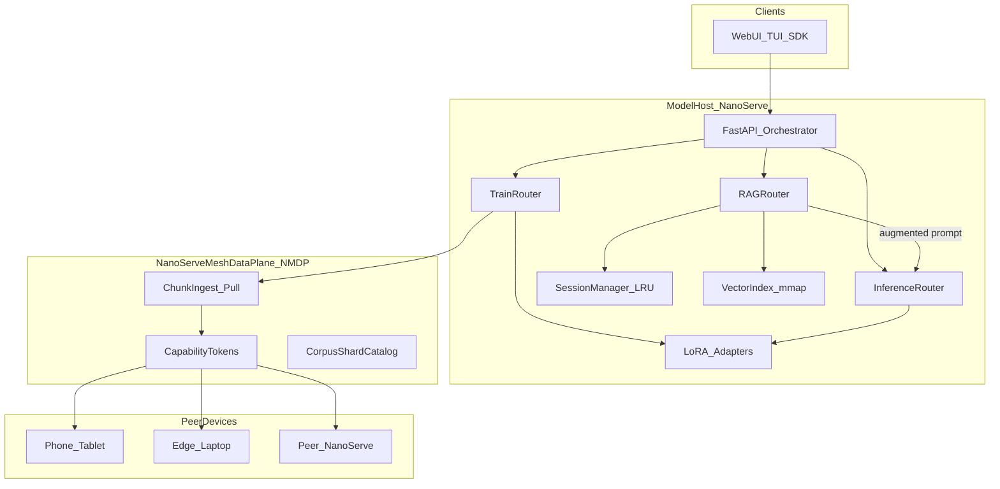

# TODO Phase 04 — NMDP Sandbox

> **Copy-paste this file into Agent mode to implement Phase 04.**
>
> **Master plan:** [TODO-NanoServe-Industry-grade-plan.md](../TODO-NanoServe-Industry-grade-plan.md) — Part B: NanoServe Mesh Data Plane (NMDP)
> **Prerequisite:** [TODO-Phase-02-Export-Orchestrator-TLS0.md](TODO-Phase-02-Export-Orchestrator-TLS0.md) Human checkpoint PASS (or stable GGUF host)
> **Index:** [TODO-Phase-INDEX.md](TODO-Phase-INDEX.md)

---

## Goal

Ship the **NanoServe Mesh Data Plane (NMDP)** — capability-gated, job-bound data sharing for ingest/train — so peers expose corpus/training shards **only during active jobs**, with deny-by-default security and audit logging.

**Tagline:** *Grounded inference + lean retrain* — not *open file server*.

---

## Prerequisites

- FastAPI server runs (`server/main.py`)
- Phase 02 optional for native path; GGUF `:8002` sufficient for downstream RAG testing

---

## Scope

### NMDP session lifecycle

1. Coordinator creates `DataJob`:

```json
{
  "job_id": "uuid",
  "type": "ingest|train",
  "expires_at": "ISO8601",
  "allowed_peers": ["device-id-1"],
  "max_bytes": 1073741824,
  "allowed_mime": ["text/plain", "text/markdown", "application/json"]
}
```

2. Issue **capability token** (HMAC JWT/macaroon): scoped to `job_id`, peer id, max bytes, MIME, shard prefix
3. Peer runs `nanoserve-data-agent` — manifest + chunk blobs only for that job
4. Job complete / TTL / cancel → revoke tokens; drop staging

### Transport

| Option | Detail |
|--------|--------|
| Dedicated port | **8010** (recommended) |
| Chunk fetch | `GET /v1/mesh/data/shard/{id}` + `Authorization: Bearer <capability>` |
| Deny | No directory listing; catalog entries only |
| Security | TLS off localhost; mTLS optional on LAN |

### Peer agent

```bash
nanoserve-data-agent \
  --share ./my-docs \
  --job-token "<capability>" \
  --coordinator http://192.168.1.42:8010 \
  --device-id laptop-alice
```

### Coordinator staging

```
~/.nanoserve/staging/{job_id}/
  manifest.json
  shards/
  audit.log
```

### API routes

| Method | Path | Purpose |
|--------|------|---------|
| POST | `/v1/mesh/jobs` | Create ingest/train data job |
| GET | `/v1/mesh/jobs/{id}` | Status + audit summary |
| POST | `/v1/mesh/jobs/{id}/cancel` | Revoke tokens, cleanup |
| GET | `/v1/mesh/data/shard/{id}` | Pull shard (capability auth) |

### Environment variables

```bash
NANOSERVE_ENABLE_NMDP=0
NANOSERVE_NMDP_PORT=8010
NANOSERVE_NMDP_TLS=1
NANOSERVE_NMDP_JOB_TTL_S=7200
NANOSERVE_NMDP_MAX_BYTES_PER_JOB=1073741824
NANOSERVE_NMDP_SECRET=              # HMAC key for capability tokens
```

---

## Implementation steps

1. Create `nanoserve/mesh/` — capability tokens, job store, audit log
2. Create `nanoserve/data_agent/` — edge CLI
3. Add `server/mesh_routes.py`; mount in `server/main.py`
4. Implement token issue/verify/revoke with TTL
5. Staging store with auto-cleanup on job complete
6. Add `tests/test_mesh_sandbox.py`, `tests/test_mesh_pull.py`
7. Document NMDP in `documentation/connect-network.md` (optional this phase)

---

## Files to add/modify

**New:** `nanoserve/mesh/`, `nanoserve/data_agent/`, `server/mesh_routes.py`, `tests/test_mesh_sandbox.py`, `tests/test_mesh_pull.py`

**Modify:** `server/main.py` (health: `nmdp_port`, `mesh_jobs_active`)

---

## Automated verification

> **Post-build gate:** After **every** Phase 04 build, run **all four** subsections below before the human checkpoint. Do not start the next phase until every row in the verification matrix passes.

### 1. Unit & integration tests

```bash
export NANOSERVE_ENABLE_NMDP=1
export NANOSERVE_NMDP_SECRET="dev-secret-change-me"

python3 tests/test_mesh_sandbox.py
python3 tests/test_mesh_pull.py
python3 tests/test_suite.py   # inference regression

# Manual: create job, fetch shard with valid token, retry with expired → 403
curl -X POST localhost:8000/v1/mesh/jobs -H 'Content-Type: application/json' \
  -d '{"type":"ingest","allowed_peers":["test-device"]}'
```

### 2. Performance benchmarks

```bash
# NMDP job create + shard fetch latency (10 iterations)
python3 -c "
import time, httpx
base='http://127.0.0.1:8000'
for i in range(10):
    t0=time.perf_counter()
    r=httpx.post(f'{base}/v1/mesh/jobs', json={'type':'ingest','allowed_peers':['bench']})
    r.raise_for_status()
    print(f'job_create_ms={(time.perf_counter()-t0)*1000:.1f}')
"
# Document p50 job-create ms in documentation/reports/PHASE04_BENCH.md
# Pass: no regression in /v1/completions latency when NMDP enabled
```

### 3. Memory leak & RSS audits

```bash
./scripts/valgrind.sh   # C engine unchanged; still required
python3 tests/memory_server_audit.py || true
# Run mesh sandbox test in loop — staging dirs cleaned after cancel
for i in $(seq 1 20); do python3 tests/test_mesh_sandbox.py || break; done
# Pass: no orphaned staging dirs; audit.log bounded
```

### 4. Load & stress tests

```bash
export NANOSERVE_ENABLE_NMDP=1
python3 tests/load_test_report.py --preset 50 --device cpu --out documentation/reports/PHASE04_LOAD.json
# Pass: inference load unchanged; mesh endpoints respond under concurrent jobs

python3 tests/test_mesh_sandbox.py
python3 tests/test_mesh_pull.py
```

### Post-build verification matrix

| Category | Command / artifact | Pass criteria |
|----------|-------------------|---------------|
| Unit / integration | `test_mesh_sandbox.py, test_mesh_pull.py` | Token expiry 403; pull OK |
| Performance | `mesh job-create benchmark` | p50 documented; no infer regression |
| Memory leak / RSS | `valgrind.sh + staging cleanup loop` | No leaks; staging cleaned |
| Load / stress | `load_test_report.py --preset 50` | ≥98% infer success with NMDP on |

**Sign-off:** Record results in `documentation/reports/PHASE04_VERIFY.md` (create if missing). CI must run sections 1–4 on every phase merge.

---

## Human checkpoint

| # | What you do | What you should see |
|---|-------------|---------------------|
| 1 | Create mesh job via API | Job id + capability token returned |
| 2 | Fetch shard with valid token | 200 + blob content |
| 3 | Fetch with expired/revoked token | **403 Forbidden** |
| 4 | Attempt directory listing / arbitrary path | **404 or 403** — catalog only |
| 5 | Run data-agent with token; cancel job | Agent stops serving; staging cleaned |
| 6 | Inspect `~/.nanoserve/staging/{job_id}/audit.log` | Pull events logged (job_id, device_id, bytes) |

---

## Acceptance checklist

- [ ] **Post-build gate:** unit/integration + performance + memory leak/RSS + load/stress (see Automated verification); `PHASE04_VERIFY.md` recorded
- [ ] Capability token required for shard fetch
- [ ] Expired/revoked token returns 403
- [ ] No directory listing; only catalog shard ids fetchable
- [ ] Peer agent stops serving after job cancel or TTL
- [ ] Audit log records pulls (no secrets in log)
- [ ] Existing `/v1/completions` unchanged
- [ ] Default install unchanged (`NANOSERVE_ENABLE_NMDP=0`)

---

## Do not break

- GGUF and native inference paths
- Default pip install (NMDP opt-in via env)
- No general-purpose P2P file sync

---

## Next phase

[TODO-Phase-05-RAG-Corpus-Ingest.md](TODO-Phase-05-RAG-Corpus-Ingest.md)
---

## Appendix — Part B intro + NMDP (full spec)

> Verbatim from [TODO-NanoServe-Industry-grade-plan.md](../TODO-NanoServe-Industry-grade-plan.md)

# PART B — Distributed RAG + lean retrain

> **Source:** [TODO-RAG-Retrain.md](TODO-RAG-Retrain.md) — preserved in full below.


> **Copy-paste this file into an agent session to implement distributed RAG deployment and federated model retraining.**

---

## Prompt header

You are implementing a **distributed RAG system** and **model retraining system** for **NanoServe** — a minimal LLM orchestrator (Rust buddy allocator, C++23 native engine, FastAPI, Python SDK, optional GGUF). The system must be:

- **Stateful** — multi-turn chat + retrieval context without reloading full corpora each request
- **Memory and resource efficient** — mmap indexes, int8 embeddings, LRU bounds, content-addressed dedup
- **Distributed** — model host pulls data from phones, laptops, and peer mesh nodes over the network (same LAN reachability as today's HTTP mesh)
- **Network sandboxed** — peers share **only approved corpus shards** with **only the active NanoServe job**; channel closes when the session ends

**Tagline:** *Grounded inference + lean retrain* — not *open file server*.

Current stack (unchanged baseline):

```
Rust buddy_alloc → C++ libnanoserve_engine.so → FastAPI (InferenceRouter)
                  ↘ optional GGUF (llama-cpp-python)
                  ↘ LAN HTTP mesh (documentation/connect-network.md) — no cluster protocol today
```

**Related planning docs:**

- [Part A — Native `.nanoq` v3 LLM runtime](#part-a-native-nanoq-v3-llm-runtime) — full native LLM runtime (prerequisite for native adapter merge/export)
- [TODO-plan-GGUF.md](TODO-plan-GGUF.md) — GGUF inference path (usable for RAG + train before native v3)

---

## Problem statement

NanoServe today is **stateless inference-only** (`server/main.py`, `nanoserve/engine/router.py`):

- No conversation memory beyond a single `/v1/completions` call
- No retrieval-augmented generation (RAG)
- No fine-tuning or adapter training
- Mesh = independent HTTP hosts; **no secure data-sharing protocol**

Users need:

1. **RAG at deploy time** — grounded answers from private corpora, low RAM, works on mesh hosts
2. **Retraining on the model host** — ingest training data from edge devices over the network
3. **Stateful sessions** — multi-turn chat + RAG context with bounded memory
4. **Sandboxed networking** — data visible to NanoServe **only during an active ingest/train job**

---

## Non-goals (v1)

- Do **not** build a general-purpose P2P file sync or NAS replacement
- Do **not** allow anonymous or persistent peer filesystem access
- Do **not** require full-weight fine-tuning as default — **LoRA/QLoRA only** in v1
- Do **not** implement FedAvg / federated gradient aggregation in v1 (Phase T3 stretch)
- Do **not** break existing `/v1/completions` without RAG flags
- Do **not** break GGUF (`:8002`) or native inference paths
- Do **not** bundle heavy ML stacks in default `pip install` — use optional `[rag]` and `[train]` extras
- Do **not** run training inside the WASM browser tier

---

## Design principles

| Principle | Rule |
|-----------|------|
| **Stateful but bounded** | Session TTL, max messages in memory, LRU eviction for sessions + chunk cache |
| **Memory-first** | mmap vector index + chunk store; int8/fp16 embeddings; Blake3 content-addressed dedup |
| **Distributed by default** | Corpora may live on peers; model host **pulls shards on demand** during ingest/train jobs |
| **Sandboxed networking** | NMDP active only for declared jobs; capability tokens + deny-by-default; auto-revoke on expiry |
| **Orchestrator-native** | Extend FastAPI coordinator; optional Docker profiles — no mandatory separate RAG server |
| **Format-agnostic** | RAG works with GGUF now; native `.nanoq` v3 when full engine lands |
| **Train lean** | Default LoRA/QLoRA adapters; full fine-tune opt-in on GPU hosts only |
| **Three planes** | Inference, Retrieval, Training — orthogonal, composable |

---

## Target architecture



### Three planes on the model host

| Plane | Role | Existing hook |
|-------|------|---------------|
| **Inference** | LLM token generation | `InferenceRouter` → `EnginePool` / `GGUFPool` |
| **Retrieval** | Embed → search → rerank → inject context | New `RAGRouter` |
| **Training** | LoRA/QLoRA coordinator; federated data pull | New `TrainRouter` |

---

## NanoServe Mesh Data Plane (NMDP)

**Session-scoped protocol** — not open file sharing. Analogous to today's `npx serve` reachability, but **capability-gated** and **job-bound**.

### Session lifecycle

1. **Coordinator** (model host) creates `DataJob`:

   ```json
   {
     "job_id": "uuid",
     "type": "ingest|train",
     "expires_at": "ISO8601",
     "allowed_peers": ["device-id-1", "device-id-2"],
     "max_bytes": 1073741824,
     "allowed_mime": ["text/plain", "text/markdown", "application/json"]
   }
   ```

2. Issues **capability token** (HMAC-signed JWT or macaroon) scoped to: `job_id`, peer device id, max bytes, allowed MIME/types, shard id prefix allowlist
3. **Peer** runs `nanoserve-data-agent` — exposes only manifest + chunk blobs registered for that job
4. On job complete / TTL / cancel → tokens revoked; peer agent stops serving; coordinator drops staging buffers

### Transport

| Option | Detail |
|--------|--------|
| Dedicated port | **8010** for NMDP (recommended) |
| Same port | `/v1/mesh/data/*` with strict middleware on `:8000` |
| Security | TLS required on non-localhost; **mTLS optional** for LAN mesh |
| Chunk fetch | `GET /v1/mesh/data/shard/{id}` + `Authorization: Bearer <capability>` |
| Deny | No directory listing, no arbitrary paths — **catalog entries only** |

### Peer agent (edge device)

```bash
# User explicitly selects folders; agent runs only while token valid
nanoserve-data-agent \
  --share ./my-docs \
  --job-token "<capability>" \
  --coordinator http://192.168.1.42:8010 \
  --device-id laptop-alice
```

- Builds manifest at startup (chunk ids, Blake3 hashes, byte sizes)
- Serves shards only matching the capability scope
- Exits or idles when token expires or coordinator sends cancel
- **No access** from coordinator outside active job window

### Coordinator staging

```
~/.nanoserve/staging/{job_id}/
  manifest.json          # merged peer manifests
  shards/                # pulled blobs (deleted after ingest/train)
  audit.log              # who pulled what, when
```

