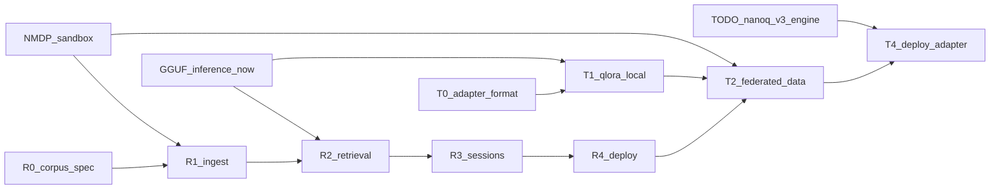

# TODO Phase 08 — Train Federated + Deploy

> **Copy-paste this file into Agent mode to implement Phase 08.**
>
> **Master plan:** [TODO-NanoServe-Industry-grade-plan.md](../TODO-NanoServe-Industry-grade-plan.md) — Part B: T2 + T4 (+ T3 sketch)
> **Prerequisite:** [TODO-Phase-04-NMDP-Sandbox.md](TODO-Phase-04-NMDP-Sandbox.md) + [TODO-Phase-07-Train-Adapter-QLoRA.md](TODO-Phase-07-Train-Adapter-QLoRA.md) Human checkpoints PASS
> **Index:** [TODO-Phase-INDEX.md](TODO-Phase-INDEX.md)

---

## Goal

Ship **federated data collection** via NMDP into train jobs, **post-train deploy** (hot-swap adapter, merge export, rollback) — so training data pulled from mock peers trains an adapter deployable without full server restart.

---

## Prerequisites

- Phase 04: NMDP sandbox
- Phase 07: local QLoRA train works
- Phase 02/03 optional for native `.nanoq` merge export (GGUF merge ok for v1)

---

## Scope

### Phase T2 — Federated data collection

1. Create NMDP `DataJob` with `type: train` and schema:

```json
{ "schema": "prompt_completion", "fields": ["prompt", "completion"] }
```

2. Peers expose matching records via data-agent
3. Coordinator validates → staging shard
4. `TrainRouter` consumes staging — **no raw peer filesystem access**

**Audit log:** every pull records `job_id`, `device_id`, shard ids, byte count, timestamp, token id (not secret).

### Phase T3 — Distributed train modes (document only)

| Mode | v1 |
|------|-----|
| Centralized QLoRA | **Default** |
| FedAvg-lite | Stretch — protocol sketch only |
| Distillation | Stretch |

Do **not** implement FedAvg in this phase.

### Phase T4 — Post-train deploy

| Path | When |
|------|------|
| Hot-swap adapter | Serve base + `.nanoadapt` without restart |
| Merge export | base + adapter → GGUF or `.nanoq` v3 snapshot |
| Rollback | Registry keeps prior adapter; UI revert |

Re-run quantizer on merged weights (int8) before native deploy.

---

## Implementation steps

1. Link train jobs to NMDP `data_job_id` in `TrainRouter`
2. Schema validation on staging shards; reject invalid records with counts
3. Implement hot-swap adapter load in `InferenceRouter`
4. Merge export path (GGUF first; native `.nanoq` when Phase 02 merge ready)
5. Registry rollback + optional Web UI revert button
6. Add federated pull to `tests/test_mesh_pull.py` integration with train
7. Document T3 FedAvg sketch in `documentation/RAG-Retrain.md`

---

## Files to add/modify

**Modify:** `nanoserve/train/`, `nanoserve/mesh/`, `nanoserve/engine/router.py`, `nanoserve/models/registry.py`, `server/static/app.js`, `documentation/RAG-Retrain.md`

**Tests:** extend `tests/test_mesh_pull.py`, `tests/test_train_qlora.py`

---

## Automated verification

> **Post-build gate:** After **every** Phase 08 build, run **all four** subsections below before the human checkpoint. Do not start the next phase until every row in the verification matrix passes.

### 1. Unit & integration tests

```bash
export NANOSERVE_ENABLE_NMDP=1
export NANOSERVE_ENABLE_TRAIN=1
export NANOSERVE_NMDP_SECRET="dev-secret-change-me"

python3 tests/test_mesh_pull.py
python3 tests/test_train_qlora.py
python3 tests/test_mesh_sandbox.py   # Phase 04 regression
python3 tests/test_suite.py

# Mock peer → staging → train job
curl -X POST localhost:8000/v1/train/jobs \
  -d '{"base_model":"distilgpt2-Q2_K","adapter_id":"fed-bot-v1","data_job_id":"JOB_UUID"}'
```

### 2. Performance benchmarks

```bash
# Federated pull throughput (mock peer → staging shard)
python3 tests/test_mesh_pull.py -v
/usr/bin/time -f 'fed_train_wall=%e maxrss=%M KB' python3 tests/test_train_qlora.py
# Document pull MB/s + federated train wall in documentation/reports/PHASE08_BENCH.md
# Pass: hot-swap adapter without server restart
```

### 3. Memory leak & RSS audits

```bash
python3 tests/test_mesh_pull.py
python3 tests/test_train_qlora.py
./scripts/valgrind.sh
python3 tests/memory_server_audit.py || true
# Pass: staging cleaned after federated job; audit.log written
```

### 4. Load & stress tests

```bash
export NANOSERVE_ENABLE_NMDP=1 NANOSERVE_ENABLE_TRAIN=1
python3 tests/load_test_report.py --preset 50 --device cpu --out documentation/reports/PHASE08_LOAD.json
python3 tests/load_test_report.py --preset 150 --device cpu --out documentation/reports/PHASE08_LOAD_150.json || true
# Pass: infer + federated train coexist; ≥98% success at 50 users

python3 tests/test_mesh_pull.py
python3 tests/test_train_qlora.py
```

### Post-build verification matrix

| Category | Command / artifact | Pass criteria |
|----------|-------------------|---------------|
| Unit / integration | `test_mesh_pull.py, test_train_qlora.py, test_mesh_sandbox.py` | Federated E2E PASS |
| Performance | `mesh_pull + federated train benchmark` | Pull + train time documented |
| Memory leak / RSS | `valgrind.sh + staging cleanup` | No orphaned shards |
| Load / stress | `load_test_report.py --preset 50 (150 optional)` | ≥98% success |

**Sign-off:** Record results in `documentation/reports/PHASE08_VERIFY.md` (create if missing). CI must run sections 1–4 on every phase merge.

---

## Human checkpoint

| # | What you do | What you should see |
|---|-------------|---------------------|
| 1 | Mock peer serves 100 JSONL records | Staging shard matches schema |
| 2 | Train job with `data_job_id` | Job completes; invalid records counted in status |
| 3 | Hot-swap adapter without restart | New adapter serves immediately |
| 4 | Merge export (GGUF or nanoq) | Combined artifact in models dir |
| 5 | Rollback adapter in registry/UI | Prior adapter restored |
| 6 | Audit log after federated pull | job_id, device_id, bytes logged |
| 7 | Infer with merged/federated adapter | Output differs from base on held-out prompt |

---

## Acceptance checklist

- [ ] **Post-build gate:** unit/integration + performance + memory leak/RSS + load/stress (see Automated verification); `PHASE08_VERIFY.md` recorded
- [ ] Mock peer fills staging shard; schema validated
- [ ] Federated train job completes using NMDP data
- [ ] Hot-swap adapter without server restart
- [ ] Merge export produces deployable artifact
- [ ] Audit log complete for all pulls
- [ ] Zero anonymous peer access outside job scope
- [ ] Regression: inference without train flags unchanged

---

## Do not break

- NMDP security from Phase 04
- Local-only train path from Phase 07
- GGUF and native inference lanes

---

## Next phase

[TODO-Phase-09-TLS-Advanced-Stretch.md](TODO-Phase-09-TLS-Advanced-Stretch.md) (optional stretch)

Platform stretch: [TODO-Phase-10-Platform-Stretch.md](TODO-Phase-10-Platform-Stretch.md)
---

## Appendix — Phases T2–T4 + file touch + future extensions (full spec)

> Verbatim from [TODO-NanoServe-Industry-grade-plan.md](../TODO-NanoServe-Industry-grade-plan.md)

## Phase T2 — Federated data collection (NMDP)

### Train job + data job linkage

1. Create NMDP `DataJob` with `type: train` and schema:

   ```json
   { "schema": "prompt_completion", "fields": ["prompt", "completion"] }
   ```

2. Peers expose only records matching schema via data-agent
3. Coordinator validates, normalizes, writes staging shard
4. `TrainRouter` consumes staging shard — **no raw peer filesystem access**

### Security audit log

Every pull records: `job_id`, peer `device_id`, shard ids, byte count, timestamp, token id (not secret).

**Acceptance:** Mock peer serves 100 records; coordinator staging matches schema; invalid records rejected with counts in job status.

---

## Phase T3 — Distributed train modes (stretch)

| Mode | Description | v1 |
|------|-------------|-----|
| **Centralized QLoRA** | All data pulled to host; train locally | **Default** |
| **FedAvg-lite** | Peers compute adapter grads; host aggregates | Stretch |
| **Distillation** | Host generates labels; peers train tiny student | Stretch |

Do **not** implement FedAvg in v1 — document protocol sketch only:

- Peer receives base adapter snapshot + local shard
- Peer returns gradient delta pack (encrypted optional)
- Host aggregates with weighted average by sample count

---

## Phase T4 — Post-train deploy

### Deploy paths

| Path | When |
|------|------|
| **Hot-swap adapter** | Serve base + `.nanoadapt` without restart |
| **Merge export** | Combine base + adapter → new GGUF or `.nanoq` v3 snapshot |
| **Rollback** | Registry keeps prior adapter; one-click revert in UI |

### Quantize after train

- Re-run quantizer on merged weights (int8 default) before native deploy
- Depends on [Part A — Phase 3](#phase-3--quantizer--export-pipeline) for native merge; TLS-Train merge via [Part C](#part-c-tls-implementation-deep-dive)

**Acceptance:** Train → register → infer with adapter produces measurably different output vs base on held-out prompt.


> **TLS cross-link (Phase T4):** Merge export to `.nanoq` v3 benefits from TLS-ready chunked index (`chunk_id`, `layer_idx`). Hot-swap adapter + TLS inference enables 7B-class RAG hosts on 4 GB RAM. See [Part D — Device tier matrix](#part-d-device-tier-matrix).

## File touch list

### New (planned)

| Path | Purpose |
|------|---------|
| `nanoserve/rag/` | router, ingest, session, retriever, spec |
| `nanoserve/train/` | job coordinator, QLoRA trainer |
| `nanoserve/mesh/` | NMDP server, capability tokens, job store |
| `nanoserve/data_agent/` | edge CLI for sandboxed share |
| `rust/nanoq_rag/` | HNSW, BM25, Blake3 chunk store |
| `server/rag_routes.py` | FastAPI RAG endpoints |
| `server/mesh_routes.py` | NMDP endpoints |
| `server/train_routes.py` | Training endpoints |
| `documentation/RAG-Retrain.md` | User guide |
| `tests/test_rag_ingest.py` | Dedup + index |
| `tests/test_rag_session.py` | LRU + TTL |
| `tests/test_mesh_sandbox.py` | Token expiry, deny-by-default |
| `tests/test_train_qlora.py` | Local train smoke |

### Modify (planned)

| Path | Change |
|------|--------|
| `server/main.py` | Mount RAG/mesh/train routes; extend health |
| `server/static/app.js` | Corpus + session UI |
| `nanoserve/engine/router.py` | RAG prompt augmentation hook |
| `nanoserve/models/registry.py` | Corpora + adapter manifests |
| `nanoserve/__init__.py` | Export RAG/train SDK methods |
| `docker-compose.yml` | `rag`, `train` profiles |
| `pyproject.toml` | `[rag]`, `[train]` extras |
| `documentation/connect-network.md` | NMDP mesh section |
| `README.md` | RAG + retrain overview |

### Do not break

## Future extensions (do not implement in v1)

- FedAvg-lite federated adapter aggregation (Phase T3)
- Cross-host sharded vector index (split HNSW by corpus shard id)
- Encrypted staging at rest (age / libsodium)
- Phone-native data-agent (Termux) — document CLI only in v1
- Real-time streaming RAG citations in SSE (stretch after `engine_infer_stream`)

### Part B dependencies + testing + test commands

## Dependencies and implementation order



**Recommended build order:**

1. **NMDP sandbox** (capability tokens, data-agent, audit) — security foundation
2. **R0–R1** — local corpus ingest + index
3. **R2–R3** — retrieval + stateful sessions
4. **R4** — UI + Docker profile
5. **T0–T1** — adapter format + local QLoRA
6. **T2** — federated data pull into train jobs
7. **T4** — hot-swap + merge export (native merge after nanoq v3)

---

## Testing strategy

| Test | File | Purpose |
|------|------|---------|
| Capability expiry | `tests/test_mesh_sandbox.py` | Revoked token → 403 |
| Dedup ingest | `tests/test_rag_ingest.py` | Same Blake3 chunk stored once |
| Session LRU | `tests/test_rag_session.py` | Bounded memory under load |
| Grounding | `tests/test_rag_chat.py` | Response includes chunk citations |
| Peer pull | `tests/test_mesh_pull.py` | Mock data-agent → staging shard |
| QLoRA smoke | `tests/test_train_qlora.py` | Adapter changes output vs base |
| Regression | `tests/test_suite.py` | Existing inference unchanged |

---

## Test commands

```bash
# Enable RAG + NMDP (after implementation)
export NANOSERVE_ENABLE_RAG=1
export NANOSERVE_ENABLE_NMDP=1
export NANOSERVE_NMDP_SECRET="dev-secret-change-me"

# Start coordinator
./scripts/run_native.sh   # or docker compose --profile rag up

# On peer laptop (same Wi-Fi)
nanoserve-data-agent \
  --share ./training-data \
  --job-token "<from POST /v1/mesh/jobs>" \
  --coordinator http://192.168.1.42:8010

# Ingest corpus from mesh
curl -X POST http://localhost:8000/v1/rag/corpora/ingest \
  -H 'Content-Type: application/json' \
  -d '{"corpus_id":"kb1","sources":[{"type":"mesh","job_id":"JOB_UUID"}]}'

# Stateful RAG chat
curl -X POST http://localhost:8000/v1/rag/sessions \
  -d '{"corpus_id":"kb1","model":"distilgpt2-Q2_K","format":"gguf"}'

curl -X POST http://localhost:8000/v1/rag/chat \
  -d '{"session_id":"SESSION_UUID","message":"What is our refund policy?"}'

# Train adapter on pulled data
curl -X POST http://localhost:8000/v1/train/jobs \
  -d '{"base_model":"distilgpt2-Q2_K","adapter_id":"bot-v1","data_job_id":"JOB_UUID"}'

# Unit tests
python3 tests/test_mesh_sandbox.py
python3 tests/test_rag_ingest.py
python3 tests/test_rag_session.py
python3 tests/test_train_qlora.py
```

