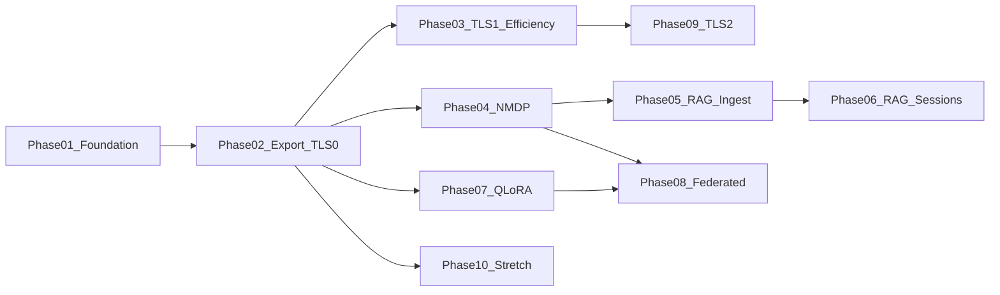

# NanoServe Industry Plan — Phased Development Index

> **Master roadmap** for implementing [TODO-NanoServe-Industry-grade-plan.md](../TODO-NanoServe-Industry-grade-plan.md) in agent-sized chunks with human-verifiable checkpoints.

---

## How to use with Agent mode

0. **Read Phase 00 once** — context, unified acceptance, success criteria.
0b. **Before Phase 02+** — read [TODO-Phase-01-Handoff.md](TODO-Phase-01-Handoff.md) (lessons, deferrals, regression rules).
1. **One phase per session** — copy-paste **Phase 00 (first time) + target Phase NN** into Agent mode.
2. **Do not start Phase N+1** until the **Human checkpoint** for Phase N passes (you verify visually or via curl/UI).
3. After **each and every phase build**, run the full **Post-build gate** in that phase file (four sections: unit/integration tests, performance benchmarks, memory leak & RSS audits, load & stress tests) plus the verification matrix — before human checkpoint.
4. Record sign-off in `documentation/reports/PHASE##_VERIFY.md` (see [Phase 00](TODO-Phase-00-Context.md#post-build-verification-standard-phases-0110) for the program-wide test index).
5. Reference the [master industry plan](../TODO-NanoServe-Industry-grade-plan.md) for full Part A/B/C/D detail when the phase file says "see master plan".

---

## Phase order and files

| Order | File | Prerequisite | Post-build gate | Human checkpoint (one line) |
|-------|------|--------------|-----------------|---------------------------|
| 0 | [TODO-Phase-00-Context.md](TODO-Phase-00-Context.md) | — | Test index + load preset guidance | Read once: vision, TLS overview, unified acceptance |
| 1 | [TODO-Phase-01-Native-Foundation.md](TODO-Phase-01-Native-Foundation.md) | Current NanoServe main | Unit + bench + valgrind + load 50 | distilgpt2 `.nanoq` v3 returns real English via `format=nanoq` |
| 2 | [TODO-Phase-02-Export-Orchestrator-TLS0.md](TODO-Phase-02-Export-Orchestrator-TLS0.md) | Phase 01 | TLS parity + export bench + load 50 | Web UI download + generate; TLS parity test passes |
| 3 | [TODO-Phase-03-TLS-Prefetch-Efficiency.md](TODO-Phase-03-TLS-Prefetch-Efficiency.md) | Phase 02 | TLS memory + prefetch bench + load 50/150 | Memory cap test passes; prefetch does not change tokens |
| 4 | [TODO-Phase-04-NMDP-Sandbox.md](TODO-Phase-04-NMDP-Sandbox.md) | Phase 02 | Mesh tests + staging cleanup + load 50 | Expired token → 403; data-agent stops after job cancel |
| 5 | [TODO-Phase-05-RAG-Corpus-Ingest.md](TODO-Phase-05-RAG-Corpus-Ingest.md) | Phase 04 | RAG ingest + dedup memory + load 50 | Corpus ingest + dedup; internal index search returns chunk ids |
| 6 | [TODO-Phase-06-RAG-Retrieval-Sessions-UI.md](TODO-Phase-06-RAG-Retrieval-Sessions-UI.md) | Phase 05 | RAG session/chat + load 50/150 | Multi-turn RAG chat in Web UI with chunk citations |
| 7 | [TODO-Phase-07-Train-Adapter-QLoRA.md](TODO-Phase-07-Train-Adapter-QLoRA.md) | Phase 02 (GGUF ok) | QLoRA bench + train/infer load 50 | `.nanoadapt` trained; adapter output ≠ base |
| 8 | [TODO-Phase-08-Train-Federated-Deploy.md](TODO-Phase-08-Train-Federated-Deploy.md) | Phase 04 + 07 | Federated pull + load 50/150 | Mock peer staging → train; hot-swap adapter |
| 9 | [TODO-Phase-09-TLS-Advanced-Stretch.md](TODO-Phase-09-TLS-Advanced-Stretch.md) | Phase 03 | TLS+RAG budget + extended valgrind + load 50/150 | 7B Q4 qualitative on 4 GB profile (stretch) |
| 10 | [TODO-Phase-10-Platform-Stretch.md](TODO-Phase-10-Platform-Stretch.md) | Phase 02 | WASM + full regression + load 50/300 | WASM smoke or documented deferral; Phase 7 design doc |

---

## Dependency graph



---

## Parallel tracks

| Track | Phases | Notes |
|-------|--------|-------|
| **Native engine + TLS** | 01 → 02 → 03 → 09 | Core `.nanoq` v3 + layer streaming |
| **RAG + mesh data** | 04 → 05 → 06 | Can use **GGUF** for inference during RAG if Phase 02 not fully native yet |
| **Training** | 07 → 08 | T0–T1 can start after Phase 02 with GGUF; T2 federated needs Phase 04 |
| **Platform stretch** | 10 | WASM + distributed pipeline (future) |

---

## Full spec parity

Each Phase 01–10 file includes an **Appendix** with verbatim sections from the master plan. Phase 00 holds program-wide context. Together they cover the full [TODO-NanoServe-Industry-grade-plan.md](../TODO-NanoServe-Industry-grade-plan.md) without detail loss.

---

## Related docs

| Doc | Role |
|-----|------|
| [TODO-Phase-01-Handoff.md](TODO-Phase-01-Handoff.md) | **Read before Phase 02+** — lessons, bugs fixed, deferrals, regression rules |
| [TODO-NanoServe-Industry-grade-plan.md](../TODO-NanoServe-Industry-grade-plan.md) | Full unified spec |
| [Future-Scope-Rust-port-for-C++Part.md](../Future-Scope-Rust-port-for-C++Part.md) | Post–Phase 03 optional Rust engine migration |
| [TODO-plan-GGUF.md](../TODO-plan-GGUF.md) | GGUF compatibility lane |

---

## Sign-off template (per phase)

```markdown
## Phase XX sign-off
- Date:
- Automated tests: PASS / FAIL
- Human checkpoint: PASS / FAIL
- Notes:
- Signed:
```
